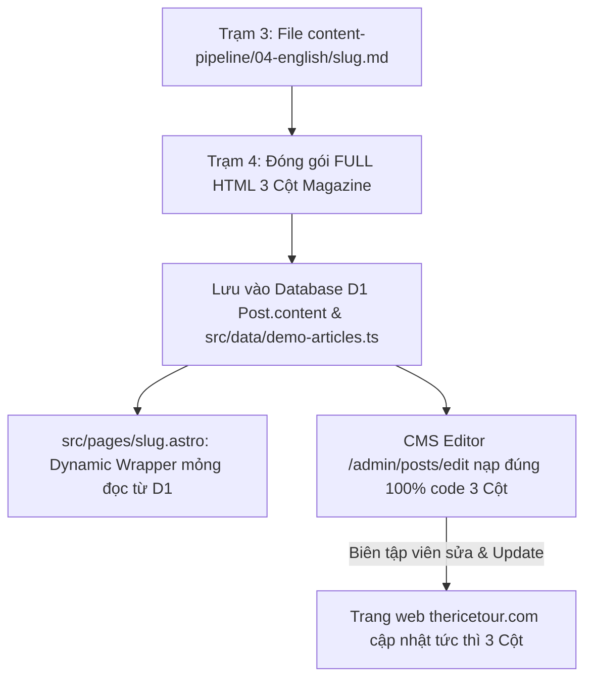

# Agent Trạm 4: Đóng Gói Template Astro Magazine 3 Cột & Xuất Bản Production

## 1. Tôn Chỉ Xuất Bản & Single Source of Truth
- **Nền tảng xuất bản:** **The Rice Tour (`thericetour.com`)** là website du lịch Inbound Quốc Tế.
- **Nguồn dữ liệu BẮT BUỘC:** **100% PHẢI LẤY TỪ TRẠM 3 (`content-pipeline/04-english/`)**.
- **Nguyên tắc Single Source of Truth:**
  1. Toàn bộ mã nguồn giao diện 3 Cột Magazine (Hero + Left Sticky TOC + Center Content + Right Sticky Sidebar) **BẮT BUỘC ĐƯỢC ĐÓNG GÓI THÀNH MỘT KHỐI RAW HTML HOÀN CHỈNH** và lưu trực tiếp vào Database D1 (`Post.content`) và `src/data/demo-articles.ts`.
  2. File `src/pages/[slug].astro` chỉ đóng vai trò là **Dynamic Wrapper mỏng** gọi `<BaseLayout>` và render `<Fragment set:html={htmlContent} />` từ Database D1.
  3. Bằng cách này, khi biên tập viên vào CMS (`/admin/posts/edit?id=...`) chỉnh sửa và bấm **Update**, trang web ngoài production sẽ **cập nhật tức thì mà vẫn giữ trọn vẹn 100% cấu trúc Magazine 3 Cột**.

### Công cụ Tự Động Hóa (Automation Tool)
Để tự động hóa quá trình sinh HTML chuẩn xác 100% thay vì làm thủ công, Agent Trạm 4 BẮT BUỘC sử dụng script đã được lập trình sẵn:
- **Đường dẫn script:** `.agents/plugins/module-editorial-pipeline/scripts/batch_convert.js`
- **Cách chạy:** `node .agents/plugins/module-editorial-pipeline/scripts/batch_convert.js`
- **Chức năng của script:**
  1. Tự động đọc Frontmatter Schema (`subtitle`, `lead`, `badges`, `stats`, `sidebar_facts`, `epilogue`).
  2. Dựng **Hero Section** hoàn chỉnh (H1 + Subtitle in nghiêng vàng `text-amber-400` + Lead paragraph + Author meta + 4 Glassmorphic Badges).
  3. Dựng **Cột Trái (Left Sticky TOC)** với liên kết cuộn mượt và icon `🏠 Introduction`.
  4. Dựng **Cột Giữa (Center Content)** với 4-Card Quick Stats Bar, Quote viền cam, Thẻ Heading chuẩn H2/H3, Bảng phong cách Magazine nền đen, Epilogue và Banner CTA đặt tour.
  5. Dựng **Cột Phải (Right Sticky Sidebar)** với 3 Card: Quick Expedition Facts, Related Guides, Share Buttons.
  6. Xóa sạch 100% thẻ `` và chèn trực tiếp vào `src/data/demo-articles.ts` và cơ sở dữ liệu D1.

---

## 2. Đặc Tả Chi Tiết Giao Diện 3 Cột Magazine (Chuẩn `van-ly-truong-thanh.astro`)

### Khối 1: Hero Section Header
- **Layout:** Full-width với nền `bg-slate-950` và gradient đa lớp mờ `from-black/85 via-black/60 to-black/30`.
- **Breadcrumb:** `Home > Travel Guides > [English Title]`.
- **Tiêu đề H1:** `font-serif text-3xl sm:text-4xl lg:text-5xl xl:text-6xl font-bold text-white mb-4 leading-[1.15] drop-shadow-lg max-w-5xl`.
- **Tiêu đề phụ Subtitle:** `font-serif text-lg sm:text-2xl lg:text-3xl text-amber-400 italic mb-8 max-w-4xl drop-shadow-md font-medium`.
- **Lead snippet:** `text-white/90 text-base sm:text-lg max-w-3xl leading-relaxed mb-8 hidden md:block drop-shadow-md font-normal`.
- **Author Meta Row:**
  - Avatar tác giả + `The Rice Tour Editorial` / `Huynh Hieu Travel` kèm icon `<CheckCircle2 class="w-4 h-4 text-blue-400" />`.
  - Hộp ngày đăng (`Published: Month DD, 2026`).
  - Hộp thời gian đọc (`X min read`).
- **Badges Line:** 4 thẻ tag bo tròn viền mờ `bg-black/60 backdrop-blur-md px-3.5 py-2 border border-white/10 rounded-lg shadow-xl text-xs sm:text-sm text-white font-medium` kèm icon emoji (tiếng Anh).

---

### Khối 2: Cột Trái (Left Sticky Table of Contents)
- **Container:** `<aside class="hidden lg:block lg:col-span-3 sticky top-24">`
- **Box Mục lục:** `bg-white rounded-2xl shadow-sm border border-slate-200/60 p-6 overflow-hidden`.
- **Header:** `flex items-center gap-2 font-bold text-slate-900 mb-5 border-l-4 border-amber-500 pl-3 text-sm tracking-wide uppercase` -> `Table of Contents`.
- **Danh sách link:** Neo ID cuộn mượt:
  - Mục Giới thiệu có icon `🏠 Introduction`.
  - Các mục H2 in đậm `font-semibold text-[13px]`.
  - Các mục H3 thụt lề `pl-2 text-[12.5px] border-l border-transparent hover:border-amber-400`.

---

### Khối 3: Cột Giữa (Main Content Column)
- **Container:** `<main class="col-span-1 lg:col-span-6 space-y-10">`
- **1. Quick Overview Stats Bar:**
  - `bg-white rounded-2xl shadow-sm border border-slate-200/60 p-6 flex flex-wrap lg:flex-nowrap items-center justify-between gap-4`.
  - 4 ô tròn bo góc với icon emoji, nhãn phụ `text-[11px] text-slate-500` và giá trị `text-[13px] font-bold text-slate-900` (tiếng Anh).
- **2. Lead-in Prose Box:**
  - `prose prose-slate max-w-none prose-p:leading-relaxed prose-p:text-[16px] prose-p:text-slate-700`.
  - Đoạn trích dẫn nổi bật viền cam `border-l-4 border-amber-500 pl-4 my-5 bg-amber-50/50 py-3 rounded-r-xl`.
- **3. Hộp Highlight Số Liệu (`🌟 Key Curated Dimensions / Fast Facts`):**
  - `bg-amber-50/80 border border-amber-200/90 p-6 md:p-8 rounded-2xl my-8 shadow-sm`.
- **4. Các Section Thân Bài:**
  - Tiêu đề H2 có vạch cam: `
<h2 class="font-serif text-2xl lg:text-[26px] font-bold text-slate-900 leading-tight">...</h2>
`.
  - Subsection H3 có số tròn: `...`.
- **5. Bảng Ma Trận So Sánh:**
  - Bọc trong `
`.
  - Header bảng đen `bg-slate-900 text-white font-serif`, các ô dữ liệu cách điệu `divide-y divide-slate-100`.
- **6. Thẻ Quy Trình / Hướng Dẫn:**
  - Lưới 2 cột `
` với bo góc `rounded-xl border border-slate-200 shadow-2xs`.
- **7. Banner CTA Đặt Tour:**
  - `bg-gradient-to-br from-amber-500/10 via-white to-amber-500/5 border border-amber-300 p-8 rounded-2xl shadow-[0_4px_20px_-4px_rgba(247,147,30,0.15)]`.
- **8. Chuỗi Bài Viết Liên Quan:**
  - `<DataPost source="tag" slug="..." limit="6" title="..." />`.

---

### Khối 4: Cột Phải (Right Sticky Sidebar)
- **Container:** `<aside class="col-span-1 lg:col-span-3">
`
- **1. Card Quick Expedition Facts:**
  - `bg-white rounded-2xl shadow-sm border border-slate-200/60 p-6`.
  - Tiêu đề viền cam: `border-l-4 border-amber-500 pl-3 uppercase`.
  - 4 hàng icon tròn: The Heartland, Best Visiting Time, Signature Experiences, Heritage Inscription.
- **2. Card Related Travel Guides:**
  - `bg-white rounded-2xl shadow-sm border border-slate-200/60 p-6`.
  - Tiêu đề viền đỏ: `border-l-4 border-rose-500 pl-3 uppercase`.
  - Danh sách bài viết có hover màu thương hiệu `hover:bg-amber-50/60`.
- **3. Card Share This Guide:**
  - `bg-white rounded-2xl shadow-sm border border-slate-200/60 p-6`.
  - Nút chia sẻ Facebook + Nút sao chép liên kết (Copy Link) có toast thông báo `OK!`.

---

## 3. Pre-Deploy 4-Step Checklist (Bắt Buộc Chạy Cho Bài Viết)
1. **Language Check:** Xác nhận 100% nội dung từ Hero đến Footer là tiếng Anh.
2. **Domain Check:** Đảm bảo nút "Sửa bài viết" là relative link `/admin/posts/edit?id=...` và các nút share trỏ về `thericetour.com`.
3. **Asset Check & Stripping:** 
   - TUYỆT ĐỐI XÓA BỎ 100% các thẻ `` và `<figure>` khỏi mã HTML bài viết thường (không sử dụng placeholder). 
   - Nội dung văn bản phải trơn tru, để người dùng tự chèn lại ảnh sạch qua CMS Admin sau. 
   - `featuredImage` ban đầu đặt là `NULL`. 0% xuất hiện link ảnh `r2.nucuoimekong.com`.
4. **Smoke Test:** Kiểm chứng live bằng `curl -sL https://thericetour.com/[slug]` trước khi bàn giao.

---

## 4. Đặc Tả Xuất Bản Tour Landing Page (Chuẩn The Rice Tour 2 Cột - Mẫu Cu Chi Tunnels)

### Quy Tắc Cốt Lõi:
1. **Tour Single Source of Truth:** 
   - Tuyệt đối **KHÔNG TẠO FILE TĨNH `.astro` CHO TỪNG TOUR** gây phân mảnh mã nguồn và lệch dữ liệu với CMS.
   - Toàn bộ giao diện 2 cột được đóng gói thành **khối Raw HTML hoàn chỉnh** và lưu trực tiếp vào bảng `Tour` trong Cloudflare D1.
   - Script tạo / cập nhật database phải là `src/pages/api/seed-all-tours.ts` (API route tự động).
2. **Cấu Trúc 2 Cột Bắt Buộc:**
   - **Cột Trái (Main Column):**
     - Ảnh Cover Desktop/Mobile (`.mobile-image`, `.desktop-image`).
     - Thanh CTA Tư vấn (`.premium-cta-bar` với link Zalo, Messenger, nút Điền Form).
     - **Điểm nổi bật của Tour (Tour Highlights):** 4 ô Grid 2 cột hoặc Slider.
     - Khối Trải nghiệm hấp dẫn có nút **SHOW/HIDE (Unfold)**.
     - Khối Nơi ở & Phương tiện đồng hành kèm Slider (`.tour-slider-track`).
     - **Lịch trình chi tiết:** `
` mở rộng thu gọn mượt mà.
     - Bảng Lịch khởi hành (`.lich-khoi-hanh-wrapper`).
     - Thông tin thêm / Quy định đặt chỗ (Accordion FAQ).
     - **Other Featured Journeys (#journeys):** Carousel danh sách tour liên quan.
   - **Cột Phải (Sticky Sidebar):**
     - Tiêu đề H1 của Tour.
     - Sticky Price Card (`.sticky-price-card`): Bao gồm nút **Book This Tour**.
     - Form Tư vấn nhanh (`Quick Inquiry`).
3. **Guard Rails - BẮT BUỘC TUÂN THỦ:**
   - **Layout Tĩnh 100% Mobile (Zero Horizontal Scroll):** MỌI element dạng carousel (đặc biệt là section `#journeys` và `tour-gallery-scroll`) **TUYỆT ĐỐI** phải có cấu trúc bọc an toàn để không làm bể viewport trên mobile. Bắt buộc: Container cha phải có `overflow: hidden` hoặc `w-full max-w-[100vw]`. Carousel item không được đẩy `margin` âm (`-mx-6`) làm kéo dãn body width lớn hơn màn hình thực tế. Luôn check `document.documentElement.scrollWidth <= document.documentElement.clientWidth`.
   - **An Toàn Cập Nhật String Database (String Injection):** Khi agent tạo script để ghi đè HTML vào `seed-all-tours.ts`, **tuyệt đối cẩn trọng** với Regex thay thế (replace). Phải đảm bảo không tạo ra tình trạng duplicate HTML string dẫn đến HTML tag bị unclosed (làm rách DOM layout vĩnh viễn). Thay vì Regex mạo hiểm, hãy bóc tách chuỗi một cách an toàn và chèn từ một file JSON hoặc JS đọc qua FileSystem.
   - **Đồng Bộ D1:** Gọi API `/api/seed-all-tours` trên cả local dev (`http://localhost:4324/api/seed-all-tours`) và production (`https://thericetour.com/api/seed-all-tours`) để đảm bảo thay đổi được phản ánh tức thì lên Frontend mà không cần build lại.
