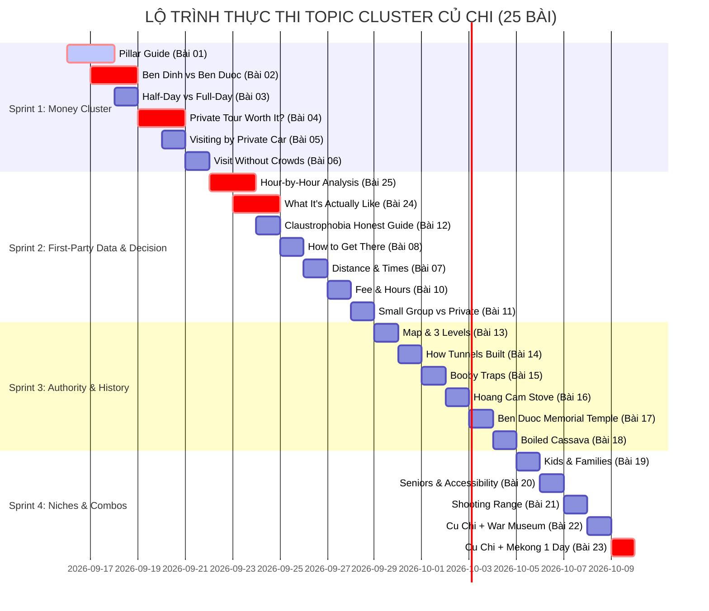

# BẢNG MA TRẬN NỘI DUNG THỰC CHIẾN CỦ CHI TUNNELS (PHIÊN BẢN 2.0)
### Kiến Trúc Thông Tin 5 Tầng, Mạng Lưới Liên Kết 3 Trục & GEO Answer Engine — The Rice Tour (`thericetour.com`)

> **Căn cứ dữ liệu:** Mọi số liệu, khoảng cách, thông số hầm và quy chuẩn trong tài liệu này được đồng bộ 100% từ [CU_CHI_FACT_BASE.md](file:///Users/huynhtronghieu/Documents/thericetour/CU_CHI_FACT_BASE.md).  
> **Mục tiêu tối thượng:** Xây dựng Topical Authority vững chắc, tối ưu hóa cho AI Search (Google AI Overview, Perplexity, ChatGPT Search) bằng **Dữ liệu thực tế độc quyền (First-Party Operational Data)**; dẫn chuyển đổi tự nhiên về 2 sản phẩm tour chủ lực:  
> 1. [Half-Day Premium Cu Chi Tunnels](/tour/half-day-cu-chi-tunnels-tour) ($75 – $115 USD)  
> 2. [1-Day Cu Chi & Saigon Discovery](/tour/1-day-premium-cu-chi-tunnels) ($122 USD)

---

## 1. SƠ ĐỒ KIẾN TRÚC THÔNG TIN (INFORMATION ARCHITECTURE)

```
                                  ┌─────────────────────────────────────────┐
                                  │       PILLAR GUIDE (XƯƠNG SỐNG)        │
                                  │  The Complete Cu Chi Tunnels Guide      │
                                  └────────────────────┬────────────────────┘
                                                       │
         ┌───────────────────────────────┬─────────────┴─────────────────┬───────────────────────────────┐
         ▼                               ▼                               ▼                               ▼
  [TIER A: MONEY CLUSTER]      [TIER B: DECISION HUBS]      [TIER C: TOPICAL AUTHORITY]     [TIER E: FIRST-HAND DATA]
  • Ben Dinh vs Ben Duoc       • Distance & Travel Times    • 3-Level Underground Map       • Hour-by-Hour Analysis
  • Private Tour Worth It?     • Private Car vs Speedboat   • How Tunnels Were Built        • What It's Actually Like
  • Half-Day vs Full-Day       • Morning vs Afternoon       • Booby Traps & Defense           (Live Operational Data)
  • Visiting by Private Car    • Entrance Fee & Hours       • Hoang Cam Smokeless Stove                  │
  • Visit Without Crowds       • Claustrophobia Guide       • Ben Duoc Memorial Temple                   │
         │                               │                               │                               │
         └───────────────────────────────┼───────────────────────────────┴───────────────────────────────┘
                                         ▼
                   ┌───────────────────────────────────────────┐
                   │    COMMERCIAL DESTINATIONS / PRODUCTS     │
                   │  • Half-Day Cu Chi Tunnels Private Tour   │
                   │  • 1-Day Cu Chi & Saigon Discovery Tour   │
                   └───────────────────────────────────────────┘
```

---

## 2. QUY CHUẨN GEO "ANSWER BLOCK" (BẮT BUỘC TRONG TẤT CẢ CÁC BÀI)

Để tối ưu hóa việc trích dẫn trực tiếp từ các mô hình ngôn ngữ lớn (LLMs), mỗi bài viết **BẮT BUỘC** phải có một khối **Quick Answer Block** ngay dưới phần mở đầu (trong vòng 100 từ đầu tiên):

```markdown
> ### Quick Answer / At a Glance
> | Question | Quick Fact / Expert Recommendation |
> | :--- | :--- |
> | **Which site is better?** | Ben Duoc for a quieter, more authentic historic atmosphere; Ben Dinh for the shortest drive. |
> | **Ideal departure time?** | 07:00 AM from District 1 to bypass the An Suong traffic choke point and arrive ahead of tour buses. |
> | **Is crawling required?** | No. Over 80% of attractions are above ground in shaded forest trails; crawling is 100% optional. |
```

---

## 3. BẢNG MA TRẬN 25 BÀI VIẾT CHI TIẾT (PHÂN THEO 5 TẦNG CHIẾN LƯỢC)

### TIER A: MONEY CLUSTER — 6 BÀI CHUYỂN ĐỔI CHỦ LỰC (PHASE 1 - VIẾT ĐẦU TIÊN)

| STT | Tiêu Đề Bài Viết & Slug Dự Kiến | Target Keywords (Primary + Long-tail) | Brief Tác Nghiệp (Chuẩn Fact Base & Du Lịch Có GUU) | Mạng Lưới Liên Kết 3 Trục (Internal Link Matrix) |
| :---: | :--- | :--- | :--- | :--- |
| **01** | **Cu Chi Tunnels: The Complete Travel Guide**<br>`/cu-chi-tunnels-travel-guide` | `cu chi tunnels travel guide`<br>• `visiting cu chi tunnels`<br>• `cu chi tunnels guide`<br>• `cu chi tunnels history and tour` | • **Xương sống số 1** của toàn bộ topic cluster (3,500 – 4,000 từ).<br>• Tổng quan hệ thống 200km đường hầm ngầm, bản đồ vị trí địa lý.<br>• Phân định rõ 2 phân khu: Bến Đình (gần, đông) vs Bến Dược (xa, yên tĩnh, nguyên bản).<br>• Hướng dẫn chi tiết: thời gian mở cửa, vé tham quan, cách đi, trang phục, các câu hỏi thường gặp. | **1. Parent:** N/A (Trang Pillar mẹ)<br>**2. Siblings:** Link tới Bài 02, 03, 04, 05, 06<br>**3. Commercial:** 2 Tour Boxes: [Tour Nửa Ngày](/tour/half-day-cu-chi-tunnels-tour) & [Tour 1 Ngày](/tour/1-day-premium-cu-chi-tunnels) |
| **02** | **Ben Dinh vs Ben Duoc: Which Cu Chi Tunnels Site Should You Visit?**<br>`/ben-dinh-vs-ben-duoc-cu-chi-tunnels` | `ben dinh vs ben duoc`<br>• `which cu chi tunnels site is better`<br>• `ben duoc tunnels vs ben dinh`<br>• `quieter cu chi tunnels site` | • **Bài nam châm chuyển đổi cao nhất** (2,200 từ).<br>• So sánh khách quan: Bến Đình (gần hơn 15km, tập trung phần lớn tour bus đông đúc, hầm cơi nới rộng hơn) vs Bến Dược (xa hơn, giữa rừng nguyên sinh, hầm 3 tầng nguyên bản, có Đền Tưởng niệm Bến Dược trang nghiêm).<br>• Nhấn mạnh: Muốn trải nghiệm chiều sâu tại Bến Dược, xe riêng là phương tiện lý tưởng nhất. | **1. Parent:** [Pillar Guide](/cu-chi-tunnels-travel-guide)<br>**2. Siblings:** Bài 05 (Private Car), Bài 06 (Crowds), Bài 07 (Distance)<br>**3. Commercial:** [Tour Củ Chi Nửa Ngày](/tour/half-day-cu-chi-tunnels-tour) (*Anchor: private Ben Duoc tour by luxury car*) |
| **03** | **Cu Chi Tunnels Half-Day vs Full-Day: Which Tour Should You Choose?**<br>`/cu-chi-tunnels-half-day-vs-full-day` | `cu chi tunnels half day vs full day`<br>• `how long is cu chi tunnel tour`<br>• `cu chi tunnels full day tour worth it`<br>• `half day cu chi tunnels morning or afternoon` | • Độ dài: 1,800 từ.<br>• Phân tích rõ ràng nhu cầu của 2 nhóm khách:<br>  + Nửa ngày (5–6 tiếng): Phù hợp khách muốn dành buổi chiều thư giãn, đi bảo tàng hoặc gia đình có con nhỏ.<br>  + Cả ngày (8–9 tiếng): Kết hợp Củ Chi sáng + Di tích nội đô Sài Gòn (Dinh Độc Lập, Bưu điện) hoặc du thuyền hoàng hôn WaterBus.<br>• Bảng ma trận so sánh thể lực, thời gian di chuyển và mức độ trọn vẹn. | **1. Parent:** [Pillar Guide](/cu-chi-tunnels-travel-guide)<br>**2. Siblings:** Bài 04 (Worth It), Bài 09 (Best Time)<br>**3. Commercial:** [Tour Nửa Ngày](/tour/half-day-cu-chi-tunnels-tour) & [Tour 1 Ngày](/tour/1-day-premium-cu-chi-tunnels) |
| **04** | **Is a Cu Chi Tunnels Private Tour Worth the Extra Cost? (An Honest Breakdown)**<br>`/is-cu-chi-tunnels-private-tour-worth-it` | `is cu chi tunnels private tour worth it`<br>• `cu chi tunnels private tour vs group bus`<br>• `cost of private tour cu chi`<br>• `private guide cu chi tunnels` | • Độ dài: 2,200 từ (Đập tan rào cản giá giữa tour bus $25 và private $75+).<br>• Phân tích thời gian: Xe bus mất 4.5 tiếng do đón 15–20 khách và kẹt xe vs Xe riêng 2.5 tiếng êm ái, đón tận sảnh.<br>• Cam kết 100% No Forced Shopping (không tốn 45 phút ở xưởng thủ công/sơn mài).<br>• Quyền lựa chọn Bến Dược và tự do điều chỉnh nhịp độ chuyến đi. | **1. Parent:** [Pillar Guide](/cu-chi-tunnels-travel-guide)<br>**2. Siblings:** Bài 02 (Ben Dinh vs Ben Duoc), Bài 05 (Private Car), Bài 11 (Small Group)<br>**3. Commercial:** [Tour Củ Chi Nửa Ngày](/tour/half-day-cu-chi-tunnels-tour) (*Anchor: tailored private Cu Chi tour*) |
| **05** | **Visiting Cu Chi Tunnels by Private Car: Costs, Routes & What to Expect**<br>`/visiting-cu-chi-tunnels-by-private-car` | `cu chi tunnels by private car`<br>• `hire private car to cu chi tunnels`<br>• `luxury car cu chi tunnels tour`<br>• `cu chi tunnels private driver` | • Độ dài: 2,000 từ.<br>• Đánh giá phương tiện: SUV 7 chỗ (Kia Carnival, Ford Everest) cho nhóm 2–3 khách; Limousine Dcar 9 chỗ cho nhóm 4–7 khách.<br>• Cung đường di chuyển tối ưu tránh kẹt xe ngã tư An Sương.<br>• Tiện ích đi kèm: Ghế da cao cấp, điều hòa 2 vùng, Wi-Fi, cổng sạc điện thoại, bánh mì sáng, nước dừa tươi. | **1. Parent:** [Pillar Guide](/cu-chi-tunnels-travel-guide)<br>**2. Siblings:** Bài 04 (Worth It), Bài 07 (Distance), Bài 08 (How to Get There)<br>**3. Commercial:** [Tour Củ Chi Nửa Ngày](/tour/half-day-cu-chi-tunnels-tour) |
| **06** | **How to Visit Cu Chi Tunnels Without the Crowds: 5 Insider Strategies**<br>`/how-to-visit-cu-chi-tunnels-without-crowds` | `how to visit cu chi tunnels without crowds`<br>• `avoid crowds cu chi tunnels`<br>• `quiet cu chi tunnels tour`<br>• `early morning cu chi tour` | • Độ dài: 1,800 từ.<br>• 5 chiến lược thực tế dựa trên dữ liệu vận hành:<br>  1. Khởi hành sớm lúc 07:00 AM để đến cổng trước dòng xe bus du lịch.<br>  2. Chọn phân khu Bến Dược thay vì Bến Đình.<br>  3. Khung giờ buổi chiều (12:30 PM) khi các đoàn sáng đã rời đi.<br>  4. Đi xe riêng hoặc nhóm nhỏ tối đa 5 người để di chuyển nhanh chóng.<br>  5. Không ghé các trạm dừng mua sắm dọc đường. | **1. Parent:** [Pillar Guide](/cu-chi-tunnels-travel-guide)<br>**2. Siblings:** Bài 02 (Ben Duoc), Bài 09 (Best Time), Bài 25 (Hour-by-Hour)<br>**3. Commercial:** [Tour Củ Chi Nửa Ngày](/tour/half-day-cu-chi-tunnels-tour) |

---

### TIER B: DECISION & COMPARISON HUBS — 6 BÀI HƯỚNG DẪN LOGISTICS (PHASE 2)

| STT | Tiêu Đề Bài Viết & Slug Dự Kiến | Target Keywords | Brief Tác Nghiệp & Chuẩn Fact Base | Mạng Lưới Liên Kết 3 Trục |
| :---: | :--- | :--- | :--- | :--- |
| **07** | **How Far is Cu Chi Tunnels from Ho Chi Minh City? Distance & Travel Times**<br>`/how-far-is-cu-chi-tunnels-from-ho-chi-minh-city` | `how far is cu chi tunnels from ho chi minh city`<br>• `distance saigon to cu chi tunnels`<br>• `travel time ho chi minh to cu chi` | • Số liệu chuẩn xác từ Fact Base: Bến Đình (45–50km, 1h15–1h30); Bến Dược (65–70km, 1h30–1h45).<br>• Giải thích tác động của giờ cao điểm tại nút giao An Sương và tuyến QL22. | **1. Parent:** [Pillar Guide](/cu-chi-tunnels-travel-guide)<br>**2. Siblings:** Bài 05 (Private Car), Bài 08 (How to Get There)<br>**3. Commercial:** [Tour Nửa Ngày](/tour/half-day-cu-chi-tunnels-tour) |
| **08** | **How to Get to Cu Chi Tunnels from Saigon: Private Car vs Speedboat vs Bus**<br>`/how-to-get-to-cu-chi-tunnels-from-saigon` | `how to get to cu chi tunnels from saigon`<br>• `public bus to cu chi tunnels`<br>• `cu chi tunnels by speedboat`<br>• `grab to cu chi tunnels cost` | • So sánh khách quan 4 phương thức: Xe riêng có tài xế, Canô cao tốc sông Sài Gòn, Xe buýt công cộng (Tuyến 13 ➔ 79), và Taxi/Grab.<br>• Bảng so sánh chi phí, thời gian, mức độ an toàn và sự tiện nghi. | **1. Parent:** [Pillar Guide](/cu-chi-tunnels-travel-guide)<br>**2. Siblings:** Bài 05 (Private Car), Bài 07 (Distance)<br>**3. Commercial:** [Tour Nửa Ngày](/tour/half-day-cu-chi-tunnels-tour) |
| **09** | **Best Time to Visit Cu Chi Tunnels: Morning vs Afternoon & Weather Guide**<br>`/best-time-to-visit-cu-chi-tunnels` | `best time to visit cu chi tunnels`<br>• `morning vs afternoon cu chi tunnels`<br>• `cu chi tunnels rainy season` | • So sánh 2 buổi: Buổi sáng (mát mẻ, dậy sớm 07:00 AM) vs Buổi chiều (thong thả, vắng khách hơn).<br>• Mùa khô (Tháng 12 – Tháng 4) vs Mùa mưa (Tháng 5 – Tháng 11): Dưới tán rừng mát rượi, cần lưu ý đường đất ẩm. | **1. Parent:** [Pillar Guide](/cu-chi-tunnels-travel-guide)<br>**2. Siblings:** Bài 06 (Crowds), Bài 10 (Fee & Hours)<br>**3. Commercial:** [Tour Nửa Ngày](/tour/half-day-cu-chi-tunnels-tour) |
| **10** | **Cu Chi Tunnels Entrance Fee & Opening Hours (2026 Verified)**<br>`/cu-chi-tunnels-entrance-fee-opening-hours` | `cu chi tunnels entrance fee`<br>• `cu chi tunnels ticket price 2026`<br>• `cu chi tunnels opening hours` | • Cập nhật giá vé chính thức 2026 từ Fact Base: 125.000 VNĐ / khách cho cả Bến Dược và Bến Đình.<br>• Giờ mở cửa: 07:00 – 17:00 hàng ngày (kể cả lễ Tết). Có dòng *Last verified: [Date]*. | **1. Parent:** [Pillar Guide](/cu-chi-tunnels-travel-guide)<br>**2. Siblings:** Bài 01 (Pillar), Bài 07 (Distance)<br>**3. Commercial:** [Tour Nửa Ngày](/tour/half-day-cu-chi-tunnels-tour) |
| **11** | **Private Tour vs Small Group Tour to Cu Chi: What's the Difference?**<br>`/cu-chi-tunnels-small-group-vs-private-tour` | `cu chi tunnels small group tour`<br>• `small group vs private tour cu chi`<br>• `max 5 pax cu chi tour` | • Phân biệt rõ: Nhóm nhỏ VIP của The Rice Tour (Tối đa 5 khách/xe) vs Tour riêng 100% (Couple, gia đình).<br>• Hướng dẫn lựa chọn phù hợp với ngân sách và mong muốn cá nhân hóa. | **1. Parent:** [Pillar Guide](/cu-chi-tunnels-travel-guide)<br>**2. Siblings:** Bài 04 (Worth It), Bài 05 (Private Car)<br>**3. Commercial:** [Tour Nửa Ngày](/tour/half-day-cu-chi-tunnels-tour) |
| **12** | **Visiting Cu Chi Tunnels with Claustrophobia: An Honest Above-Ground Guide**<br>`/can-claustrophobic-people-visit-cu-chi-tunnels` | `cu chi tunnels claustrophobia`<br>• `fear of small spaces cu chi tunnels`<br>• `cu chi tunnels without going underground` | • **Honest Answer (Không khẳng định tuyệt đối):** Giải thích rõ hơn 80% trải nghiệm diễn ra trên mặt đất rợp bóng rừng mát mẻ. Không ai bị ép chui hầm.<br>• Miêu tả chân thực cảm giác dưới hầm (nhiệt độ, độ hẹp) và các lối thoát hiểm ngắt quãng. | **1. Parent:** [Pillar Guide](/cu-chi-tunnels-travel-guide)<br>**2. Siblings:** Bài 01 (Pillar), Bài 13 (Map & Layout)<br>**3. Commercial:** [Tour Nửa Ngày](/tour/half-day-cu-chi-tunnels-tour) |

---

### TIER C: TOPICAL AUTHORITY & HISTORICAL DEPTH — 6 BÀI CHIỀU SÂU (PHASE 3)

| STT | Tiêu Đề Bài Viết & Slug Dự Kiến | Target Keywords | Brief Tác Nghiệp & Chuẩn Fact Base | Mạng Lưới Liên Kết 3 Trục |
| :---: | :--- | :--- | :--- | :--- |
| **13** | **Cu Chi Tunnels Map & Layout: Underground 3-Level Network Explained**<br>`/cu-chi-tunnels-map-underground-layout` | `cu chi tunnels map`<br>• `cu chi tunnels diagram`<br>• `cu chi tunnels 3 levels depth` | • Sơ đồ mặt cắt 3 tầng: Tầng 1 (3m - pháo đạn), Tầng 2 (6m - bom nhỏ), Tầng 3 (8–12m - chống bom B-52).<br>• Bố cục các phòng chức năng: phòng chỉ huy, giếng nước ngầm, bệnh viện phẫu thuật, bếp Hoàng Cầm. | **1. Parent:** [Pillar Guide](/cu-chi-tunnels-travel-guide)<br>**2. Siblings:** Bài 12 (Claustrophobia), Bài 14 (How Built)<br>**3. Commercial:** [Tour Nửa Ngày](/tour/half-day-cu-chi-tunnels-tour) |
| **14** | **How the Cu Chi Tunnels Were Built: Hand Tools, Soil Science & Ingenuity**<br>`/how-cu-chi-tunnels-were-built` | `how were cu chi tunnels built`<br>• `cu chi tunnels construction tools`<br>• `cu chi red clay soil engineering` | • Kỳ tích đào hơn 200km hầm bằng cuốc chim, xẻng tay và sọt tre.<br>• Khoa học địa chất: Đất sét laterite đỏ Củ Chi khô lại cứng như bê tông, chịu lực cực tốt.<br>• Cách ngụy trang đất thừa ban đêm ra sông Sài Gòn hoặc hố bom cũ. | **1. Parent:** [Pillar Guide](/cu-chi-tunnels-travel-guide)<br>**2. Siblings:** Bài 13 (Map), Bài 15 (Traps)<br>**3. Commercial:** [Tour Nửa Ngày](/tour/half-day-cu-chi-tunnels-tour) |
| **15** | **The Traps of Cu Chi: Booby Traps, Punji Sticks & Guerilla Defense Tactics**<br>`/booby-traps-of-cu-chi-tunnels` | `cu chi tunnels traps`<br>• `punji stick traps vietnam war`<br>• `cu chi booby traps list` | • Các mô hình bẫy ngụy trang trưng bày trên thực địa: bẫy hầm chông nắp lật, bẫy kẹp nách, bẫy cửa quay.<br>• Triết lý chiến tranh du kích phòng vệ và tái chế phế liệu chiến tranh. | **1. Parent:** [Pillar Guide](/cu-chi-tunnels-travel-guide)<br>**2. Siblings:** Bài 14 (How Built), Bài 16 (Hoang Cam)<br>**3. Commercial:** [Tour Nửa Ngày](/tour/half-day-cu-chi-tunnels-tour) |
| **16** | **Hoang Cam Stove: The Genius Smokeless Kitchen of the Vietnam War**<br>`/hoang-cam-smokeless-stove-cu-chi` | `hoang cam stove`<br>• `smokeless stove vietnam war`<br>• `how hoang cam stove works` | • Câu chuyện sáng tạo của anh nuôi Hoàng Cầm: "Nấu không khói, đi không dấu".<br>• Nguyên lý vật lý của hệ thống rãnh tản khói ngầm uốn lượn dưới tán lá và đất ẩm.<br>• Tận mắt xem bếp Hoàng Cầm hoạt động tại khu rừng Củ Chi. | **1. Parent:** [Pillar Guide](/cu-chi-tunnels-travel-guide)<br>**2. Siblings:** Bài 15 (Traps), Bài 18 (Cassava)<br>**3. Commercial:** [Tour Nửa Ngày](/tour/half-day-cu-chi-tunnels-tour) |
| **17** | **Ben Duoc Memorial Temple: The Sacred Monument in the Forest**<br>`/ben-duoc-memorial-temple-guide` | `ben duoc memorial temple`<br>• `ben duoc temple cu chi`<br>• `sacred temple cu chi tunnels` | • Kiến trúc tam quan và tháp 9 tầng uy nghiêm giữa rừng cao su bạt ngàn.<br>• Ý nghĩa lịch sử: Bức tường đá hoa cương khắc danh tính 44.520 liệt sĩ.<br>• Không gian tâm linh trang nghiêm, không thương mại hóa tại Bến Dược. | **1. Parent:** [Pillar Guide](/cu-chi-tunnels-travel-guide)<br>**2. Siblings:** Bài 02 (Ben Duoc vs Ben Dinh)<br>**3. Commercial:** [Tour Nửa Ngày](/tour/half-day-cu-chi-tunnels-tour) (*Anchor: Ben Duoc historical tour*) |
| **18** | **Eating Boiled Cassava with Sesame Salt: The Taste of Wartime Sustenance**<br>`/eating-boiled-cassava-sesame-salt-cu-chi` | `boiled cassava cu chi tunnels`<br>• `cassava with peanut salt vietnam`<br>• `wartime food cu chi` | • Ý nghĩa của củ khoai mì (sắn) trong việc duy trì sức bền của quân dân vùng đất thép.<br>• Trải nghiệm thưởng thức đĩa khoai mì hấp lá dứa nóng hổi chấm muối mè đậu phộng và ngụm trà sen ấm dưới tán rừng. | **1. Parent:** [Pillar Guide](/cu-chi-tunnels-travel-guide)<br>**2. Siblings:** Bài 16 (Hoang Cam Stove)<br>**3. Commercial:** [Tour Nửa Ngày](/tour/half-day-cu-chi-tunnels-tour) |

---

### TIER D: LONG-TAIL NICHES & CROSS-SELL — 5 BÀI ĐỐI TƯỢNG ĐẶC THÙ (PHASE 4)

| STT | Tiêu Đề Bài Viết & Slug Dự Kiến | Target Keywords | Brief Tác Nghiệp & Chuẩn Fact Base | Mạng Lưới Liên Kết 3 Trục |
| :---: | :--- | :--- | :--- | :--- |
| **19** | **Visiting Cu Chi Tunnels with Kids: Safety, Pace & Age Recommendations**<br>`/visiting-cu-chi-tunnels-with-kids` | `cu chi tunnels with kids`<br>• `family tour cu chi tunnels`<br>• `cu chi tunnels suitable for children` | • Khuyến nghị độ tuổi: Trẻ từ 7 tuổi trở lên; trẻ nhỏ hơn có thể đi dạo ngắm rừng mát mẻ.<br>• Lợi ích của tour xe riêng: Bé có thể ngủ nghỉ thoải mái trên xe, điều chỉnh thời gian nghỉ chân linh hoạt. | **1. Parent:** [Pillar Guide](/cu-chi-tunnels-travel-guide)<br>**2. Siblings:** Bài 05 (Private Car), Bài 12 (Claustrophobia)<br>**3. Commercial:** [Tour Nửa Ngày](/tour/half-day-cu-chi-tunnels-tour) |
| **20** | **Cu Chi Tunnels for Seniors & Travelers with Mobility Needs**<br>`/cu-chi-tunnels-for-seniors` | `cu chi tunnels for seniors`<br>• `accessible cu chi tunnels tour`<br>• `cu chi tunnels elderly travelers` | • Đánh giá thực địa: Đường đi bộ trong rừng bằng phẳng rợp bóng râm, có nhiều ghế đá nghỉ chân.<br>• Xe điện trung chuyển nội khu tại Bến Dược hỗ trợ giảm tải quãng đường đi bộ. | **1. Parent:** [Pillar Guide](/cu-chi-tunnels-travel-guide)<br>**2. Siblings:** Bài 05 (Private Car), Bài 17 (Ben Duoc Temple)<br>**3. Commercial:** [Tour Nửa Ngày](/tour/half-day-cu-chi-tunnels-tour) |
| **21** | **Cu Chi Tunnels Shooting Range: Firearms, Rules & Verification Guide**<br>`/cu-chi-tunnels-shooting-range-prices` | `cu chi tunnels shooting range price`<br>• `shooting ak47 cu chi tunnels`<br>• `cu chi tunnels gun range cost` | • **Tuân thủ Fact Base:** Ghi rõ mức giá dao động ~50.000 – 65.000 VNĐ/viên đạn tùy loại súng (AK47, M16), tối thiểu 10 viên. Quy định an toàn do sĩ quan quân đội phụ trách.<br>• Ghi rõ nhãn *Prices subject to official military range counter*. | **1. Parent:** [Pillar Guide](/cu-chi-tunnels-travel-guide)<br>**2. Siblings:** Bài 10 (Fee & Hours)<br>**3. Commercial:** [Tour Nửa Ngày](/tour/half-day-cu-chi-tunnels-tour) |
| **22** | **Cu Chi Tunnels and War Remnants Museum: A Seamless 1-Day History Journey**<br>`/cu-chi-tunnels-and-war-remnants-museum-in-one-day` | `cu chi tunnels and war remnants museum in one day`<br>• `vietnam war day tour saigon`<br>• `cu chi and war museum itinerary` | • Hành trình kết nối lịch sử liền mạch: Buổi sáng đi thực địa Củ Chi ➔ Buổi trưa ăn phở ngon tại trung tâm ➔ Buổi chiều tham quan Bảo tàng Chứng tích Chiến tranh.<br>• Di chuyển bằng xe riêng giúp giữ trọn thể lực và không gian suy ngẫm. | **1. Parent:** [Pillar Guide](/cu-chi-tunnels-travel-guide)<br>**2. Siblings:** Bài 03 (Half-Day vs Full-Day)<br>**3. Commercial:** [Tour Củ Chi 1 Ngày](/tour/1-day-premium-cu-chi-tunnels) |
| **23** | **Is Cu Chi Tunnels and Mekong Delta in One Day Actually Worth It?**<br>`/cu-chi-tunnels-and-mekong-delta-in-one-day` | `cu chi tunnels and mekong delta in one day`<br>• `can you do cu chi and mekong in 1 day`<br>• `cuchi and mekong delta 1 day tour private` | • **Đánh giá khách quan theo 3 hồ sơ khách lữ hành:**<br>  1. Khách đi lần đầu, ít thời gian: Có thể đi nhưng ngày sẽ rất dài (07:00 – 18:30).<br>  2. Khách đi xe riêng cao cấp: Rất khả thi nhờ né kẹt xe và đi thẳng cao tốc về Mỹ Tho.<br>  3. Khách du lịch chậm (Slow traveler): Khuyến nghị tách thành 2 ngày riêng biệt. | **1. Parent:** [Pillar Guide](/cu-chi-tunnels-travel-guide)<br>**2. Siblings:** Bài 03 (Half-Day vs Full-Day)<br>**3. Commercial:** [Tour Củ Chi Nửa Ngày](/tour/half-day-cu-chi-tunnels-tour) & [Tour Mekong 1 Ngày](/tour/full-day-mekong-delta-tour-ben-tre-my-tho) |

---

### TIER E: FIRST-HAND EXPERIENCE & ORIGINAL DATA — 2 BÀI MOAT ĐỘC QUYỀN (THE GEO MOAT)

| STT | Tiêu Đề Bài Viết & Slug Dự Kiến | Target Keywords & Ý Định Tìm Kiếm | Dữ Liệu Độc Quyền Của The Rice Tour (First-Party Data) | Mạng Lưới Liên Kết 3 Trục |
| :---: | :--- | :--- | :--- | :--- |
| **24** | **What a Cu Chi Tunnels Private Tour Is Actually Like: An Hour-by-Hour Guest Journey**<br>`/what-a-cu-chi-tunnels-private-tour-is-actually-like` | `cu chi tunnels private tour experience`<br>• `honest cu chi tunnels review`<br>• `inside a private cu chi tour` | • Tường thuật chân thực từng giờ: 07:00 đón tại sảnh, gặm bánh mì giòn trên xe ngắm phố xá thức giấc ➔ 08:30 đến rừng cao su Bến Dược vắng bóng người ➔ 09:15 cùng Hướng dẫn viên riêng khám phá bẫy ngụy trang ➔ 11:30 thưởng thức khoai mì nóng ➔ 13:15 về đến khách sạn.<br>• Ảnh tư liệu thực tế không qua chỉnh sửa quá đà. | **1. Parent:** [Pillar Guide](/cu-chi-tunnels-travel-guide)<br>**2. Siblings:** Bài 04 (Worth It), Bài 05 (Private Car), Bài 25 (Hour-by-Hour)<br>**3. Commercial:** [Tour Nửa Ngày](/tour/half-day-cu-chi-tunnels-tour) (*Anchor: explore our private Cu Chi itinerary*) |
| **25** | **Cu Chi Tunnels by the Hour: What Changes Between 7:00 AM, 9:00 AM, and 1:00 PM?**<br>`/cu-chi-tunnels-by-the-hour-traffic-crowds-timing` | `best time of day to visit cu chi tunnels`<br>• `cu chi tunnels 7am vs 9am`<br>• `cu chi tunnels crowd patterns by hour` | • **Bài phân tích dữ liệu vận hành cực hiếm:**<br>  + **07:00 – 08:30 AM:** Đường thông thoáng, không khí rừng Bến Dược mát 26°C, không có đoàn xe lớn.<br>  + **09:30 – 11:30 AM:** Giờ cao điểm tại Bến Đình, nhiệt độ tăng 32°C, hàng chờ chui hầm đông.<br>  + **13:00 – 15:00 PM:** Các đoàn sáng rút về, không gian yên tĩnh trở lại nhưng thời tiết nắng nóng hơn.<br>• Khuyến nghị chuyên gia về thời điểm vàng cho từng kiểu du khách. | **1. Parent:** [Pillar Guide](/cu-chi-tunnels-travel-guide)<br>**2. Siblings:** Bài 06 (Without Crowds), Bài 09 (Morning vs Afternoon)<br>**3. Commercial:** [Tour Nửa Ngày](/tour/half-day-cu-chi-tunnels-tour) |

---

## 4. KẾ HOẠCH TRIỂN KHAI THEO 4 SPRINT THỰC CHIẾN


