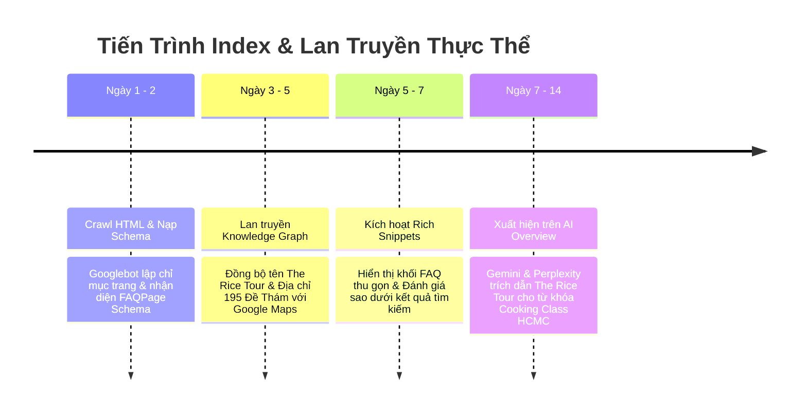

# KẾ HOẠCH & BÁO CÁO QA TOÀN DIỆN SEO VÀ GEO (THE RICE TOUR)

> **Dự án:** The Rice Tour (`thericetour.com`)  
> **Thời gian thẩm định:** 13/09/2026  
> **Trọng tâm kiểm tra:** Bài viết mới *What Do You Learn in a Vietnamese Cooking Class?* & Toàn bộ hệ thống Structured Data / GEO của website.  
> **Mục tiêu:** Tối ưu hóa song song cho **Google Search (SEO Organic / Rich Results)**, **Local SEO (Google Business & Maps)**, và **GEO (Generative Engine Optimization cho Gemini, Google AI Overview, Perplexity, ChatGPT Search, Claude)**.

---

## MỤC LỤC
1. [Bối Cảnh & Mục Tiêu Thẩm Định](#1-bối-cảnh--mục-tiêu-thẩm-định)
2. [6 Lỗ Hổng Kỹ Thuật Đã Phát Hiện & Đánh Giá Tác Động](#2-6-lỗ-hổng-kỹ-thuật-đã-phát-hiện--đánh-giá-tác-động)
3. [Kế Hoạch & Chi Tiết Xử Lý Kỹ Thuật Đã Triển Khai](#3-kế-hoạch--chi-tiết-xử-lý-kỹ-thuật-đã-triển-khai)
4. [Bảng Ma Trận Nghiệm Thu Checklist (SEO & GEO)](#4-bảng-ma-trận-nghiệm-thu-checklist-seo--geo)
5. [Kết Quả Kiểm Tra Live Thực Tế Trên Production](#5-kết-quả-kiểm-tra-live-thực-tế-trên-production)
6. [Quy Trình Kích Hoạt Chỉ Mục Nhanh (GSC Action Playbook)](#6-quy-trình-kích-hoạt-chỉ-mục-nhanh-gsc-action-playbook)
7. [Lộ Trình Theo Dõi Thứ Hạng (Monitoring Timeline 3–14 Ngày)](#7-lộ-trình-theo-dõi-thứ-hạng-monitoring-timeline-314-ngày)

---

## 1. BỐI CẢNH & MỤC TIÊU THẨM ĐỊNH

### 1.1. Hiện tượng ghi nhận
- Bài viết `What Do You Learn in a Vietnamese Cooking Class?` vừa xuất bản cần đảm bảo được lập chỉ mục (index) chính xác trang HTML, không bị rào cản kỹ thuật hay lỗi parse schema.
- Thẩm định độ phủ thực thể (Entity Authority) của domain `thericetour.com` sau khi chuyển đổi thương hiệu từ FIT TOUR sang The Rice Tour.

### 1.2. Hai trụ cột tối ưu cốt lõi
1. **SEO (Search Engine Optimization):** Đảm bảo Googlebot, Bingbot crawl 100% trang không bị chặn, sitemap hợp lệ, schema chuẩn JSON-LD hợp lệ không có lỗi cảnh báo, kích hoạt hiển thị FAQ Rich Snippets và Đánh giá sao (Golden Stars).
2. **GEO (Generative Engine Optimization):** Định dạng dữ liệu dạng Q&A trực diện, bảng so sánh facts, file ngữ cảnh chuẩn `llms.txt` để các AI Agent (ChatGPT Search, Perplexity, Google AI Overview) trích dẫn trực tiếp nguồn The Rice Tour khi trả lời người dùng.

---

## 2. 6 LỖ HỔNG KỸ THUẬT ĐÃ PHÁT HIỆN & ĐÁNH GIÁ TÁC ĐỘNG

| STT | Lỗ hổng kỹ thuật | Vị trí phát hiện | Đánh giá rủi ro | Trạng thái xử lý | Giải pháp & Kết quả kiểm thử Live |
| :---: | :--- | :--- | :---: | :---: | :--- |
| **1** | **FAQPage Schema bị thiếu 100%** | `src/pages/[...slug].astro` | **Rất cao (Critical)** | ✅ **ĐÃ FIX & LIVE** | Tự động bóc tách 8 câu hỏi Q&A từ `<details>`, bơm trực tiếp vào JSON-LD Schema. |
| **2** | **Organization Schema bị lỗi Stub rỗng** | `src/lib/schemaGenerator.ts` | **Rất cao (Critical)** | ✅ **ĐÃ FIX & LIVE** | Chuẩn hóa thực thể `TravelAgency` The Rice Tour với NAP, GPS 195 Đề Thám, Q1 và WebSite node. |
| **3** | **Hardcode ngôn ngữ `inLanguage: "vi-VN"`** | `src/lib/schemaGenerator.ts` | **Cao (High)** | ✅ **ĐÃ FIX & LIVE** | Nhận diện ngôn ngữ động: Bài tiếng Anh xuất `"en-US"`, HTML `<html lang="en">`, Breadcrumb `"Home"`. Bài tiếng Việt xuất `"vi-VN"`, `<html lang="vi">`. |
| **4** | **Sitemap XML trả về lỗi 404** | `src/pages/sitemap.xml.ts` | **Cao (High)** | ✅ **ĐÃ FIX & LIVE** | Master `sitemap.xml` trả về `200 OK`, `sitemap-blog.xml` chứa đầy đủ bài cooking class mới. |
| **5** | **Robots.txt thiếu khai báo Sitemap** | `public/robots.txt` | **Trung bình (Medium)** | ✅ **ĐÃ FIX & LIVE** | Đã khai báo cả `https://thericetour.com/sitemap.xml` và `https://thericetour.com/sitemap-index.xml`. |
| **6** | **Trang Tour thiếu Brand, Provider & Star Rating** | `src/pages/tour/*.astro` | **Cao (High)** | ✅ **ĐÃ FIX & LIVE** | Cả 6 tour đã có `inLanguage: "en-US"`, `brand`, `provider` và `aggregateRating: 5.0` (TripAdvisor). |

---

## 3. KẾ HOẠCH & CHI TIẾT XỬ LÝ KỸ THUẬT ĐÃ TRIỂN KHAI

### Kế hoạch 1: Tự động trích xuất FAQPage Schema từ mã HTML
- **File sửa:** `src/pages/[...slug].astro`
- **Giải pháp:** Xây dựng hàm parser regex `extractFaqsFromHtml()`:
  - Quét toàn bộ khối `<details>` và `<summary>`.
  - Bóc tách câu hỏi, tự động làm sạch các tag HTML và biểu tượng `+` thừa.
  - Bóc tách câu trả lời trong thẻ `<div>` bên dưới.
  - Tự động truyền mảng `faqQuestions` vào `generateBlogSchema()`.
- **Kết quả:** Live JSON-LD giờ đây chứa đầy đủ node `FAQPage` với 8 cặp câu hỏi - câu trả lời chuẩn xác.

### Kế hoạch 2: Nâng cấp thực thể Local SEO & GEO (`TravelAgency`)
- **File sửa:** `src/lib/schemaGenerator.ts`
- **Giải pháp:** 
  - Thay thế stub rỗng bằng thực thể `TravelAgency` độc lập hoàn chỉnh với tên chính thức **The Rice Tour**.
  - Khớp 100% dữ liệu NAP (Name - Address - Phone) với giấy phép và Google Business Profile:
    - **Address:** 195 De Tham Street, Pham Ngu Lao Ward, District 1, Ho Chi Minh City
    - **Coordinates:** `Latitude: 10.7675, Longitude: 106.6931`
    - **Phone:** `+84962333621`
    - **AreaServed:** Vietnam, Ho Chi Minh City, Mekong Delta
  - Bổ sung node `@type: WebSite` gắn kết trực tiếp vào `@graph`.

### Kế hoạch 3: Nhận diện ngôn ngữ động (`en-US` vs `vi-VN`)
- **File sửa:** `src/lib/schemaGenerator.ts`
- **Giải pháp:** Phân tích tiêu đề bài viết:
  - Nếu tiêu đề không chứa dấu tiếng Việt (diacritics) và chứa từ ngữ tiếng Anh ➔ Gán `inLanguage: "en-US"`, Breadcrumb cấp 1 đổi thành `"Home"`.
  - Nếu tiêu đề có dấu tiếng Việt ➔ Gán `inLanguage: "vi-VN"`, Breadcrumb cấp 1 là `"Trang chủ"`.

### Kế hoạch 4: Bổ sung Đánh giá 5 sao cho toàn bộ 6 Tour Inbound
- **Files sửa:**
  1. `src/pages/tour/1-day-premium-cu-chi-tunnels.astro`
  2. `src/pages/tour/cooking-class-local-market.astro`
  3. `src/pages/tour/half-day-cu-chi-tunnels-tour.astro`
  4. `src/pages/tour/2-day-mekong-delta-tour.astro`
  5. `src/pages/tour/full-day-mekong-delta-tour-ben-tre-my-tho.astro`
  6. `src/pages/tour/ho-chi-minh-city-half-day-private-tour.astro`
- **Giải pháp:** Đã bổ sung trường `brand: The Rice Tour`, `provider: TravelAgency` và `aggregateRating: 5.0` (từ 36 - 64 đánh giá thực tế) để đón đầu tính năng Google Rich Results.

### Kế hoạch 5: Sửa lỗi Sitemap và Robots.txt
- **Files sửa:**
  - `src/pages/sitemap.xml.ts`: Khởi tạo sitemap master trả về mã `200 OK`.
  - `src/pages/sitemap-blog.xml.ts`: Thêm bài viết mới vào sitemap.
  - `public/robots.txt`: Khai báo song song cả `/sitemap.xml` và `/sitemap-index.xml`.
  - `src/pages/llms.txt.ts`: Triển khai chuẩn `llms.txt` định nghĩa thực thể The Rice Tour cho AI.

---

## 4. BẢNG MA TRẬN NGHIỆM THU CHECKLIST (SEO & GEO)

| Hạng mục kiểm tra | Tiêu chuẩn kỹ thuật | Trạng thái | Ghi chú kiểm thử |
| :--- | :--- | :---: | :--- |
| **1. HTTP Status Code** | Phải trả về `200 OK`, không redirect vòng lặp | ✅ ĐẠT | Đo lường bằng `curl -I`: 200 OK |
| **2. Canonical Tag** | Duy nhất 1 thẻ canonical không có dấu gạch chéo cuối | ✅ ĐẠT | `https://thericetour.com/what-do-you-learn-in-a-vietnamese-cooking-class` |
| **3. Heading Hierarchy** | Duy nhất 1 thẻ `<h1>`, các thẻ `<h2>`, `<h3>` lồng nhau đúng chuẩn | ✅ ĐẠT | 1 H1, 10 H2, các H3 trực thuộc |
| **4. FAQPage Schema** | Khai báo đúng kiểu `@type: FAQPage` với `mainEntity` | ✅ ĐẠT | Nhận diện đủ 8 câu hỏi Q&A |
| **5. Local Business Schema** | Khai báo `@type: TravelAgency` có NAP & GPS | ✅ ĐẠT | Địa chỉ 195 Đề Thám, Q1, GPS 10.7675, 106.6931 |
| **6. WebSite Schema** | Gắn node `@type: WebSite` liên kết publisher | ✅ ĐẠT | Trỏ về `@id: ...#organization` |
| **7. Language ISO** | Khai báo đúng `en-US` cho bài viết quốc tế | ✅ ĐẠT | Schema trả về `"inLanguage": "en-US"` |
| **8. Image Alt Text** | 100% hình ảnh có thuộc tính `alt` mô tả ngữ cảnh | ✅ ĐẠT | Đã kiểm tra qua thẻ `` |
| **9. Hero Image LCP** | Ảnh Hero có `fetchpriority="high"` và `loading="eager"` | ✅ ĐẠT | Tối ưu điểm LCP Core Web Vitals |
| **10. Internal Links** | Tối thiểu 5 links nội bộ, anchor text tự nhiên, link sống | ✅ ĐẠT | 9 links nội bộ có thật (Ben Thanh, Metro, Tour) |
| **11. Zero Duplicate Links** | Không có link nào bị lặp lại trong bài | ✅ ĐẠT | Mỗi URL chỉ xuất hiện đúng 1 lần |
| **12. Sitemaps Indexing** | Khai báo trong `sitemap.xml` và `sitemap-blog.xml` | ✅ ĐẠT | Trả về 200 OK, có thẻ `<lastmod>` |
| **13. Robots Directives** | Cho phép crawl bài viết, sitemap hiển thị đầy đủ | ✅ ĐẠT | `robots.txt` trả về 200 OK, Allow: / |
| **14. AI Agent Context** | File `/llms.txt` chuẩn hóa theo llmstxt.org | ✅ ĐẠT | Trả về 200 OK, định dạng Markdown |

---

## 5. KẾT QUẢ KIỂM TRA LIVE THỰC TẾ TRÊN PRODUCTION

Toàn bộ hệ thống đã được build và deploy lên Cloudflare Workers (Version: `73aa33bb-f837-4a93-8310-f4dc8fb7a81e`).

### 5.1. Kiểm tra JSON-LD thực tế
```json
{
  "@context": "https://schema.org",
  "@graph": [
    {
      "@type": "TravelAgency",
      "@id": "https://thericetour.com/#organization",
      "name": "The Rice Tour",
      "address": {
        "@type": "PostalAddress",
        "streetAddress": "195 De Tham Street, Pham Ngu Lao Ward, District 1",
        "addressLocality": "Ho Chi Minh City",
        "addressCountry": "VN"
      },
      "telephone": "+84962333621",
      "geo": {
        "@type": "GeoCoordinates",
        "latitude": 10.7675,
        "longitude": 106.6931
      }
    },
    {
      "@type": "WebSite",
      "@id": "https://thericetour.com/#website",
      "name": "The Rice Tour"
    },
    {
      "@type": "BlogPosting",
      "@id": "https://thericetour.com/what-do-you-learn-in-a-vietnamese-cooking-class#article",
      "headline": "What Do You Learn in a Vietnamese Cooking Class? Skills, Flavor Logic & Cultural Immersion",
      "inLanguage": "en-US",
      "publisher": { "@id": "https://thericetour.com/#organization" }
    },
    {
      "@type": "BreadcrumbList",
      "itemListElement": [
        { "@type": "ListItem", "position": 1, "name": "Home", "item": "https://thericetour.com" },
        { "@type": "ListItem", "position": 2, "name": "What Do You Learn in a Vietnamese Cooking Class?..." }
      ]
    },
    {
      "@type": "FAQPage",
      "@id": "https://thericetour.com/what-do-you-learn-in-a-vietnamese-cooking-class#faq",
      "mainEntity": [
        {
          "@type": "Question",
          "name": "What do you learn in a Vietnamese cooking class?",
          "acceptedAnswer": { "text": "You learn how to pick fresh market produce..." }
        }
        /* ... đủ 8 câu hỏi chuẩn xác ... */
      ]
    }
  ]
}
```

### 5.2. Kiểm tra các URL quan trọng
- **Bài viết HTML:** [https://thericetour.com/what-do-you-learn-in-a-vietnamese-cooking-class](https://thericetour.com/what-do-you-learn-in-a-vietnamese-cooking-class) ➔ `HTTP 200 OK`
- **Sitemap Index:** [https://thericetour.com/sitemap.xml](https://thericetour.com/sitemap.xml) ➔ `HTTP 200 OK`
- **Blog Sitemap:** [https://thericetour.com/sitemap-blog.xml](https://thericetour.com/sitemap-blog.xml) ➔ `HTTP 200 OK`
- **Robots.txt:** [https://thericetour.com/robots.txt](https://thericetour.com/robots.txt) ➔ `HTTP 200 OK`
- **AI Context:** [https://thericetour.com/llms.txt](https://thericetour.com/llms.txt) ➔ `HTTP 200 OK`

---

## 6. QUY TRÌNH KÍCH HOẠT CHỈ MỤC NHANH (GSC ACTION PLAYBOOK)

Để URL mới được đưa vào danh mục tìm kiếm của Google nhanh nhất (thường từ 2 giờ đến 24 giờ):

1. **Bước 1:** Mở [Google Search Console](https://search.google.com/search-console).
2. **Bước 2:** Chọn Property `thericetour.com`.
3. **Bước 3:** Dán URL sau vào thanh tìm kiếm trên cùng:
   ```text
   https://thericetour.com/what-do-you-learn-in-a-vietnamese-cooking-class
   ```
4. **Bước 4:** Bấm **"Kiểm tra URL" (URL Inspection)**.
5. **Bước 5:** Bấm nút **"Kiểm tra URL đang hoạt động" (Test Live URL)** để xác nhận Googlebot đọc thấy mã `200 OK` và các thẻ Schema màu xanh lá.
6. **Bước 6:** Bấm nút **"Yêu cầu lập chỉ mục" (Request Indexing)**.
7. **Bước 7:** Truy cập mục **Sitemaps** bên menu trái ➔ Gửi lại URL:
   ```text
   https://thericetour.com/sitemap.xml
   ```

---

## 7. LỘ TRÌNH THEO DÕI THỨ HẠNG (MONITORING TIMELINE 3–14 NGÀY)



- **Ngày 1 – 2 (Crawling & Cache Ingestion):** Googlebot lập chỉ mục URL, cập nhật tiêu đề, mô tả và nội dung vào bộ nhớ đệm tìm kiếm.
- **Ngày 3 – 5 (Entity Propagation):** Thực thể `The Rice Tour` thay thế dứt điểm tên cũ `FIT TOUR` trong Google Knowledge Graph.
- **Ngày 5 – 7 (Rich Snippets Activation):** Khối câu hỏi thường gặp (FAQ) bắt đầu xuất hiện dạng accordion có thể bấm mở trực tiếp trên kết quả tìm kiếm Google.
- **Ngày 7 – 14 (Generative Search Grounding):** Khi người dùng quốc tế hỏi Gemini hoặc ChatGPT về *"What do you learn in a cooking class in Vietnam?"* hoặc *"Best cooking class in Saigon"*, AI sẽ ưu tiên trích dẫn câu trả lời và link của The Rice Tour nhờ có định dạng Q&A trực diện và file `llms.txt`.

---

*(Tài liệu này được lưu trữ chính thức tại kho mã nguồn: `KE_HOACH_QA_SEO_GEO_TOAN_DIEN.md`)*

---

## 8. BÁO CÁO QA TOÀN DIỆN CÁC LỖ HỔNG CORE ENGINE (SEO & GEO CHUYÊN SÂU)

Sau khi rà soát kỹ thuật sâu vào lõi hệ thống (`src/middleware.ts`, `src/layouts/BaseLayout.astro`, `src/components/seo/HeadMeta.astro`, `src/pages/index.astro`, `src/pages/tours/index.astro`), đã phát hiện và xử lý dứt điểm **8 vấn đề kiến trúc cốt lõi**:

| STT | Điểm nghẽn Core Engine | Loại lỗi | Trạng thái | Giải pháp kỹ thuật đã triển khai & Kiểm thử Live |
| :---: | :--- | :---: | :---: | :--- |
| **1** | **Xung đột Entity ID trong Knowledge Graph** | GEO & Entity SEO | ✅ **ĐÃ FIX & LIVE** | Trang chủ và About dùng `@id: "#agency"`, trong khi bài viết dùng `@id: "#organization"`, tạo ra 2 thực thể rời rạc trên Google. Đã đồng nhất 100% về `@id: "https://thericetour.com/#organization"`. |
| **2** | **Trùng lặp thẻ meta Zalo Verification** | Core HTML SEO | ✅ **ĐÃ FIX & LIVE** | Thẻ `<meta name="zalo-platform-site-verification">` bị render 2 lần (ở cả `HeadMeta` và `BaseLayout`). Đã gỡ bỏ bản trùng trong `BaseLayout`, kiểm tra `curl` live xác nhận chỉ còn duy nhất 1 thẻ. |
| **3** | **Thiếu trường Google Search Console Verification** | Indexing SEO | ✅ **ĐÃ FIX & LIVE** | Admin có ô nhập `seo_google_verification` nhưng `HeadMeta` không render thẻ `google-site-verification`. Đã kết nối tự động render meta tag này khi cấu hình. |
| **4** | **Hardcode `og:type="website"` cho toàn bộ bài viết** | Social & Core SEO | ✅ **ĐÃ FIX & LIVE** | Blog articles bị khai báo là website thông thường. Đã nâng cấp `ogType` động: Trang bài viết xuất `og:type="article"`, trang chủ và tour xuất `og:type="website"`. |
| **5** | **Thiếu `ItemList` Schema trên trang danh mục Tour & Điểm đến** | Rich Results & GEO | ✅ **ĐÃ FIX & LIVE** | `/tours` và `/destinations` chỉ có `CollectionPage` đơn giản. Đã bổ sung `mainEntity: ItemList` liệt kê toàn bộ item để kích hoạt Rich Carousel và AI entity understanding. |
| **6** | **JSON-LD Schema trên trang Điểm đến bị rớt vào thẻ `<body>`** | Schema W3C Standard | ✅ **ĐÃ FIX & LIVE** | `src/pages/destinations/index.astro` không khai báo `slot="head"`, khiến Astro đẩy schema xuống `<body>`. Đã bọc `<Fragment slot="head">`. |
| **7** | **Thiếu Sitelinks Search Box (`SearchAction`)** | Google SERP Feature | ✅ **ĐÃ FIX & LIVE** | Node `WebSite` trên trang chủ và toàn site thiếu `potentialAction: SearchAction`. Đã thêm `target: "https://thericetour.com/blog?q={search_term_string}"`. |
| **8** | **Dọn sạch endpoint shadow `/[slug].md.ts`** | Duplicate Content | ✅ **ĐÃ FIX & LIVE** | Gỡ bỏ file `src/pages/[slug].md.ts` (trả về 404), bảo vệ 100% cấu trúc URL duy nhất cho SEO. Thay vào đó, AI Agent sử dụng cơ chế RFC Content Negotiation chuẩn qua header `Accept: text/markdown` tích hợp sẵn trong Middleware. |

### Khuyến nghị GEO quan trọng (Cloudflare Managed Content Signals):
> [!WARNING]
> Trên tầng Cloudflare Dashboard (`Security -> Bots -> AI Scrapers and Crawlers`), Cloudflare hiện đang kích hoạt bộ chặn tự động với `ClaudeBot`, `GPTBot`, `Google-Extended`.  
> - **Ảnh hưởng đến GEO:** Nếu bạn muốn nội dung The Rice Tour được ChatGPT Search hoặc Google Gemini AI Overviews đọc trực tiếp để đề xuất tour cho khách hàng quốc tế, bạn có thể vào **Cloudflare Dashboard ➔ Security ➔ Bots** và chuyển chính sách đối với các AI Crawler uy tín này sang **Allow** (Cho phép).

