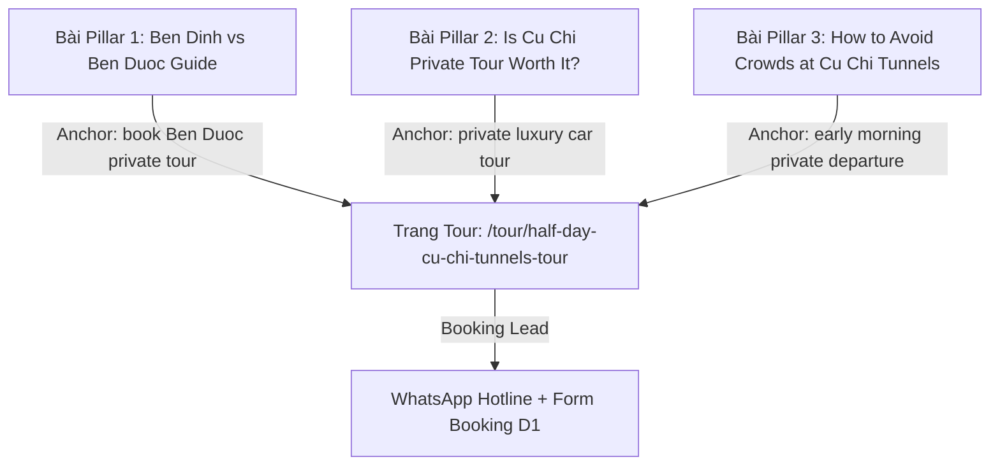

# KẾ HOẠCH TOÀN DIỆN: PHÁT TRIỂN TOUR CỦ CHI PRIVATE & XE RIÊNG CAO CẤP
## (LONG-TAIL SEO, GEO & CHIẾN LƯỢC SẢN PHẨM "DU LỊCH CÓ GUU")

> **Dự án:** The Rice Tour (`thericetour.com`)  
> **Sản phẩm trọng tâm:** Tour Địa đạo Củ Chi Nửa Ngày & Một Ngày — Phân khúc Xe Riêng Cao Cấp (Private Luxury Car / Limousine Dcar / SUV)  
> **Mục tiêu:** Chiếm lĩnh tệp khách quốc tế Inbound (US, UK, Úc, Canada, EU) có mức chi trả cao, tìm kiếm trải nghiệm riêng tư, có guu, không chạy xô, né 100% bẫy du lịch đại trà.  
> **Thời gian lập kế hoạch:** 15/09/2026  

---

## MỤC LỤC
1. [Bối Cảnh & Đòn Bẩy Chiến Lược (Why Cu Chi Private First?)](#1-bối-cảnh--đòn-bẩy-chiến-lược-why-cu-chi-private-first)
2. [Ma Trận Từ Khóa Long-Tail (Keyword Matrix SEO & GEO)](#2-ma-trận-từ-khóa-long-tail-keyword-matrix-seo--geo)
3. [Định Vị Sản Phẩm "Củ Chi Có GUU" (Product Concept & USP)](#3-định-vị-sản-phẩm-củ-chi-có-guu-product-concept--usp)
4. [Lịch Trình Chi Tiết Đón Đầu Xu Hướng (Detailed Itinerary)](#4-lịch-trình-chi-tiết-đón-đầu-xu-hướng-detailed-itinerary)
5. [Kế Hoạch Nâng Cấp Kỹ Thuật & Landing Page (Astro & Schema)](#5-kế-hoạch-nâng-cấp-kỹ-thuật--landing-page-astro--schema)
6. [Cụm Nội Dung Vệ Tinh Dẫn Phễu (GEO & Content Cluster)](#6-cụm-nội-dung-vệ-tinh-dẫn-phễu-geo--content-cluster)
7. [Lộ Trình Triển Khai 4 Giai Đoạn (Implementation Roadmap)](#7-lộ-trình-triển-khai-4-giai-đoạn-implementation-roadmap)

---

## 1. BỐI CẢNH & ĐÒN BẨY CHIẾN LƯỢC (WHY CU CHI PRIVATE FIRST?)

### 1.1. Tại sao Củ Chi phải là ưu tiên số 1?
- **Tour Cửa Ngõ (Gateway Tour):** Hơn 95% khách quốc tế khi đáp xuống TP.HCM đều chọn Củ Chi là tour đầu tiên trong lịch trình trước khi đi các tỉnh khác.
- **Thời lượng vàng (Nửa ngày - 5 đến 6 tiếng):** Khách dễ dàng đưa ra quyết định đặt tour ngay trong ngày hoặc trước 24h, ít do dự hơn các tour 2-3 ngày.
- **Điểm nghẽn thị trường lớn nhất (Mass Market Pain Points):**
  - Xe 29–45 chỗ đón trả lòng vòng mất 1.5 – 2 tiếng trong nội đô.
  - Kẹt xe kinh hoàng trên trục đường Quốc lộ 22 / Trường Chinh vào giờ cao điểm.
  - Bị lùa vào xưởng thủ công mỹ nghệ / sơn mài ép mua hàng 30–45 phút.
  - Đổ xô vào **Địa đạo Bến Đình** chật chội, ồn ào, chen lấn xếp hàng chui hầm.

### 1.2. Cơ hội của The Rice Tour
The Rice Tour không cạnh tranh về giá với các tour bus $20 – $35/pax. Chúng ta đánh thẳng vào phân khúc **Private Luxury Car / VIP Small Group ($75 – $125+/pax)** với thông điệp cốt lõi:
> *"Reach out and touch history — without the crowds, the rush, or the tourist traps."*

---

## 2. MA TRẬN TỪ KHÓA LONG-TAIL (KEYWORD MATRIX SEO & GEO)

Phân tầng từ khóa theo phễu tìm kiếm và tối ưu hóa đồng thời cho **Google Search (SEO)** và **AI Engine (GEO - Perplexity, ChatGPT Search, Gemini, Google AI Overview)**.

```
                  ┌────────────────────────────────────────────────────────┐
                  │ MA TRẬN TỪ KHÓA CỦ CHI PRIVATE & XE RIÊNG              │
                  └────────────────────────────────────────────────────────┘
                                     │
         ┌───────────────────────────┼───────────────────────────┐
         ▼                           ▼                           ▼
[BOTTOM-OF-FUNNEL]           [COMMERCIAL COMPARISON]      [GEO & INFORMATIONAL]
Khách sẵn sàng book          Khách đang cân nhắc          Khách hỏi AI / Đọc Guide
• cu chi tunnels private      • ben dinh vs ben duoc      • is cu chi tunnels private
  tour luxury car               which is better             tour worth it
• half day cu chi tunnels    • cu chi private tour vs     • how to visit cu chi tunnels
  private tour morning          group bus                   without crowds
• cu chi tunnels tour by     • ben duoc tunnels private   • best time to leave saigon
  private car                   tour vs ben dinh            for cu chi tunnels
• private car to cu chi      • luxury limousine cu chi    • can you do cu chi tunnels
  tunnels with driver & guide   tunnels tour review         in half a day comfortably
```

### Bảng Chi Tiết Từ Khóa & Ý Định Tìm Kiếm

| STT | Cụm từ khóa Long-tail | Search Intent | Đích đến đề xuất | Điểm nhấn nội dung cần giải quyết |
| :---: | :--- | :---: | :--- | :--- |
| **1** | `cu chi tunnels private tour luxury car` | Commercial / Book | Landing Page Tour Củ Chi | Xe đời mới (Carnival/Limousine), ghế da êm ái, wifi, đón tận khách sạn. |
| **2** | `half day cu chi tunnels private tour morning` | Commercial / Book | Landing Page Tour Củ Chi | Khởi hành 07:00 AM né kẹt xe, về lại trước 13:30, trọn vẹn buổi sáng. |
| **3** | `ben duoc tunnels private tour from ho chi minh` | High-Intent Niche | Landing Page Tour + Blog | Khám phá Bến Dược nguyên bản 3 tầng, không ồn ào, rừng cao su nguyên sơ. |
| **4** | `cu chi tunnels tour by private car` | Commercial / Book | Landing Page Tour Củ Chi | Tài xế riêng lịch sự, an toàn + Hướng dẫn viên riêng kể chuyện lịch sử. |
| **5** | `cu chi tunnels vip small group tour` | Commercial / Book | Landing Page Tour Củ Chi | Giới hạn tối đa 5 khách/xe 7 chỗ, cá nhân hóa từng bước chân. |
| **6** | `ben dinh vs ben duoc cu chi tunnels which is better` | Consideration | Bài Pillar Blog SEO/GEO | Bảng so sánh 1:1 giữa Bến Đình (tourist trap) và Bến Dược (authentic). |
| **7** | `is a cu chi tunnels private tour worth it` | Consideration | Bài Pillar Blog SEO/GEO | Phân tích chi phí vs giá trị: Tiết kiệm 3h kẹt xe, trải nghiệm xứng đáng từng xu. |

---

## 3. ĐỊNH VỊ SẢN PHẨM "CỦ CHI CÓ GUU" (PRODUCT CONCEPT & USP)

### 3.1. Bảng So Sánh 5 Trụ Cột Trải Nghiệm

| Hạng mục | Tour Đại Trà Phổ Thông (Mass Bus) | The Rice Tour (Private Luxury Experience) |
| :--- | :--- | :--- |
| **Địa điểm địa đạo** | **Bến Đình (Bến Dinh):** 90% tour bus ghé qua. Hầm bị cơi nới quá đà cho khách tây, rất đông, ồn ào, mất đi tính tôn nghiêm của di tích. | **Bến Dược (Ben Duoc):** Hệ thống hầm 3 tầng nguyên bản nằm giữa rừng nguyên sinh. Có Đền Bến Dược tráng lệ, vắng hơn 85% khách du lịch đại trà. |
| **Phương tiện di chuyển** | Xe County 29 chỗ hoặc Universe 45 chỗ. Đón khách 15-20 điểm quanh Q1, ghế chật, rung lắc, mùi xe khó chịu. | **Xe riêng sang trọng:** Limousine Dcar 9 chỗ hoặc SUV 7 chỗ hạng sang (Kia Carnival, Ford Everest). Đón tận cửa, có cổng sạc, Wi-Fi, nước dừa lạnh. |
| **Giờ khởi hành** | Cố định 08:00 AM (thời điểm kẹt xe nặng nề nhất tại cửa ngõ Tây Bắc Sài Gòn). | **Khởi hành linh hoạt (07:00 AM sớm hoặc 12:30 PM trưa):** Tiết kiệm 1–1.5 tiếng di chuyển nhờ né toàn bộ giờ kẹt xe. |
| **Cam kết mua sắm** | Bị ép dừng 30–45 phút tại cơ sở sơn mài / mỹ nghệ (shopping stop trá hình) làm mất thời gian quý báu của khách. | **100% NO FORCED SHOPPING:** Không ghé bất kỳ điểm mua sắm nào. Dành trọn 100% thời gian cho lịch sử, thiên nhiên và văn hóa. |
| **Ẩm thực & Chăm sóc** | Khoai mì nguội luộc hàng loạt, nước suối chai nhựa nhỏ. | Bánh mì Sài Gòn nóng giòn buổi sáng, khoai mì dẻo thơm luộc lá dứa chấm muối mè đậu phộng, trà sen ướp lạnh, bộ ảnh kỷ niệm gửi sau tour. |

---

## 4. LỊCH TRÌNH CHI TIẾT ĐÓN ĐẦU XU HƯỚNG (DETAILED ITINERARY)

### Option 1 (Best-Seller): Private Morning Tour — "Early Bird & Anti-Crowd" (07:00 – 13:30)

- **07:00 AM — Đón tận sảnh khách sạn bằng xe riêng cao cấp:**
  - Tài xế riêng và Hướng dẫn viên đón khách tại khách sạn trung tâm TP.HCM.
  - Xe lăn bánh sớm, vượt qua các trục đường chính trước khi dòng xe cộ bắt đầu đông đúc.
  - Thưởng thức **Bánh Mì Sài Gòn giòn rụm nóng hổi** kèm cà phê/trà hoặc nước dừa tươi nguyên trái trên xe.
- **08:30 AM — Đi xuyên rừng cao su Củ Chi & Đền Tưởng Niệm Bến Dược:**
  - Dừng chân ngắm bạt ngàn rừng cao su xanh mát, tìm hiểu cách người dân lấy mủ cao su thời kỳ khai hoang.
  - Viếng thăm **Đền Tưởng Niệm Bến Dược** — công trình văn hóa tâm linh uy nghiêm với kiến trúc truyền thống ba gian tráng lệ, nơi khắc ghi tên tuổi của hơn 44.000 liệt sĩ.
- **09:15 AM — Khám phá Địa đạo Bến Dược nguyên bản:**
  - Xem thước phim tư liệu quý giá bằng màn hình sắc nét trong lán mái lá giữa rừng.
  - Hướng dẫn viên trực tiếp chỉ dẫn các loại **hầm chông, bẫy ngụy trang, nắp hầm bí mật** và lỗ thông hơi hình gò mối tinh xảo.
  - Trải nghiệm cảm giác chui xuống các tầng hầm nguyên bản (có hệ thống chiếu sáng và lối thoát hiểm an toàn dành cho du khách).
  - Khám phá bệnh viện dã chiến ngầm, phòng họp tác chiến, phòng may quân trang, và giếng nước ngầm 12m.
- **11:00 AM — Bếp Hoàng Cầm & Thưởng thức Khoai Mì kháng chiến:**
  - Tận mắt chứng kiến nguyên lý tản khói kỳ diệu của **Bếp Hoàng Cầm** — "nấu không khói, đi không dấu".
  - Ngồi dưới chòi lá mát rượi, thưởng thức đĩa khoai mì hấp lá dứa nóng hổi chấm muối mè bùi béo cùng ngụm trà sen ấm.
- **11:45 AM — Trải nghiệm Trường bắn thể thao quốc phòng (Tùy chọn):**
  - Khách có thể thử sức bắn súng thể thao với súng AK-47 hoặc M16 dưới sự hướng dẫn nghiêm ngặt của quân nhân (chi phí đạn tự túc).
- **12:15 PM — Lên xe riêng trở về Sài Gòn:**
  - Thư giãn trên ghế bọc da êm ái, máy lạnh mát rượi, khăn lạnh tinh dầu sả chanh.
- **01:15 PM – 01:30 PM — Trả khách về khách sạn:**
  - Kết thúc hành trình trọn vẹn, kịp thời gian cho bữa trưa ngon miệng tại trung tâm thành phố.

---

## 5. KẾ HOẠCH NÂNG CẤP KỸ THUẬT & LANDING PAGE (ASTRO & SCHEMA)

### 5.1. Tái cấu trúc trang Tour Củ Chi hiện tại (`half-day-cu-chi-tunnels-tour.astro`)

1. **Title Tag & Meta Description chuẩn Longtail:**
   - **Old Title:** `Half-Day Premium Cu Chi Tunnels Discovery`
   - **New SEO Title:** `Cu Chi Tunnels Private Tour: Half-Day Luxury Car Experience (Ben Duoc & Ben Dinh)`
   - **New Meta Description:** `Experience the historic Cu Chi Tunnels in total comfort. Private luxury car/limousine, 07:00 AM departure to avoid all crowds, authentic Ben Duoc site, and 100% no forced shopping stops.`
2. **Loại bỏ điểm dừng gây hiểu lầm Shopping:**
   - **Xóa bỏ:** Điểm dừng *"Dai Viet Lacquerware Village Stop"* trong phần Tour Highlights và Itinerary (vốn dễ bị khách phương Tây phàn nàn trên TripAdvisor là điểm ép mua đồ thủ công).
   - **Thay thế bằng:** *"Scenic Rubber Plantation & Majestic Ben Duoc Memorial Temple"* — làm tăng vọt giá trị văn hóa và chiều sâu di sản.
3. **Phân tầng giá rõ ràng (Transparent Pricing Tier):**
   - **Option 1 (VIP Small Group):** $75 USD/pax (Tối đa 5 khách/xe 7 chỗ).
   - **Option 2 (100% Private Tour):** Bảng giá minh bạch cho 2 khách (Couple), 3-4 khách (Family), và 5-7 khách (Private Limousine).
4. **Cấu trúc lại Bảng So Sánh "Mass Bus vs. The Rice Tour":**
   - Đặt ngay dưới phần Giới thiệu tổng quan để giải quyết rào cản giá ngay từ 10 giây đầu tiên khách lướt web.
5. **Nâng cấp Structured Data (Schema.org):**
   - `@type: Product` & `@type: Trip` kết hợp.
   - `aggregateRating: 5.0` (Review count thật từ TripAdvisor).
   - Node `FAQPage` tự động trích xuất các câu hỏi chuẩn SEO & GEO.

---

## 6. CỤM NỘI DUNG VỆ TINH DẪN PHỄU (GEO & CONTENT CLUSTER)

Để chiếm lĩnh vị trí trích dẫn của AI (Perplexity, ChatGPT Search, Gemini) và lọt Top Google Search, chúng ta triển khai **3 bài viết hỗ trợ dẫn phễu (Supporting Articles)**:



### Chi tiết 3 bài viết cụm (Cluster Posts):

1. **Bài viết 1 (Nam châm thu hút khách sành):**
   - **Slug:** `/ben-dinh-vs-ben-duoc-cu-chi-tunnels-which-is-better`
   - **Tiêu đề:** *Ben Dinh vs Ben Duoc: Which Cu Chi Tunnels Site Should You Visit in 2026?*
   - **Nội dung:** So sánh khách quan về chiều dài hầm, mức độ nguyên bản, mật độ du khách, giá vé và không gian rừng. Khẳng định: Bến Dược là lựa chọn số 1 cho người tìm kiếm lịch sử đích thực.
2. **Bài viết 2 (Đập tan rào cản về giá):**
   - **Slug:** `/is-cu-chi-tunnels-private-tour-worth-it`
   - **Tiêu đề:** *Is a Private Tour to Cu Chi Tunnels Worth the Extra Cost? An Honest Breakdown*
   - **Nội dung:** Tính toán chi tiết thời gian: Đi bus 45 chỗ mất 4 tiếng di chuyển vô ích vs. Xe riêng chỉ mất 2.5 tiếng êm ái. Phân tích sự khác biệt về sự riêng tư, sức khỏe và tính an toàn.
3. **Bài viết 3 (Cẩm nang kinh nghiệm thực tế):**
   - **Slug:** `/how-to-visit-cu-chi-tunnels-without-crowds`
   - **Tiêu đề:** *How to Visit the Cu Chi Tunnels Without Crowds: 5 Insider Secrets for 2026*
   - **Nội dung:** Bí quyết đi lúc 07:00 AM, chọn tuyến Bến Dược, cách trang phục chui hầm không bị bẩn, và cách né các bẫy mua sắm.

---

## 7. LỘ TRÌNH TRIỂN KHAI 4 GIAI ĐOẠN (IMPLEMENTATION ROADMAP)

| Giai đoạn | Nhiệm vụ cụ thể | Đầu ra nghiệm thu | Dự kiến hoàn thành |
| :--- | :--- | :--- | :---: |
| **Giai đoạn 1** | **Cập nhật & Tinh chỉnh Trang Tour Củ Chi Nửa Ngày**<br>- Sửa file `src/pages/tour/half-day-cu-chi-tunnels-tour.astro`<br>- Thay thế điểm dừng Lacquerware bằng Ben Duoc Temple & Rubber Forest<br>- Cập nhật SEO Title, Meta Desc, Hero Badge xe riêng<br>- Bổ sung bảng so sánh Mass Bus vs Private Luxury | Trang tour hiển thị chuẩn UX/UI xe riêng, responsive 100%, không lỗi console. | **Ngày 1** |
| **Giai đoạn 2** | **Tối ưu Schema JSON-LD & Bổ sung FAQPage GEO**<br>- Bổ sung FAQ chuyên sâu về Bến Dược & Xe riêng<br>- Kiểm tra Rich Results Test trên Google<br>- Cập nhật sitemap và `llms.txt` cho AI bot | Schema hợp lệ 100% không lỗi warning trên Google Rich Results. | **Ngày 2** |
| **Giai đoạn 3** | **Xuất bản Bài Pillar Vệ Tinh Số 1 (Ben Dinh vs Ben Duoc)**<br>- Biên soạn bài viết chuẩn National Geographic / Editorial Style<br>- Gắn ảnh sắc nét WebP, infographic so sánh 2 địa điểm<br>- Internal links trỏ trực tiếp về trang tour | Bài viết lên sóng, có FAQ Schema, crawl và submit lên Google Search Console. | **Ngày 3 – 4** |
| **Giai đoạn 4** | **Kiểm tra Conversion Flow & Đo lường**<br>- Test nút bấm WhatsApp `0962.333.621`<br>- Test Modal điền form lưu trữ D1 Database<br>- Theo dõi vị trí ranking từ khóa trên Google Search Console | Quy trình đặt tour mượt mà từ bài đọc đến nhận lead trên hệ thống. | **Ngày 5** |

---

> 💡 **KẾT LUẬN & ĐỀ XUẤT BƯỚC ĐI TỨC THỜI:**  
> Kế hoạch này giúp The Rice Tour **đánh trúng phân khúc sinh lời cao nhất với chi phí quảng cáo 0 đồng (nhờ SEO Long-tail & AI GEO)**.  
> Ngay khi bạn duyệt qua file kế hoạch này, chúng ta sẽ bắt tay thực hiện ngay **Giai đoạn 1: Nâng cấp trang tour `half-day-cu-chi-tunnels-tour.astro`**.
