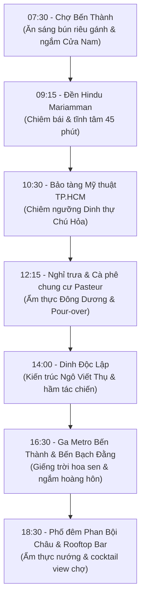

# Lộ Trình Đi Bộ 1 Ngày Quanh Bến Thành: Di Sản, Cà Phê Cổ & Hoàng Hôn Bến Bạch Đằng

> *“Cách duy nhất để thấu cảm linh hồn của một đô thị không phải là nhìn ngắm nó qua khung kính kín mít của những chiếc xe hơi máy lạnh, mà là đặt từng bước chân trần thực xuống những vỉa hè rợp bóng cây cổ thụ. Đi để nghe tiếng chuông chùa thanh thản, để ngửi thấy mùi khói cà phê rang xay thơm nồng từ những chung cư trăm tuổi, và để đón làn gió mát rượi thổi vào từ dòng sông Sài Gòn lúc chiều buông.”*

Là một hợp phần cốt lõi trong hệ thống [những địa điểm nổi tiếng quanh Bến Thành](/dia-diem-noi-tieng-quanh-ben-thanh), **Lộ trình tản bộ di sản 1 ngày (One-Day Heritage Walking Tour)** được The Rice Tour thiết kế khoa học nhằm giúp du khách tận hưởng trọn vẹn những gì tinh túy nhất của trung tâm Quận 1 mà không hề cảm thấy hối hả hay kiệt sức dưới khí hậu nhiệt đới phương Nam.

---

## 🌟 Những Con Số Ấn Tượng Của Cung Đường

- **6 di sản & công trình kiến trúc biểu tượng:** Kết nối liên hoàn Chợ Bến Thành, [Đền Hindu Mariamman](/den-hindu-mariamman-sai-gon), [Bảo tàng Mỹ thuật TP.HCM](/bao-tang-my-thuat-tphcm), [Dinh Độc Lập](/dinh-doc-lap-sai-gon), [Ga ngầm Metro Bến Thành](/ga-ngam-metro-ben-thanh) và Bến Bạch Đằng.
- **3 trường phái kiến trúc kinh điển:** Dẫn dắt bạn đi qua phong cách Thuộc địa Pháp (Colonial), Art Deco Đông Dương thập niên 1930 và Hiện đại nhiệt đới (Tropical Modernism) thập niên 1960.
- **Dưới 15 phút đi bộ:** Khoảng cách tối đa giữa các điểm dừng chân liên tiếp trong hành trình, luôn có bóng mát của các hàng cây dầu và sao đen cổ thụ che chở.
- **1 hoàng hôn tuyệt mỹ:** Điểm kết ngoạn mục tại công viên bờ sông Bến Bạch Đằng ngắm nhìn mặt trời lặn sau các tòa nhà chọc trời của bán đảo Thủ Thiêm.

---

## Triết Lý Du Hành: Khám Phá Sài Gòn Bằng Bước Chân Chậm

Tại sao lại là đi bộ? Trung tâm Quận 1 sở hữu một mật độ di sản dày đặc mà việc di chuyển bằng xe máy hay taxi sẽ vô tình tước đi của bạn những chi tiết quý giá: một bức phù điêu gốm Biên Hòa ẩn dưới mái ngói chợ cũ, một cánh cửa gỗ lá sách màu xanh rêu trong con hẻm nhỏ, hay mùi hương trầm nồng ấm thoảng ra từ một ngôi đền cổ bên góc đường Trương Định.

  

<blockquote class="instagram-media" data-instgrm-captioned data-instgrm-permalink="https://www.instagram.com/p/Dcz0lOyEhXG/?utm_source=ig_embed&utm_campaign=loading" data-instgrm-version="14" style="background:#FFF; border:0; border-radius:3px; box-shadow:0 0 1px 0 rgba(0,0,0,0.5),0 1px 10px 0 rgba(0,0,0,0.15); margin: 1px; max-width:540px; min-width:326px; padding:0; width:99.375%;">
  

    <a href="https://www.instagram.com/p/Dcz0lOyEhXG/?utm_source=ig_embed&utm_campaign=loading" target="_blank">Xem bài viết này trên Instagram</a>
  

</blockquote>

  

Lộ trình được sắp xếp nương theo nhịp điệu của mặt trời phương Nam: buổi sáng sớm nắng êm đềm dành cho chợ và đền đài; giữa trưa oi ả được nép mình trong các phòng trưng bày máy lạnh của bảo tàng và quán cà phê chung cư cổ; buổi chiều mát dịu dành cho công viên Dinh Độc Lập và sông nước Bạch Đằng; buổi tối hòa mình vào phố đêm sôi động.

---

## Chi Tiết Lộ Trình 4 Chặng: Từ Bình Minh Đến Đêm Đô Thị

### Chặng 1 (07:30 – 10:15): Đón Bình Minh Sạp Chợ & Nốt Lặng Tâm Linh
- **07:30 – 09:00:** Bắt đầu ngày mới tại Cửa Đông Chợ Bến Thành. Thưởng thức tô [bún riêu gánh Bến Thành](/am-thuc-cho-ben-thanh) nóng hổi đậm đà hương vị cua đồng. Sau đó dạo bước quanh Cửa Nam ngắm tháp đồng hồ 1914 và chiêm ngưỡng các bức phù điêu gốm Biên Hòa dưới ánh nắng sớm tinh khôi.
- **09:15 – 10:15:** Tản bộ 200m qua đường Trương Định viếng **Đền Hindu Mariamman**. Cởi bỏ giày dép nơi ngưỡng cửa, hít thở hương trầm nồng ấm và ngắm nhìn tháp Gopuram rực rỡ tượng thần Hindu chạm khắc thủ công.

### Chặng 2 (10:30 – 13:45): Không Gian Nghệ Thuật & Quán Cà Phê Chung Cư Cổ
- **10:30 – 12:00:** Đi bộ 350m qua đường Lê Thị Hồng Gấm hướng về **Bảo tàng Mỹ thuật TP.HCM (97A Phó Đức Chính)**. Dành 90 phút chiêm ngưỡng dinh thự 99 ô cửa của gia tộc Chú Hỏa, ngắm các vệt nắng rọi qua kính màu stained-glass và thưởng lãm kiệt tác *"Vườn xuân Trung Nam Bắc"*.
- **12:15 – 13:45:** Bữa trưa thanh nhã với các món cơm niêu, gỏi cuốn hoặc phở truyền thống tại nhà hàng phong cách Indochine quanh khu vực Nguyễn Thái Bình. Sau đó, leo cầu thang gạch bông lên quán cà phê ẩn mình trong chung cư cổ đường Pasteur, nhâm nhi ly cà phê phin nguyên bản và đọc một cuốn sách trong không gian hoài niệm.

### Chặng 3 (14:00 – 17:45): Dấu Ấn Lịch Sử, Tuyến Metro 2026 & Gió Sông Sài Gòn
- **14:00 – 16:00:** Rảo bước dọc Nam Kỳ Khởi Nghĩa rợp bóng cây dầu cổ thụ để đến **Dinh Độc Lập**. Khám phá tuyệt tác kiến trúc Hiện đại nhiệt đới của KTS Ngô Viết Thụ, tìm hiểu triết lý chữ Cát - Khẩu - Trung và bước xuống khu hầm tác chiến kiên cố thời chiến.
- **16:15 – 17:00:** Trở lại quảng trường trước chợ Bến Thành, đi xuống lối thang cuốn trải nghiệm **Ga ngầm Trung tâm Metro Bến Thành 2026**, ngắm nhìn giếng trời kính hoa sen Toplight khổng lồ lộng lẫy ánh chiều.
- **17:00 – 17:45:** Tản bộ xuôi theo đại lộ Lê Lợi thẳng ra Phố đi bộ Nguyễn Huệ và dừng chân tại **Công viên Bến Bạch Đằng**. Ngồi bên lan can bờ sông, đón những cơn gió lộng mát rượi và ngắm nhìn hoàng hôn buông xuống trên mặt nước lung linh phản chiếu những tòa tháp hiện đại.

### Chặng 4 (18:00 – 20:30): Đại Tiệc Phố Đêm & Khúc Biến Tấu Cocktail
- **18:00 – 19:30:** Quay trở lại phố ẩm thực đêm Phan Bội Châu bên hông chợ Bến Thành. Thưởng thức đĩa bò nướng lá lốt thơm khói than hoa hoặc hải sản Cần Giờ tươi ngọt.
- **19:45 – 20:30:** Lên tầng thượng một quán Rooftop Bar gần đó (như The View hoặc Rex Rooftop), gọi một ly cocktail pha thảo mộc Nam Bộ và ngắm nhìn tháp đồng hồ chợ Bến Thành rực sáng đèn vàng giữa ngã sáu giao lộ sầm uất.

---

## Bảng Phân Bổ Thời Gian & Dự Toán Chi Phí Thực Tế 2026

| Khung Giờ | Điểm Dừng Chân | Hoạt Động Cốt Lõi | Vé Tham Quan 2026 | Chi Phí Ăn Uống Ước Tính |
| :--- | :--- | :--- | :--- | :--- |
| **07:30 – 09:00** | Chợ Bến Thành | Ăn sáng bún riêu, ngắm phù điêu Cửa Nam | Miễn phí | 60.000 VNĐ |
| **09:15 – 10:15** | Đền Hindu Mariamman | Chiêm bái đền cổ, ngắm tháp Gopuram | Miễn phí (tùy tâm) | 20.000 VNĐ (dâng hương) |
| **10:30 – 12:00** | Bảo tàng Mỹ thuật TP.HCM | Khám phá Dinh thự Chú Hỏa, tranh sơn mài | 30.000 VNĐ | — |
| **12:15 – 13:45** | Phố cổ & Chung cư Pasteur | Ăn trưa món Việt & cà phê pour-over | Miễn phí | 180.000 – 220.000 VNĐ |
| **14:00 – 16:00** | Dinh Độc Lập | Tham quan phòng khánh tiết & hầm bí mật | 65.000 VNĐ | — |
| **16:15 – 17:45** | Ga Metro & Bến Bạch Đằng | Chiêm ngưỡng giếng trời Toplight, ngắm hoàng hôn | 15.000 VNĐ (vé metro) | 30.000 VNĐ (nước dừa) |
| **18:00 – 20:30** | Phố đêm & Rooftop Bar | Ẩm thực nướng than hoa & cocktail đêm | Miễn phí | 250.000 – 350.000 VNĐ |
| **TỔNG CỘNG** | **Trọn vẹn 1 ngày** | **6 di sản văn hóa + 4 trải nghiệm ẩm thực** | **~110.000 VNĐ** | **~540.000 – 680.000 VNĐ** |

---

## Checklist Chuẩn Bị Thực Địa Cho Người Du Hành (Field Checklist 2026)

- [ ] **Giày đi bộ êm chân:** Vì tổng quãng đường tản bộ khoảng 4.5km, một đôi giày sneaker thoáng khí hoặc sandal da mềm là ưu tiên số một.
- [ ] **Trang phục kín đáo, lịch sự:** Cần có áo có tay và quần/váy quá đầu gối để tiện vào Đền Mariamman và Dinh Độc Lập.
- [ ] **Vật dụng chống nắng nhiệt đới:** Kính râm, kem chống nắng và một chiếc ô gấp nhỏ (vừa che nắng gắt buổi trưa, vừa che những cơn mưa rào bất chợt của mùa mưa phương Nam).
- [ ] **Phương thức thanh toán:** Toàn bộ điểm vé, quán ăn và cà phê trong lộ trình đều hỗ trợ thanh toán thẻ không chạm và VietQR; bạn chỉ cần mang khoảng 100.000 – 200.000 VNĐ tiền mặt để dự phòng.
- [ ] **Nâng tầm trải nghiệm với chuyên gia:** Nếu bạn muốn có một chuyên gia văn hóa đồng hành thuyết minh chi tiết từng câu chuyện lịch sử và bảo bối nghệ thuật, hãy đặt tour [Ho Chi Minh City Half Day Private Tour](/tour/ho-chi-minh-city-half-day-private-tour) độc quyền của The Rice Tour.

---

## Lời Kết (Epilogue): Bước Chậm Để Yêu Sài Gòn Sâu Sắc Hơn

Một ngày tản bộ quanh Bến Thành sẽ đập tan hoàn toàn định kiến cho rằng Sài Gòn chỉ là một đô thị xô bồ, ồn ã và thiếu vắng chiều sâu văn hóa. Từng góc phố bạn đi qua, từng bóng cây dầu trăm tuổi bạn dừng chân đều mang trong mình những lớp phù sa lịch sử lấp lánh. Khi đêm buông xuống và nhấp ly cocktail ngắm nhìn dòng xe như thoi đưa quanh bùng binh Bến Thành, bạn sẽ nhận ra mình đã trót yêu thành phố này từ những điều mộc mạc và chân phương nhất.
