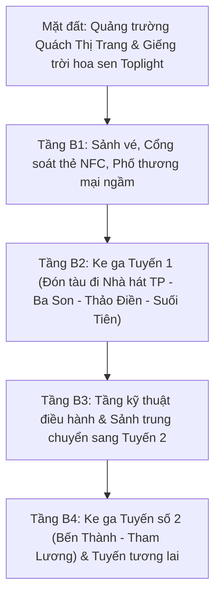

# Ga Ngầm Metro Bến Thành 2026: Trải Nghiệm Tuyến Tàu Đô Thị Đầu Tiên Của TP.HCM

> *“Nếu tháp đồng hồ Chợ Bến Thành là biểu tượng của ký ức thế kỷ 20, thì ngay dưới chân nó, Ga ngầm Trung tâm Bến Thành chính là cánh cửa mở toang kỷ nguyên tương lai của Sài Gòn. Nơi đây, ánh sáng mặt trời phương Nam xuyên qua vòm kính giếng trời hoa sen khổng lồ rọi thẳng xuống lòng đất sâu 32 mét, biến không gian trung chuyển đường sắt thành một tác phẩm nghệ thuật vị lai đầy kiêu hãnh.”*

Là mảnh ghép hiện đại nhất trong bức tranh [những địa điểm nổi tiếng quanh Bến Thành](/things-to-do-near-ben-thanh-market), **Ga ngầm Trung tâm Bến Thành (Tuyến Metro số 1 Bến Thành – Suối Tiên)** chính thức vận hành thương mại và trở thành niềm tự hào hạ tầng của hơn 10 triệu người dân Thành phố Hồ Chí Minh. Đây không chỉ là một đầu mối giao thông công cộng hiện đại, mà còn là một không gian kiến trúc công cộng mang tính thẩm mỹ cao, mở ra trải nghiệm du hành đô thị văn minh cho du khách trong và ngoài nước.

---

## 🌟 Những Con Số Kỷ Lục Của Ga Ngầm Bến Thành

- **32 mét chiều sâu:** Ga ngầm sâu nhất Việt Nam, tương đương với chiều cao của một tòa nhà 10 tầng xây ngược xuống lòng đất.
- **236 mét chiều dài:** Trải dài từ khu vực trước Cửa Nam chợ Bến Thành xuôi dọc theo công viên 23 Tháng 9.
- **Giếng trời Toplight hoa sen 21m:** Mái vòm kính cường lực lấy sáng tự nhiên cao 6 mét, đường kính 21.6 mét mô phỏng hình cánh sen cách điệu nở rộ đón nắng.
- **Đầu mối của 4 tuyến Metro:** Thiết kế kết nối liên hoàn Tuyến số 1 (Bến Thành – Suối Tiên), Tuyến số 2 (Bến Thành – Tham Lương), Tuyến số 3A và Tuyến số 4 trong quy hoạch đường sắt đô thị tổng thể.
- **14 phút:** Thời gian di chuyển thần tốc từ trung tâm Quận 1 sang khu phố nghệ thuật và ẩm thực Thảo Điền (thay vì 45 phút kẹt xe giờ cao điểm trước đây).

---

## 1. Không Gian Đô Thị Ngầm: Bước Chuyển Mình Kỳ Vĩ Của Hạ Tầng Phương Nam

Sau hơn một thập kỷ thi công với công nghệ đào hầm TBM (Tunnel Boring Machine) tiên tiến của Nhật Bản cùng hàng ngàn kỹ sư, công nhân Việt Nam, Ga trung tâm Bến Thành đã hoàn thành việc tái thiết toàn bộ cảnh quan quảng trường Quách Thị Trang. 

  

<blockquote class="instagram-media" data-instgrm-captioned data-instgrm-permalink="https://www.instagram.com/p/DbpaAa5CW0n/?utm_source=ig_embed&utm_campaign=loading" data-instgrm-version="14" style="background:#FFF; border:0; border-radius:3px; box-shadow:0 0 1px 0 rgba(0,0,0,0.5),0 1px 10px 0 rgba(0,0,0,0.15); margin: 1px; max-width:540px; min-width:326px; padding:0; width:99.375%;">
  

    <a href="https://www.instagram.com/p/DbpaAa5CW0n/?utm_source=ig_embed&utm_campaign=loading" target="_blank">Xem bài viết này trên Instagram</a>
  

</blockquote>

  

Khu vực lầy lội hồ Bồ Rùa thời phong kiến, bùng binh giao thông đông đúc thời Pháp thuộc nay đã lột xác thành một quảng trường đi bộ lát đá granite phẳng phiu trên mặt đất, kết nối trực tiếp với không gian thương mại và đường sắt ngầm hiện đại bên dưới.

Sự xuất hiện của ga metro đã thay đổi căn bản cách thức tiếp cận di sản của du khách: từ ga Bến Thành, bạn chỉ cần bước lên mặt đất vài bước chân là đã chạm vào Chợ Bến Thành, tản bộ 5 phút đến [Bảo tàng Mỹ thuật TP.HCM](/bao-tang-my-thuat-tphcm), hoặc rảo bước 9 phút đến [Dinh Độc Lập](/dinh-doc-lap-sai-gon).

---

## 2. Giải Mã Kiến Trúc 4 Tầng Ngầm Dưới Lòng Bến Thành

### 2.1. Tầng B1: Sảnh Đón Khách & Phố Thương Mại Ngầm
Tầng B1 là không gian công cộng rộng lớn nhất, nơi đặt hệ thống máy bán vé tự động đa ngôn ngữ, quầy hỗ trợ du khách của The Rice Tour / Sở Du lịch, và cổng soát vé thông minh hỗ trợ thanh toán một chạm bằng thẻ ngân hàng, thẻ IC hoặc mã QR. 

Khu phố ngầm tại đây tập trung các tiệm cà phê đặc sản Việt Nam, tiệm bánh mì truyền thống và các cửa hàng lưu niệm thủ công mỹ nghệ chuẩn mực, phục vụ hành khách trước khi lên tàu.

### 2.2. Giếng Trời Hoa Sen (Toplight Khổng Lồ)
Điểm nhấn kiến trúc biểu tượng của tầng B1 chính là khu vực giếng trời hoa sen. Thiết kế vòm kính trong suốt cho phép ánh sáng ban ngày rọi thẳng xuống sàn đá hoa cương, tạo hiệu ứng thị giác kỳ ảo. Khi đứng từ dưới sảnh nhìn ngược lên, bạn sẽ thấy tháp đồng hồ Chợ Bến Thành uy nghi in bóng trên nền trời xanh – một khoảnh khắc giao thoa ngoạn mục giữa quá khứ trăm năm và nhịp thở tương lai.

### 2.3. Tầng B2: Ke Ga Tuyến Số 1
Nơi đoàn tàu metro đón trả khách với hệ thống cửa chắn ke ga tự động (Platform Screen Doors - PSD) bằng kính chịu lực toàn phần, đảm bảo an toàn tuyệt đối và duy trì nhiệt độ mát mẻ 24/24 trong sảnh chờ.

---

## 3. Bảng Ma Trận Lộ Trình & Giá Vé Tuyến Metro Số 1 (Năm 2026)

| Ga Đến Trọng Điểm | Thời Gian Từ Bến Thành | Điểm Nhấn Tham Quan / Trải Nghiệm | Giá Vé Lượt 2026 |
| :--- | :--- | :--- | :--- |
| **Ga Nhà Hát Thành Phố** | 2 phút | Nhà hát Thành phố, Khách sạn Continental, Phố đi bộ Nguyễn Huệ | 7.000 VNĐ |
| **Ga Ba Son** | 4 phút | Di tích Ba Son, Cầu Thủ Thiêm 2, Bến du thuyền sông Sài Gòn | 8.000 VNĐ |
| **Ga Văn Thánh / Tân Cảng** | 8 phút | Tòa nhà Landmark 81, Công viên sinh thái ven sông | 12.000 VNĐ |
| **Ga Thảo Điền** | 13 phút | Khu phố nghệ thuật, ẩm thực phương Tây, quán bar bờ sông | 16.000 VNĐ |
| **Ga Bến xe Miền Đông Mới** | 28 phút | Bến xe liên tỉnh kết nối các tỉnh miền Trung & miền Bắc | 20.000 VNĐ |

---

## 4. Hướng Dẫn Trải Nghiệm Thực Tế Cho Người Du Hành Có GUU (Field Notes 2026)

1. **Lựa chọn loại vé thông minh:**
   - Nếu bạn chỉ đi thử nghiệm 1 – 2 chặng: Mua vé lượt tại máy bán vé tự động (chấp nhận tiền mặt, thẻ Visa/Mastercard hoặc quét mã VietQR).
   - Nếu bạn muốn kết hợp khám phá toàn thành phố trong ngày: Nên mua **Vé ngày (Day Pass) giá 40.000 VNĐ** tại quầy dịch vụ khách hàng để đi lại không giới hạn số lượt.
2. **Quy tắc văn minh trên tàu:** Tuyệt đối không ăn uống kẹo cao su, không hút thuốc và giữ trật tự trên các toa tàu. Toàn bộ các toa xe đều có ghế ưu tiên dành riêng cho người cao tuổi, phụ nữ mang thai và người khuyết tật.
3. **Gợi ý hành trình kết hợp:** Buổi sáng bạn tản bộ khám phá di sản quanh Bến Thành theo [Lộ trình Walking Tour 1 ngày](/lich-trinh-di-bo-ben-thanh-1-ngay), buổi chiều đón chuyến tàu metro lúc 16:30 từ Ga Bến Thành đi Ga Ba Son để ngắm hoàng hôn sông Sài Gòn từ trên cao.
4. **Đồng hành cùng The Rice Tour:** Nếu muốn trải nghiệm city tour kết hợp giữa tản bộ di sản cổ kính và đi tàu điện ngầm hiện đại cùng hướng dẫn viên bản địa am tường, hãy đăng ký [Ho Chi Minh City Half Day Private Tour](/tour/ho-chi-minh-city-half-day-private-tour).

---

## Lời Kết (Epilogue): Bước Nhảy Vọt Của Đô Thị Phương Nam

Ga ngầm Bến Thành không chỉ rút ngắn khoảng cách địa lý giữa các quận huyện, mà còn là lời khẳng định mạnh mẽ về sức sống và khát vọng vươn tầm của Thành phố Hồ Chí Minh trong kỷ nguyên mới. Đứng dưới giếng trời hoa sen, ngắm nhìn dòng người đa sắc tộc thong dong bước lên những chuyến tàu hiện đại, bạn sẽ cảm nhận sâu sắc rằng Sài Gòn luôn biết cách tự làm mới mình mà không bao giờ đánh mất bản sắc hào sảng vốn có.
