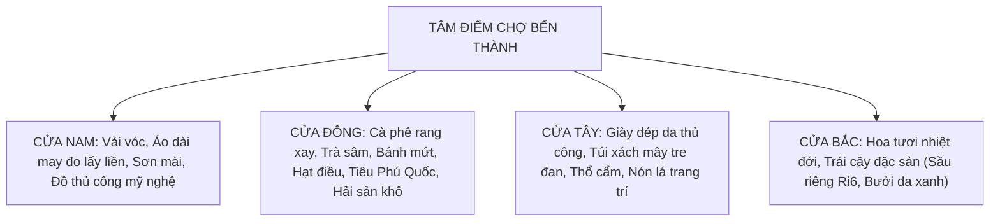

# Kinh Nghiệm Mua Sắm Tại Chợ Bến Thành: Nghệ Thuật Trả Giá Văn Minh & Chọn Đồ Thủ Công Tinh Xảo

> *“Mua sắm tại Chợ Bến Thành chưa bao giờ là một cuộc giao dịch tiền – hàng khô khan. Đó là một vũ điệu giao tiếp văn hóa đầy duyên dáng giữa người mua và người bán, nơi một nụ cười ấm áp, sự am tường về chất liệu thủ công và thái độ tôn trọng lẫn nhau sẽ mở ra những trải nghiệm mua sắm tuyệt vời nhất giữa lòng đô thị trăm năm.”*

Là một điểm nhấn thực chiến không thể bỏ lỡ trong cẩm nang [những địa điểm nổi tiếng quanh Bến Thành](/things-to-do-near-ben-thanh-market), **trải nghiệm mua sắm tại Chợ Bến Thành** đưa bạn bước vào mê cung của hơn 1.400 sạp hàng rực rỡ sắc màu. Đối với người lữ khách có gu, việc dạo chợ không chỉ để mang về những món quà lưu niệm độc đáo mà còn là dịp để chiêm ngưỡng kỹ nghệ thủ công tinh xảo của các làng nghề truyền thống ba miền hội tụ về đất Sài Gòn.

---

## Quick Overview Stats Bar (Thông Số Mua Sắm 2026)

| 🏪 Quy mô gian hàng | 🕒 Giờ mở cửa hoạt động | 💳 Phương thức thanh toán 2026 | 🌟 Mặt hàng tiêu biểu |
| :--- | :--- | :--- | :--- |
| **1.400+ sạp hàng chuyên nghiệp** | **07:00 – 18:00 (Trong chợ)** | **100% Chấp nhận VietQR, Visa/Mastercard** | **Lụa tơ tằm, sơn mài khảm trứng, cà phê rang mộc** |

---

## 🌟 Những Con Số Ấn Tượng Về Thương Mại Bến Thành

- **1.400 sạp hàng:** Được phân chia khoa học theo hình ô bàn cờ xuyên suốt 4 cửa chính Đông - Tây - Nam - Bắc.
- **4 chiếc cân đối chứng điện tử:** Được Ban Quản lý chợ lắp đặt cố định tại 4 cổng chính để người mua tự tay kiểm tra độ chính xác tuyệt đối về trọng lượng hàng hóa.
- **24 giờ may đo lấy liền:** Dịch vụ may áo dài truyền thống và âu phục cao cấp lấy ngay trong ngày dành riêng cho du khách quốc tế bận rộn.
- **15% – 25%:** Biên độ thương lượng giá cả hợp lý, giúp giữ trọn vẹn sự hài lòng cho cả người mua và người bán.
- **100% không tiền mặt:** Toàn bộ tiểu thương chợ Bến Thành hiện đều sở hữu mã thanh toán điện tử thông minh, loại bỏ hoàn toàn nỗi lo đổi tiền lẻ.

---

## 1. Sơ Đồ 4 Phân Khu Hàng Hóa Theo 4 Cửa Chính

Để không bị lạc lối giữa ma trận hàng hóa, người du hành thông thái cần nắm rõ bản đồ phân bố các ngành hàng theo 4 hướng cổng chính:

### 1.1. Cửa Nam (Đường Lê Lợi): Không Gian Vải Vóc & Nghệ Thuật Thủ Công
Cửa Nam là mặt tiền biểu tượng với tháp đồng hồ. Bước vào đây, bạn sẽ choáng ngợp trước những cuộn lụa tơ tằm óng ả, gấm hoa, voan thêu tay tinh xảo. Nơi đây quy tụ các nhà may gia truyền cung cấp dịch vụ chọn vải và may đo áo dài lấy ngay chỉ sau 12 – 24 tiếng với độ chuẩn xác tuyệt vời về phom dáng. Bên cạnh đó là các gian hàng trưng bày đồ sơn mài dát vàng, khảm trai và tranh thêu tay nghệ thuật.

### 1.2. Cửa Đông (Đường Phan Bội Châu): Hương Vị Nông Sản & Trầm Tích Đồ Khô
Khu vực ngạt ngào mùi hương của những hạt cà phê Robusta Buôn Ma Thuột và Arabica Cầu Đất rang mộc tại chỗ. Nơi đây bày bán các loại hạt cao cấp như hạt điều Bình Phước nguyên vỏ lụa, mắc ca Tây Nguyên, tiêu sọ Phú Quốc và các loại đặc sản cá khô, mực khô một nắng Cần Giờ được đóng gói hút chân không tiêu chuẩn lữ hành quốc tế.

### 1.3. Cửa Tây (Đường Phan Chu Trinh): Thế Giới Phụ Kiện Thủ Công
Nếu bạn đang tìm kiếm những chiếc túi xách đan bằng mây tre mộc mạc, ví da thuộc thủ công hay những chiếc nón lá vẽ phong cảnh sông nước miền Tây, Cửa Tây chính là thiên đường dành cho bạn.

### 1.4. Cửa Bắc (Đường Lê Thánh Tôn): Sắc Màu Nông Sản Tươi Rói
Thiên đường của các loài hoa quả nhiệt đới tươi ngon chuyển trực tiếp từ miệt vườn Tiền Giang, Bến Tre trong đêm: sầu riêng Ri6 cơm vàng hạt lép, măng cụt Lái Thiêu, xoài cát Hòa Lộc và thanh long Bình Thuận rực rỡ sắc màu.

---

## 2. Nghệ Thuật Trả Giá Văn Minh: "Bargaining With Grace"

Trả giá tại chợ truyền thống không phải là một cuộc chiến giành giật từng đồng, mà là sự giao tế duyên dáng. Hãy ghi nhớ 4 nguyên tắc vàng sau:

### 2.1. Tôn Trọng "Vía Mở Hàng" Buổi Sáng Sớm
Người tiểu thương phương Nam rất coi trọng người khách mua đầu tiên trong ngày (từ 07:00 đến 08:30 sáng). Họ tin rằng vị khách mở hàng vui vẻ, xởi lởi sẽ đem lại may mắn cho cả ngày buôn bán. Do đó, nếu bạn ghé chợ vào khung giờ này, hãy tránh mặc cả quá gắt gao hoặc nâng lên đặt xuống nhiều lần mà không mua. Nếu muốn trải nghiệm cảm giác trả giá thong thả, hãy ghé sau 09:30 sáng.

### 2.2. Biên Độ Thương Lượng Hợp Lý: 15% – 25%
Tại Chợ Bến Thành, nhiều sạp hàng (đặc biệt là hàng lưu niệm và vải vóc) có niêm yết mức giá chào ban đầu cao hơn giá bán thực tế để dự trù khoảng thương lượng cho du khách. Mức trả giá lý tưởng là giảm từ **15% đến 25%**. 
- *Mẹo nhỏ:* Hãy mỉm cười, bắt đầu bằng câu nói thân thiện: *"Chị ơi, em mua kỷ niệm, chị bớt cho em chút lộc may mắn nhé!"*. Nụ cười chân thành luôn có sức mạnh hơn bất kỳ sự đôi co nào.

### 2.3. Quy Tắc Rời Đi Nhẹ Nhàng (Walk Away Technique)
Nếu mức giá người bán đưa ra vẫn chưa đạt tới con số mong muốn của bạn, hãy mỉm cười, cúi đầu cảm ơn lịch sự và thong thả bước sang gian hàng khác. Trong rất nhiều trường hợp, tiểu thương sẽ vui vẻ gọi bạn quay lại và chấp nhận mức giá bạn đã đề nghị.

---

## 3. Cẩm Nang Phân Biệt Hàng Thủ Công Cao Cấp vs Hàng Công Nghiệp

| Mặt Hàng | Dấu Hiệu Nhận Biết Hàng Thủ Công Thật | Cảnh Báo Hàng Công Nghiệp Kém Chất Lượng |
| :--- | :--- | :--- |
| **Sơn Mài Khảm Trứng** | Bề mặt mài nhẵn thấu quang, vỏ trứng có vết nứt tự nhiên rạn vi tế, sơn ta có mùi thơm nhẹ của nhựa cây tự nhiên | Dán decal in hình công nghiệp, phủ keo bóng epoxy dày cộp, có mùi hóa chất nồng hắc |
| **Lụa Tơ Tằm Bảo Lộc** | Bề mặt mềm rũ, sờ vào có cảm giác mát lạnh tức thì, bắt sáng óng ánh tự nhiên theo góc nhìn, khi vò nhẹ thả ra tự phẳng | Pha sợi polyester thô cứng, tích điện dính vào da, bề mặt bóng lóa nhân tạo |
| **Cà Phê Rang Mộc** | Hạt cà phê màu nâu cánh gián, không bóng dầu, xay ra có mùi thơm thảo mộc tự nhiên, khi pha nước có màu nâu hổ phách trong | Hạt đen bóng do tẩm bơ và caramen nhân tạo, nước pha đen kịt, đặc sánh mùi hương liệu hóa chất |
| **Hạt Điều Bình Phước** | Hạt đều đặn, còn nguyên vỏ lụa màu nâu nhạt, vị bùi béo giòn rụm, không có mùi dầu cũ | Hạt ngâm hóa chất tẩy trắng, hạt teo tóp hoặc ỉu xìu |

---

## 4. Quyền Lợi Của Người Mua Sắm Tại Chợ Bến Thành 2026

1. **Kiểm tra trọng lượng tại cân đối chứng:** Nếu mua các mặt hàng nông sản, trái cây hoặc hải sản khô theo trọng lượng (kilogram), bạn có thể mang ngay ra bàn cân đối chứng điện tử tại 4 cửa cổng để kiểm tra lại. Ban Quản lý chợ xử lý rất nghiêm khắc các trường hợp cân thiếu.
2. **Hệ thống phản ánh du khách 24/7:** Tại mỗi dãy sạp đều có dán mã QR và số điện thoại đường dây nóng của Tổ Quản lý Thị trường Quận 1 và Ban Quản lý Chợ. Mọi tranh chấp về thái độ phục vụ hay giá cả đều được can thiệp giải quyết tức thì.
3. **Thanh toán số an toàn:** 100% sạp hàng đều hỗ trợ chuyển khoản ngân hàng và quẹt thẻ, giúp bạn hoàn toàn an tâm không lo bị nhầm lẫn tiền bạc.
4. **Học văn hóa chợ cùng The Rice Tour:** Để được các chuyên gia bản địa đồng hành hướng dẫn từng sạp gia vị và học nghệ thuật chế biến ẩm thực truyền thống, hãy tham gia tour [Cooking Class & Local Market Experience](/tour/cooking-class-local-market).

---

## Lời Kết (Epilogue): Mang Về Một Mảnh Hồn Sài Gòn

Món quà lưu niệm quý giá nhất sau chuyến đi Chợ Bến Thành không chỉ là tấm khăn lụa mềm mại hay hộp cà phê rang xay thơm ngát, mà chính là kỷ niệm về những cuộc đối thoại ấm áp với những người buôn bán chân chất đất phương Nam. Hãy bước vào chợ bằng sự háo hức, mua sắm bằng sự am tường và trả giá bằng lòng tôn trọng – bạn sẽ thấy Chợ Bến Thành luôn dành tặng cho bạn những điều tuyệt vời nhất.
