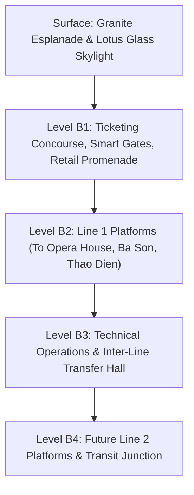

# Ben Thanh Central Metro Station: Navigating Saigon’s Futuristic Underground Pulse

  If Ben Thanh Market's clock tower embodies the romance of 20th-century nostalgia, the cavernous terminal directly beneath its foundations heralds Saigon’s bold technological future. Here, equatorial sunlight cascades through a monumental glass lotus skylight into the subterranean depths, transforming mass transit into a poetic architectural dialogue.

Enshrined as the crowning technological triumph within our guide to [things to do near Ben Thanh Market](/things-to-do-near-ben-thanh-market), the newly inaugurated **Ben Thanh Central Metro Station (Urban Railway Line 1)** represents a milestone in Southeast Asian urban infrastructure. Descending four tiers into the southern delta's earth, this intermodal hub seamlessly integrates ancient heritage with 21st-century rapid transit.

---

## Quick Overview Stats (2026 Transit Dimensions)

| 📍 Epicenter Location | 🚇 Subterranean Scale | 🕒 Daily Schedule | 🎟️ 2026 Fare Baseline |
| :--- | :--- | :--- | :--- |
| **Quach Thi Trang Concourse, South Portal** | **32m Depth (4 Levels) – 236m Length** | **05:00 AM – 23:00 PM (4–8 min intervals)** | **7,000 – 20,000 VND (Day Pass: 40,000 VND)** |

---

## 🌟 Record-Breaking Architectural Dimensions

- **32-Meter Subterranean Depth:** Vietnam’s deepest underground engineering project, equivalent to a 10-story skyscraper descending into bedrock.
- **236-Meter Concourse Length:** Stretching gracefully from the market’s South Portal through the greenery of September 23rd Park.
- **The 21-Meter Lotus Toplight:** A circular skylight rising 6 meters above the granite plaza, engineered with curved laminated structural glass to channel natural sunlight deep into the central hall.
- **Four-Line Junction:** Designed to integrate Line 1 (Ben Thanh – Suoi Tien), Line 2 (Ben Thanh – Tham Luong), Line 3A, and Line 4 into a unified subterranean transit ecosystem.
- **14-Minute Transit to Thao Dien:** Shrinking an exhausting 45-minute rush-hour taxi commute across congested bridges into a smooth, climate-controlled glide.

---

## 1. Subterranean Renaissance: Reimagining the Urban Landscape

Following a decade of surgical underground construction utilizing Japanese Tunnel Boring Machines (TBM), Ben Thanh Central Station has catalyzed the total pedestrianization of Quach Thi Trang Square.

Where colonial roundabouts once jammed with exhaust fumes, visitors now stroll across a pristine, granite-paved public concourse. Steps away from the historic market entrances, sleek escalator portals invite commuters down into an immaculate underground city of retail promenades, artisan kiosks, and transit platforms.

---

## 2. Navigating the Four-Tier Subterranean Labyrinth

### 2.1. Level B1: The Commercial Concourse & Ticketing Mezzanine
The upper concourse functions as an expansive subterranean civic plaza. Automated multi-lingual kiosks dispense tickets via cash, international credit cards, or VietQR codes. Flanking the ticketing gates are specialty coffee houses serving cold-brew Robusta, traditional bakeries, and curated cultural boutiques.

### 2.2. The Architectural Centerpiece: The Lotus Toplight
Standing at the center of Level B1, commuters are naturally drawn toward the monumental skylight. Looking skyward through its geometric framework, one captures an astonishing sightline: the amber tiles of the 1914 Ben Thanh clock tower rising against equatorial clouds—a breathtaking visual metaphor uniting two centuries of Saigon history.

### 2.3. Level B2: Line 1 Boarding Platforms
Equipped with full-height, automated Platform Screen Doors (PSD), Level B2 maintains whisper-quiet acoustics and an ambient temperature of 23°C. Electric trainsets depart every four to eight minutes, whisking passengers northeast along the Saigon River.

---

## 3. Curated Line 1 Route & Fare Matrix (2026 Reference)

| Key Station | Transit Time from Ben Thanh | Signature Destination / Cultural Highlight | Single Fare 2026 |
| :--- | :--- | :--- | :--- |
| **Saigon Opera House** | 2 minutes | Continental Hotel, Lam Son Square, Nguyen Hue Walking Street | 7,000 VND |
| **Ba Son Terminal** | 4 minutes | Historic Naval Shipyards, Thu Thiem 2 Bridge, Riverfront Marina | 8,000 VND |
| **Van Thanh / Tan Cang** | 8 minutes | Landmark 81 Tower, Riverside Ecological Park | 12,000 VND |
| **Thao Dien Station** | 13 minutes | Bohemian art galleries, international bistros, riverfront lounges | 16,000 VND |
| **New Eastern Bus Terminal** | 28 minutes | Interprovincial terminal connecting Central & Northern Vietnam | 20,000 VND |

---

## 4. Curated Transit Insights for Conscious Travelers (2026)

1. **Selecting Your Fare Media:**
   - For casual journeys: Purchase single-journey tokens via automated ticketing machines accepting contactless Visa/Mastercard.
   - For comprehensive urban explorations: Opt for the **Unlimited 1-Day Pass (40,000 VND)** at the information counter for boundless hops across the network.
2. **Onboard Protocol:** Chewing gum, food consumption, and smoking are strictly prohibited. Dedicated priority seating is reserved across every carriage for seniors, pregnant women, and travelers with mobility needs.
3. **Curated Transit Connection:** Pair your morning heritage walk through our [One-Day Walking Tour](/ben-thanh-one-day-walking-tour) with a late afternoon metro ride departing Ben Thanh at 16:30 PM to Ba Son Station to witness dusk settling over the Saigon River.
4. **Bespoke City Journeys:** To integrate walking heritage immersion with private metro guidance led by certified cultural guides, reserve the [Ho Chi Minh City Half Day Private Tour](/tour/ho-chi-minh-city-half-day-private-tour) hosted by The Rice Tour.

---

## Epilogue: The Velocity of a Renewed Metropolis

Ben Thanh Central Metro Station is far more than an underground web of rails and escalators; it is the physical manifestation of Ho Chi Minh City’s soaring contemporary ambition. Gazing upward through the lotus skylight at the century-old market tower while listening to the whisper of arriving electric trains, the thoughtful traveler realizes that Saigon’s true greatness lies in its capacity to honor its roots while fearlessly accelerating into tomorrow.
