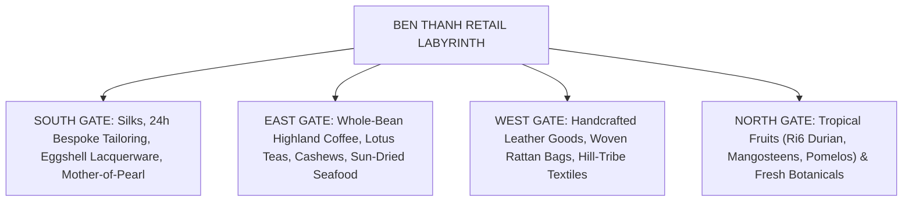

# Bargaining with Grace: The Smart Traveler’s Guide to Shopping at Ben Thanh Market

  Shopping inside the vaulted avenues of Ben Thanh Market has never been a sterile commercial transaction. It is a graceful cultural dance between buyer and seller, where an engaging smile, genuine appreciation for traditional craft, and mutual respect unlock the finest artisanal treasures of southern Vietnam.

Highlighted in our comprehensive field guide to [things to do near Ben Thanh Market](/things-to-do-near-ben-thanh-market), stepping into the historic market places you at the center of an intoxicating labyrinth of over 1,400 vibrant retail stalls. For conscious voyagers, shopping here is an opportunity to acquire authentic handmade heirlooms and connect directly with the multi-generational trade guilds of the Southern Delta.

---

## Quick Overview Stats (2026 Commerce Dimensions)

| 🏪 Merchant Stalls | 🕒 Trading Hours | 💳 2026 Payment Standards | 🤝 Respectful Negotiation Buffer |
| :--- | :--- | :--- | :--- |
| **1,400+ Certified Vendors** | **07:00 AM – 18:00 PM (Daily)** | **100% Contactless Cards & VietQR** | **15% – 25% Balanced Adjustment** |

---

## 🌟 Key Curated Dimensions of Market Commerce

- **1,400 Grid Stalls:** Meticulously organized into specialized guild quadrants accessible through the four cardinal gates.
- **4 Electronic Verification Scales:** Positioned by municipal market authorities at each portal, empowering shoppers to self-verify weighed items with pinpoint accuracy.
- **24-Hour Express Tailoring:** Bespoke *áo dài* and linen safari suits tailored overnight for international travelers on tight itineraries.
- **100% Cashless Operations:** Every vendor terminal is equipped with tap-to-pay technology and dual-currency digital receipts.

---

## 1. Navigating the Four Cardinal Shopping Quadrants

### 1.1. The South Gate (Le Loi Boulevard): Silks & Master Lacquerware
Entering beneath the iconic clock tower, you are immediately enveloped in vibrant textiles. Bolts of shimmering mulberry silk from Bao Loc and Van Phuc drape from ceiling beams alongside bespoke tailors capable of cutting and stitching an exquisite traditional *áo dài* within 12 to 24 hours. Surrounding stalls showcase handcrafted lacquer boxes inlaid with mother-of-pearl and natural duck eggshells.

### 1.2. The East Gate (Phan Boi Chau Street): Highland Coffees & Delta Spices
Follow your nose into the aromatic domain of whole-bean Vietnamese coffees. Merchants roast Arabica from the misty highlands of Da Lat and rich Robusta from Buon Ma Thuot on-site, grinding beans to your exact brewing preference. Nearby bins overflow with silk-skinned Binh Phuoc cashews and white peppercorns from Phu Quoc Island.

### 1.3. The West Gate (Phan Chu Trinh Street): Artisan Woven Goods & Leather
A haven for sustainable, natural accessories: hand-plaited water hyacinth and rattan tote bags, full-grain leather wallets, and hand-embroidered conical hats.

### 1.4. The North Gate (Le Thanh Ton Street): Orchard Bounty
Vibrant fruit pyramids showcasing southern Vietnam's seasonal harvest: Ri6 golden durians, sweet mangosteens, and green-skin pomelos fresh from Tien Giang province.

---

## 2. Bargaining with Grace: Cultural Guidelines

Negotiating in a traditional Vietnamese market should never feel confrontational; it is an engaging, respectful dialogue:

  

<blockquote class="instagram-media" data-instgrm-captioned data-instgrm-permalink="https://www.instagram.com/p/DV5CI9OjQtB/?utm_source=ig_embed&utm_campaign=loading" data-instgrm-version="14" style="background:#FFF; border:0; border-radius:3px; box-shadow:0 0 1px 0 rgba(0,0,0,0.5),0 1px 10px 0 rgba(0,0,0,0.15); margin: 1px; max-width:540px; min-width:326px; padding:0; width:99.375%;">
  

    <a href="https://www.instagram.com/p/DV5CI9OjQtB/?utm_source=ig_embed&utm_campaign=loading" target="_blank">Xem bài viết này trên Instagram</a>
  

</blockquote>

  

### 2.1. Honor the Morning Opening Rite (*Mở Hàng*)
Southern merchants hold deep spiritual reverence for their first customer of the morning (between 07:00 and 08:30 AM). A swift, pleasant initial sale is believed to bestow auspicious commercial luck upon the entire day. Refrain from aggressive bargaining or prolonged indecision during this dawn window. For unhurried negotiation, visit after 09:30 AM.

### 2.2. The 15% to 25% Equilibrium
Souvenir, textile, and handicraft stalls often quote an initial price that factors in a modest negotiation buffer. Proposing a polite 15% to 25% adjustment usually reaches an equitable midpoint. 
- *Local Tip:* Frame your counteroffer with a genuine smile and a warm phrase: *"Em mua kỷ niệm, chị bớt chút may mắn nhé!"* (I'm purchasing a keepsake; please grant a little lucky discount).

### 2.3. The Gentle Walk-Away
If a mutually agreeable price cannot be reached, bow your head slightly, offer a sincere thank you, and calmly step toward the next stall. In many instances, the vendor will gracefully call you back and accept your counteroffer.

---

## 3. Detecting Authentic Artisanship vs. Mass-Produced Counterfeits

| Handicraft | Hallmarks of Authentic Craft | Warning Signs of Industrial Fakes |
| :--- | :--- | :--- |
| **Eggshell Lacquerware** | Smooth, translucent depth, natural microscopic eggshell fractures, subtle resin scent | Printed vinyl stickers covered in thick synthetic epoxy, harsh chemical odor |
| **Bao Loc Natural Silk** | Fluid drape, immediate cool touch against skin, shimmering prismatic refraction, wrinkle-resistant | Stiff polyester blends, synthetic static cling, unyielding artificial sheen |
| **Single-Origin Coffee** | Uniform cinnamon-brown beans, dry non-oily surface, herbal floral aromatics | Oily pitch-black beans roasted with artificial butter and chemical flavorings |
| **Binh Phuoc Cashews** | Plump, intact thin papery skin, crisp buttery crunch, no rancid oil trace | Chemically bleached white kernels, shriveled or chewy texture |

---

## 4. Consumer Protections & Traveler Rights (2026)

1. **Verify Weight at Public Scales:** If purchasing dried fruits, cashews, or spices by weight, feel free to verify your purchase at the electronic scales installed beside each of the four main gates.
2. **24/7 Consumer Support:** QR complaint placards with hotlines to District 1 market authorities are displayed across every aisle to immediately arbitrate service or pricing disputes.
3. **Secure Contactless Billing:** All stalls support tap-to-pay international card terminals and display clear digital currency conversion rates.
4. **Curated Culinary Market Tours:** To navigate market stalls alongside master chefs and source authentic culinary ingredients for private cooking classes, book the [Cooking Class & Local Market Tour](/tour/cooking-class-local-market) operated by The Rice Tour.

---

## Epilogue: Carrying Home the Warmth of Southern Hospitality

The greatest souvenir carried away from Ben Thanh Market is not merely an exquisite silk scarf or a fragrant pouch of roasted highland coffee; it is the lingering warmth of human connection with generational merchants who proudly safeguard their craft. Step into these historic corridors with curiosity, bargain with dignity, and you will find Saigon opening its heart to you in return.
