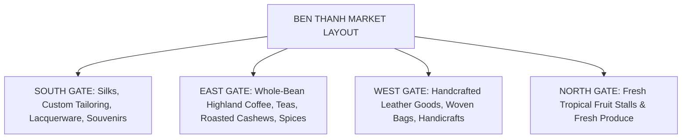

# Bargaining with Grace: The Smart Traveler’s Guide to Shopping at Ben Thanh Market

  Shopping inside Ben Thanh Market is as much a social exchange as a retail one. With over 1,400 stalls selling everything from whole-bean coffee and roasted cashews to silk scarves and lacquerware, approaching vendors with a friendly smile, clear expectations, and good humor makes bargaining an enjoyable part of the visit.

Highlighted in our comprehensive field guide to [things to do near Ben Thanh Market](/things-to-do-near-ben-thanh-market), stepping into the historic market places you inside a bustling grid of over 1,400 retail stalls. For travelers, shopping here is a chance to pick up handcrafted gifts, local pantry staples, and regional specialties while chatting directly with vendors whose families have traded here for decades.

---

## 🌟 Key Highlights of Shopping at Ben Thanh

- **1,400 Stalls:** Neatly divided into distinct sections across the market's four main entrances.
- **4 Electronic Verification Scales:** Installed by market management at each main gate, allowing shoppers to double-check weighted goods on the spot.
- **24-Hour Custom Tailoring:** Tailors can craft bespoke *áo dài* or lightweight linen clothing within 12 to 24 hours.
- **Cash and QR Payments:** While domestic VietQR is widespread, international credit cards are increasingly accepted at larger textile stalls. Keeping modest cash (200,000 – 500,000 VND) is still ideal for small purchases like dried fruits, coffee beans, and snacks.

---

## Navigating the Four Main Shopping Sections

```mermaid
graph TD
    Market["BEN THANH MARKET LAYOUT"]
    Market --> South["SOUTH GATE: Silks, Custom Tailoring, Lacquerware, Souvenirs"]
    Market --> East["EAST GATE: Whole-Bean Highland Coffee, Teas, Roasted Cashews, Spices"]
    Market --> West["WEST GATE: Handcrafted Leather Goods, Woven Bags, Handicrafts"]
    Market --> North["NORTH GATE: Fresh Tropical Fruit Stalls & Fresh Produce"]
```

### The South Gate (Le Loi Boulevard): Silks & Master Lacquerware
Entering beneath the iconic clock tower, you are immediately enveloped in vibrant textiles. Bolts of shimmering mulberry silk from Bao Loc and Van Phuc drape from ceiling beams alongside bespoke tailors capable of cutting and stitching an exquisite traditional *áo dài* within 12 to 24 hours. Surrounding stalls showcase handcrafted lacquer boxes inlaid with mother-of-pearl and natural duck eggshells.

### The East Gate (Phan Boi Chau Street): Highland Coffees & Delta Spices
Follow your nose into the aromatic domain of whole-bean Vietnamese coffees. Merchants roast Arabica from the misty highlands of Da Lat and rich Robusta from Buon Ma Thuot on-site, grinding beans to your exact brewing preference. Nearby bins overflow with silk-skinned Binh Phuoc cashews and white peppercorns from Phu Quoc Island.

### The West Gate (Phan Chu Trinh Street): Artisan Woven Goods & Leather
A haven for sustainable, natural accessories: hand-plaited water hyacinth and rattan tote bags, full-grain leather wallets, and hand-embroidered conical hats.

### The North Gate (Le Thanh Ton Street): Orchard Bounty
Vibrant fruit pyramids showcasing southern Vietnam's seasonal harvest: Ri6 golden durians, sweet mangosteens, and green-skin pomelos fresh from Tien Giang province.

---

## Bargaining with a Smile: Practical Etiquette & Tips

Negotiating in a traditional Vietnamese market should never feel confrontational; it is an engaging, respectful dialogue:

  

<blockquote class="instagram-media" data-instgrm-captioned data-instgrm-permalink="https://www.instagram.com/p/DV5CI9OjQtB/?utm_source=ig_embed&utm_campaign=loading" data-instgrm-version="14" style="background:#FFF; border:0; border-radius:3px; box-shadow:0 0 1px 0 rgba(0,0,0,0.5),0 1px 10px 0 rgba(0,0,0,0.15); margin: 1px; max-width:540px; min-width:326px; padding:0; width:99.375%;">
  

    <a href="https://www.instagram.com/p/DV5CI9OjQtB/?utm_source=ig_embed&utm_campaign=loading" target="_blank">Xem bài viết này trên Instagram</a>
  

</blockquote>

  

### Respect the Morning Opening (*Mở Hàng*)
Market vendors in southern Vietnam value their first transaction of the day (usually between 07:00 and 08:30 AM). A smooth, friendly opening sale is seen as a harbinger of good luck for the day's trade. It is best to avoid hard bargaining or taking up stall space without intent to purchase during this early morning hour. For relaxed browsing and negotiating, visit after 09:30 AM.

### The 15% to 25% Guideline
Stalls selling souvenirs, clothing, and handicrafts generally quote starting prices that factor in negotiation. Offering a polite 15% to 25% discount provides a balanced starting point.
- *Local Tip:* Keep the tone warm and courteous: *"Em mua làm kỷ niệm, chị bớt chút nhé!"* (I'm buying this as a souvenir; could you give me a small discount?).

### The Polite Walk-Away
If you cannot agree on a price, thank the vendor with a smile and begin walking to another stall. Quite often, the seller will call you back to accept or meet you halfway. If not, it means the price has reached their bottom line.

---

## Detecting Authentic Artisanship vs. Mass-Produced Goods

| Handicraft | What to Look For | What to Avoid |
| :--- | :--- | :--- |
| **Eggshell Lacquerware** | Smooth surface with visible microscopic fissures in real duck eggshells; subtle wood and resin scent | Screen-printed plastic stickers coated in thick clear resin; strong chemical smell |
| **Bao Loc Silk** | Soft drape, cool touch, natural gentle sheen, subtle creasing | Stiff polyester fabrics, static cling, plastic-like high shine |
| **Coffee Beans** | Even medium roast, dry non-greasy surface, naturally chocolatey or nutty aroma | Jet-black, greasy beans coated in artificial butter and flavoring oils |
| **Roasted Cashews** | Intact thin papery skin, crisp crunch, fresh buttery flavor | Broken, soft kernels with bitter or stale aftertaste |

---

## Consumer Tips & Traveler Rights (2026)

1. **Check Weights at Public Scales:** If you buy dried fruit, nuts, or coffee by the kilogram, you can verify your package at the electronic scales situated near each of the market's four gates.
2. **Clear Price Inquiries:** Always confirm prices before having fruits sliced or coffee beans ground into powder.
3. **Payment Methods:** While vendors commonly use VietQR bank transfers, international cards are accepted at larger jewelry and textile shops. Keep cash handy for small transactions.
4. **Market & Cooking Tours:** If you'd like to explore the market with a local chef and learn how fresh ingredients are selected for classic southern dishes, check out our [Cooking Class & Local Market Tour](/tour/cooking-class-local-market).

---

## 🗺️ Nearby Guides & Resources

To help you explore District 1 with ease, check out these related guides:
- **Exchanging Money:** Find competitive rates at the trusted [money exchange near Ben Thanh Market](/money-exchange-ben-thanh-ha-tam-guide).
- **Avoiding Common Scams:** Practical safety advice in our [Ben Thanh Market scams and safety guide](/ben-thanh-market-scams-safety-guide).
- **Market Highlights:** Gate-by-gate orientation in our [things to do in Ben Thanh Market](/things-to-do-in-ben-thanh-market) guide.
- **Full Planning Overview:** Hours, history, and tips in our [Ben Thanh Market ultimate travel guide](/ben-thanh-market-ultimate-travel-guide).

## Final Thoughts: Shopping with Respect and Curiosity

Shopping at Ben Thanh Market is less about driving a hard bargain and more about engaging with Saigon's everyday commercial rhythm. Take your time, inspect goods closely, and maintain good humor throughout. With a friendly approach and realistic expectations, you'll find quality souvenirs and enjoy one of the city's most enduring traditions.
