# Master Blueprint: Chiến Dịch SEO Topic Cluster "Chợ Bến Thành & Quận 1 Toàn Tập" (The Rice Tour)

Tài liệu này xác lập toàn bộ chiến lược, kiến trúc từ khóa, mô hình liên kết nội bộ và hệ thống xuất bản đa kênh cho **Chiến dịch SEO Topic Cluster toàn diện quanh Chợ Bến Thành & Lõi Di Sản Sài Gòn Quận 1** (18 bài viết song ngữ VI – EN, 36 tài liệu Word `.docx` riêng lẻ, 2 Master Compendium Dossiers), tích hợp trực tiếp vào hệ thống 4 Agent của The Rice Tour và nền tảng Astro SSR Magazine 3 Cột.

---

## 1. Kiến Trúc Chủ Đề: Search Intent Triad & Pain Point Cluster

Chiến dịch được tái cấu trúc từ danh sách địa điểm đơn thuần thành một hệ sinh thái nội dung bao phủ 100% phễu tìm kiếm của du khách:

```mermaid
graph TD
    subgraph "PILLAR PAGES (Trục Lõi Search Intent Triad)"
        P1["Pillar 1 (Where/Attractions):<br>Những Địa Điểm Nổi Tiếng Quanh Bến Thành"]
        P2["Pillar 2 (What to do/Activities):<br>Chợ Bến Thành Có Gì Chơi? 15 Trải Nghiệm"]
        P3["Pillar 3 (How-to/Survival Guide):<br>Kinh Nghiệm Đi Chợ Bến Thành A-Z 2026"]
    end

    subgraph "SATELLITE CLUSTER 1: DI SẢN & ĐIỂM ĐẾN"
        S1["Bảo Tàng Mỹ Thuật TP.HCM"]
        S2["Dinh Độc Lập"]
        S3["Ga Ngầm Metro Bến Thành 2026"]
        S4["Đền Hindu Mariamman Sài Gòn"]
        S5["Lịch Trình Đi Bộ 1 Ngày"]
    end

    subgraph "SATELLITE CLUSTER 2: ẨM THỰC & LIFESTYLE"
        S6["Thiên Đường Ẩm Thực Chợ Bến Thành"]
        S7["Kinh Nghiệm Mua Sắm & Trả Giá"]
        S8["Xe Bus 2 Tầng Hop-On Hop-Off"]
        S9["Cà Phê Chung Cư Cổ Ẩn Mình"]
        S10["Top Rooftop Bar & Sky Lounge"]
        S11["Khách Sạn Boutique & Heritage"]
    end

    subgraph "PAIN POINTS CLUSTER: VẤN ĐỀ NÓNG & CẠM BẪY THỰC ĐỊA"
        PP1["Cảnh Báo Lừa Đảo & Chặt Chém (7 Cái Bẫy)"]
        PP2["Kinh Nghiệm Đổi Ngoại Tệ Tiệm Vàng Hà Tâm"]
        PP3["Bản Đồ Bãi Gửi Xe Máy & Ô Tô 2026"]
        PP4["Hướng Dẫn Đi Từ Sân Bay Tân Sơn Nhất Về Bến Thành"]
    end

    P1 --> S1 & S2 & S3 & S4 & S5
    P2 --> S6 & S8 & S9 & S10
    P3 --> S7 & S11 & PP1 & PP2 & PP3 & PP4
    PP1 & PP2 & PP3 & PP4 -.-> P3
```



---

## 2. Ma Trận 18 Bài Viết Song Ngữ (VI - EN) & Liên Kết Live Preview

Tất cả 18 bài viết đều đã được xuất bản hoàn chỉnh sang **3 định dạng**:
1. **Giao diện Web:** Chuẩn Magazine 3 Cột (National Geographic / Travel + Leisure) tại `http://localhost:4323/`.
2. **Hồ sơ Word (.docx):** Thiết kế chuẩn Typography Navy, bảng biểu và callouts chuyên nghiệp tại `content-pipeline/campaign-ben-thanh/word/`.
3. **Dữ liệu D1/Manifests:** Đầy đủ JSON manifest kiểm duyệt QA 100% không cắt gọt (Zero-truncation).

| STT | Cấp Độ Phân Loại | Slug Tiếng Việt | Slug Tiếng Anh (NatGeo) | Từ Khóa Trọng Tâm (VI / EN) | Thời Lượng |
| :---: | :--- | :--- | :--- | :--- | :---: |
| **01** | **PILLAR 1 (Where)** | `dia-diem-noi-tieng-quanh-ben-thanh` | `things-to-do-near-ben-thanh-market` | địa điểm quanh bến thành / things to do near ben thanh | 15 phút |
| **02** | Di Tích & Nghệ Thuật | `bao-tang-my-thuat-tphcm` | `hcmc-museum-of-fine-arts-guide` | bảo tàng mỹ thuật tphcm / hcmc museum fine arts | 12 phút |
| **03** | Ẩm Thực Bản Địa | `am-thuc-cho-ben-thanh` | `ben-thanh-market-food-guide` | ăn gì ở chợ bến thành / ben thanh food guide | 14 phút |
| **04** | Lộ Trình Thực Địa | `lich-trinh-di-bo-ben-thanh-1-ngay` | `ben-thanh-one-day-walking-tour` | lịch trình đi bộ bến thành / ben thanh walking tour | 16 phút |
| **05** | Di Tích Lịch Sử | `dinh-doc-lap-sai-gon` | `independence-palace-saigon-guide` | dinh độc lập / independence palace saigon guide | 13 phút |
| **06** | Hạ Tầng Hiện Đại | `ga-ngam-metro-ben-thanh` | `ben-thanh-central-metro-station-guide` | ga metro bến thành / ben thanh central metro | 12 phút |
| **07** | Văn Hóa Tâm Linh | `den-hindu-mariamman-sai-gon` | `mariamman-hindu-temple-saigon` | chùa bà ấn độ bến thành / mariamman temple saigon | 11 phút |
| **08** | Mua Sắm & Thủ Công | `kinh-nghiem-mua-sam-cho-ben-thanh` | `ben-thanh-market-shopping-guide` | mua sắm chợ bến thành / ben thanh shopping guide | 12 phút |
| **09** | Trải Nghiệm Đô Thị | `xe-bus-2-tang-hop-on-hop-off-sai-gon` | `saigon-hop-on-hop-off-bus-guide` | xe bus 2 tầng bến thành / saigon hop on hop off | 12 phút |
| **10** | Vintage Lifestyle | `ca-phe-chung-cu-gan-ben-thanh` | `secret-apartment-cafes-near-ben-thanh` | cà phê chung cư gần bến thành / apartment cafes | 13 phút |
| **11** | Nightlife & Cocktail | `rooftop-bar-view-cho-ben-thanh` | `best-rooftop-bars-near-ben-thanh` | rooftop bar bến thành / best rooftop bars saigon | 12 phút |
| **12** | Lưu Trú Sang Trọng | `khach-san-boutique-gan-ben-thanh` | `boutique-hotels-near-ben-thanh` | khách sạn boutique gần bến thành / boutique hotels | 14 phút |
| **13** | **PILLAR 2 (Activities)** | `cho-ben-thanh-co-gi-choi` | `things-to-do-in-ben-thanh-market` | chợ bến thành có gì chơi / things to do in ben thanh | 14 phút |
| **14** | **PILLAR 3 (Survival)** | `kinh-nghiem-di-cho-ben-thanh` | `ben-thanh-market-ultimate-travel-guide` | kinh nghiệm đi chợ bến thành / ben thanh travel guide | 15 phút |
| **15** | **PAIN POINT (An toàn)** | `canh-bao-lua-dao-chat-chem-cho-ben-thanh` | `ben-thanh-market-scams-safety-guide` | lừa đảo chợ bến thành / ben thanh market scams | 14 phút |
| **16** | **PAIN POINT (Tài chính)** | `doi-ngoai-te-cho-ben-thanh-ha-tam` | `money-exchange-ben-thanh-ha-tam-guide` | đổi ngoại tệ hà tâm / ha tam money exchange | 13 phút |
| **17** | **PAIN POINT (Gửi xe)** | `bai-gui-xe-quanh-cho-ben-thanh` | `parking-guide-near-ben-thanh-market` | bãi gửi xe chợ bến thành / parking near ben thanh | 12 phút |
| **18** | **PAIN POINT (Sân bay)** | `di-tu-san-bay-tan-son-nhat-ve-ben-thanh` | `tan-son-nhat-airport-to-ben-thanh-transfer-guide` | tân sơn nhất về bến thành / airport to ben thanh | 14 phút |

---

## 3. Cấu Trúc Thư Mục Lưu Trữ Độc Lập Cho Chiến Dịch

Chiến dịch Bến Thành được phân tách độc lập hoàn toàn trong thư mục:
`content-pipeline/campaign-ben-thanh/`

```text
content-pipeline/campaign-ben-thanh/
├── vietnamese/               # 18 bản thảo Markdown Tiếng Việt chuẩn "Du lịch có GUU"
│   ├── 001_dia-diem-noi-tieng-quanh-ben-thanh.md
│   └── ... (đến 018)
├── english/                  # 18 bản dịch Transcreation Tiếng Anh chuẩn NatGeo / T+L
│   ├── 001_things-to-do-near-ben-thanh-market.md
│   └── ... (đến 018)
├── manifests/                # 18 file JSON cấu hình xuất bản D1 & CMS
│   ├── 001_dia-diem-noi-tieng-quanh-ben-thanh.json
│   └── ... (đến 018)
└── word/                     # 38 file Microsoft Word (.docx) sang trọng
    ├── 000_TONG_HOP_18_BAI_VIET_BEN_THANH_VI.docx   # File Master Tiếng Việt tổng hợp
    ├── 000_FULL_COLLECTION_18_ARTICLES_BEN_THANH_EN.docx # File Master Tiếng Anh tổng hợp
    ├── 001_dia-diem-noi-tieng-quanh-ben-thanh.docx
    ├── 001_things-to-do-near-ben-thanh-market.docx
    └── ... (đủ 36 file lẻ cho 18 bài VI và 18 bài EN)
```

---

## 4. Kiểm Thử Hệ Thống & Trực Quan Hóa (Dev Server)

- **Dev Server Port:** `http://localhost:4323/`
- **Mã phản hồi:** Tất cả 36 đường dẫn (18 slug EN + 18 slug VI) đều trả về `HTTP 200 OK`.
- **Giao diện:** Tương thích di động và máy tính để bàn, tích hợp Sticky Table of Contents, Lead Editorial, Quick Facts, và Phễu chuyển đổi dịch vụ tour du lịch cao cấp của The Rice Tour.
