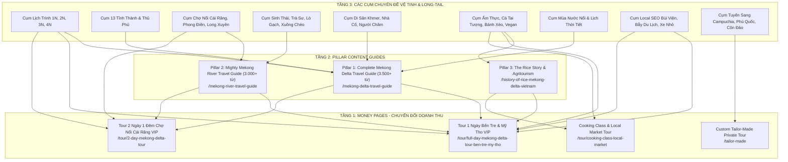

# BẢNG KẾ HOẠCH BÀI VIẾT SEO TOÀN DIỆN MEKONG DELTA & MEKONG RIVER (72 BÀI)
### Cẩm Nang Brief Chi Tiết Tác Nghiệp Dành Cho Content Writers & Biên Tập Viên — The Rice Tour (`thericetour.com`)

> **Mục tiêu chiến lược:** Xây dựng mạng lưới nội dung bao phủ 100% các điểm chạm tìm kiếm tự nhiên (Organic Search Intents) của du khách quốc tế về miền Tây Nam Bộ & Sông Mê Kông; thống trị cụm từ khóa "Mekong Delta Tour", "Mekong River Cruise", "Vietnam Rice Travel"; đánh bại các đối thủ OTA và tour đại trà giá rẻ bằng chiều sâu trải nghiệm bản địa; chuyển đổi độc giả thành khách hàng cho các tour chủ lực đón tại 195 Đề Thám, Quận 1, TP. Hồ Chí Minh.  
> **Quy chuẩn phong cách "Du lịch có GUU":** Trung thực, giàu cảm xúc, hiểu biết địa phương sâu sắc, tôn trọng văn hóa bản địa, mô tả thực tế (không thổi phồng, không tô hồng, không viết quảng cáo sáo rỗng).

---

## 1. BẢNG PHÂN CÔNG TÁC NGHIỆP CHI TIẾT (72 BÀI VIẾT TOÀN MẠNG LƯỚI)

| STT | Cụm Chủ Đề | Tiêu Đề Bài Viết & Slug Dự Kiến | Từ Khóa Chính & Long-Tail LSI | Yêu Cầu Nội Dung & Dàn Ý Bắt Buộc (Brief Chi Tiết Cho Writer) | Link Đích & Anchor Text Bắt Buộc | Giai Đoạn |
| :---: | :--- | :--- | :--- | :--- | :--- | :---: |
| **I** | **CỤM 1: TRỤ CỘT XƯƠNG SỐNG (CORE PILLARS & GEOGRAPHY)** | | | | | |
| **1** | **Pillar Cốt Lõi** | **The Complete Mekong Delta Travel Guide (2026 Edition)**<br>`/mekong-delta-travel-guide` | **Key chính:** `mekong delta travel guide`<br>**LSI:** `things to do in mekong delta`, `best places in mekong delta`, `mekong delta itinerary 2026`, `how to travel mekong delta` | • **Độ dài:** 3,500 – 4,500 từ (Pillar Guide xương sống số 1).<br>• Bản đồ 5 trung tâm du lịch: Bến Tre, Mỹ Tho, Cần Thơ, Sa Đéc, Châu Đốc.<br>• Phân tích 3 mùa nông nghiệp: Mùa khô (T12-T4), Mùa trái cây (T5-T8), Mùa nước nổi (T9-T11).<br>• Gợi ý khung thời gian 1N, 2N, 3N, 4N.<br>• Cập nhật thực tế thời giá 2026: vé đò, cao tốc Trung Lương - Mỹ Thuận, quy định môi trường. | **Chèn 2 Tour Box:**<br>1. [Tour 1 Ngày Bến Tre](/tour/full-day-mekong-delta-tour-ben-tre-my-tho) (*Anchor: 1-day Ben Tre & My Tho VIP tour*)<br>2. [Tour 2 Ngày Cần Thơ](/tour/2-day-mekong-delta-tour) (*Anchor: 2-day Cai Rang sunrise tour*) | **Đợt 1 (Gấp)** |
| **2** | **Pillar Sông Nước** | **The Mighty Mekong River: Waterways, History & Travel Guide**<br>`/mekong-river-travel-guide` | **Key chính:** `mekong river travel guide`<br>**LSI:** `mekong river facts`, `where does the mekong river start and end`, `traveling the mekong river vietnam`, `mekong river boat trips` | • **Độ dài:** 2,800 – 3,200 từ (Pillar Sông Lớn).<br>• Dòng chảy sông Mẹ qua 6 quốc gia (Tây Tạng ➔ Cửu Long).<br>• Phân biệt rõ: Du lịch sông Mekong ở Lào (núi đá, ghềnh) vs Hạ lưu sông Mekong tại Việt Nam (kênh rạch chằng chịt, phù sa).<br>• Hướng dẫn ngắm hoàng hôn trên sông Tiền/sông Hậu, các tuyến thuyền ngắm cảnh, hệ sinh thái thủy sinh. | **Link về:**<br>Pillar [Mekong Delta Guide](/mekong-delta-travel-guide)<br>và [Tour 1 Ngày Bến Tre](/tour/full-day-mekong-delta-tour-ben-tre-my-tho) | **Đợt 1 (Gấp)** |
| **3** | **Địa Lý & Bản Đồ** | **Mekong Delta Map & Geography: 13 Provinces Explained for Travelers**<br>`/mekong-delta-map-geography-guide` | **Key chính:** `mekong delta map`<br>**LSI:** `mekong delta provinces`, `geography of mekong delta`, `where is mekong delta vietnam`, `mekong river branches` | • **Độ dài:** 2,200 từ.<br>• Giải thích khái niệm "Chín Rồng" (Cửu Long) và mạng lưới sông Tiền - sông Hậu.<br>• Phân nhóm 13 tỉnh thành theo 3 cụm du lịch chính: Cửa ngõ (Tiền Giang, Bến Tre), Trung tâm (Cần Thơ, Vĩnh Long, Đồng Tháp), và Miền Tây sâu (An Giang, Kiên Giang, Cà Mau, Bạc Liêu, Sóc Trăng, Trà Vinh, Hậu Giang).<br>• Nhúng bản đồ minh họa trực quan các tuyến quốc lộ và cao tốc. | **Link về:**<br>Pillar [Mekong Delta Guide](/mekong-delta-travel-guide) | **Đợt 1 (Gấp)** |
| **4** | **Chi Phí & Ngân Sách** | **Mekong Delta Travel Costs & Budgeting (2026): What to Expect per Day**<br>`/mekong-delta-travel-costs-budget-guide` | **Key chính:** `mekong delta travel cost`<br>**LSI:** `how expensive is mekong delta`, `mekong delta budget per day`, `price of food transport mekong 2026` | • **Độ dài:** 2,000 từ.<br>• Bảng phân bổ chi phí thực tế 2026 theo 3 hạng mức: Backpacker ($25-$35/ngày), Flashpacker ($60-$90/ngày), Luxury/Bespoke ($150-$250/ngày).<br>• Chi tiết giá vé tham quan, giá thuê xuồng ba lá, giá dừa xiêm ven đường (15.000 - 25.000 VNĐ), bữa ăn cá tai tượng, khách sạn riverside.<br>• Mẹo đổi tiền, cây ATM ở các tỉnh lẻ và văn hóa boa tiền (tipping) tại Việt Nam. | **Link về:**<br>[Tour 1 Ngày Bến Tre](/tour/full-day-mekong-delta-tour-ben-tre-my-tho)<br>và [Trang Báo Giá Tour Riêng](/tailor-made) | **Đợt 2** |
| **II** | **CỤM 2: LỊCH TRÌNH & HÀNH TRÌNH THEO NGÀY (ITINERARIES & TRIP PLANNING)** | | | | | |
| **5** | **Lịch Trình 1 Ngày** | **Can You Visit the Mekong Delta in One Day from Ho Chi Minh City?**<br>`/can-you-visit-mekong-delta-in-one-day` | **Key chính:** `can you visit mekong delta in one day`<br>**LSI:** `one day mekong delta from saigon`, `is one day enough for mekong delta`, `day trip to mekong delta realistic timing` | • **Độ dài:** 1,800 từ.<br>• **Góc tiếp cận:** Trả lời thẳng thắn: CÓ, nhưng CHỈ NÊN đi Tiền Giang/Bến Tre (1.5 - 2h di chuyển), TUYỆT ĐỐI KHÔNG đi Cần Thơ trong 1 ngày vì mất 8h ngồi xe.<br>• Timeline chi tiết từng giờ: 07:30 đón tại 195 Đề Thám ➔ 09:30 lên thuyền ➔ 12:00 ăn trưa cá tai tượng ➔ 15:30 viếng chùa Vĩnh Tràng ➔ 17:30 về khách sạn.<br>• Bí quyết không bị kiệt sức vì di chuyển. | **Link về:**<br>[Tour 1 Ngày Bến Tre](/tour/full-day-mekong-delta-tour-ben-tre-my-tho)<br>*Anchor text:* `our 1-day premium Ben Tre & My Tho private tour` | **Đợt 1 (Gấp)** |
| **6** | **Thời Gian Chuyến Đi** | **How Many Days in the Mekong Delta is Enough? (1, 2, 3 or 4 Days)**<br>`/how-many-days-in-mekong-delta` | **Key chính:** `how many days in mekong delta`<br>**LSI:** `how long to spend in mekong delta`, `mekong delta 2 days 1 night`, `mekong delta itinerary 3 days`, `best mekong delta duration` | • **Độ dài:** 2,000 từ.<br>• So sánh 4 kịch bản thời gian:<br>  + 1 Ngày: Dành cho ai ít thời gian (khám phá rạch dừa Bến Tre).<br>  + 2 Ngày 1 Đêm: Chuẩn nhất (ngủ Cần Thơ, ngắm chợ nổi 5h30 sáng).<br>  + 3 Ngày: Dành cho ai thích đi sâu (Trà Sư Châu Đốc, văn hóa Chăm/Khmer).<br>  + 4 Ngày: Khám phá toàn cảnh Cực Nam Đất Mũi Cà Mau.<br>• Bảng ma trận so sánh đối tượng, năng lượng và trải nghiệm nhận được. | **Link về cả 2 tour:**<br>1. [Tour 1 Ngày](/tour/full-day-mekong-delta-tour-ben-tre-my-tho)<br>2. [Tour 2 Ngày Cần Thơ](/tour/2-day-mekong-delta-tour)<br>*Anchor text:* `bespoke 2-day Mekong Delta itinerary` | **Đợt 1 (Gấp)** |
| **7** | **Lịch Trình 2N1Đ** | **The Ultimate 2-Day Mekong Delta Itinerary: Can Tho & Rural Ben Tre**<br>`/2-day-mekong-delta-itinerary` | **Key chính:** `2 day mekong delta itinerary`<br>**LSI:** `mekong delta 2 days 1 night itinerary`, `can tho 2 day tour`, `weekend trip to mekong delta from saigon` | • **Độ dài:** 2,200 từ.<br>• Lịch trình mẫu chi tiết từng buổi:<br>  + Ngày 1: Sài Gòn ➔ Bến Tre chèo xuồng qua rạch dừa ➔ Ăn trưa miệt vườn ➔ Chiều về Cần Thơ ngắm hoàng hôn bến Ninh Kiều.<br>  + Ngày 2: 05:15 sáng chợ nổi Cái Răng ➔ Lò hủ tiếu Sáu Hoài ➔ Nhà cổ Bình Thủy ➔ Về Sài Gòn.<br>• Hướng dẫn chọn khách sạn/resort ven sông Cần Thơ. | **Link về:**<br>[Tour 2 Ngày Cần Thơ](/tour/2-day-mekong-delta-tour)<br>*Anchor text:* `curated 2-day Mekong Delta private tour` | **Đợt 1 (Gấp)** |
| **8** | **Lịch Trình 3N2Đ** | **3-Day Mekong Delta Deep-Dive Itinerary: Ben Tre, Can Tho & Chau Doc**<br>`/3-day-mekong-delta-itinerary` | **Key chính:** `3 day mekong delta itinerary`<br>**LSI:** `mekong delta 3 days 2 nights`, `deep mekong delta tour`, `chau doc can tho 3 days itinerary` | • **Độ dài:** 2,400 từ.<br>• Lộ trình khám phá vòng cung miền Tây: Sài Gòn ➔ Bến Tre ➔ Cần Thơ ➔ Châu Đốc.<br>• Các điểm dừng: Chợ nổi, rừng tràm Trà Sư xanh mướt, làng nổi cá bè sông Châu Đốc, thánh đường Hồi giáo Mubarak của người Chăm.<br>• Lời khuyên về thể lực, phương tiện và lưu trú tại Châu Đốc (Victoria Chau Doc hoặc homestay). | **Form dẫn về:**<br>[Trang Custom Tailor-Made Tour](/tailor-made)<br>cho hành trình 3 ngày | **Đợt 2** |
| **9** | **Lịch Trình 4N3Đ** | **4-Day Grand Mekong Loop: From Mangrove Swamps to the Cambodian Border**<br>`/4-day-grand-mekong-delta-loop` | **Key chính:** `4 day mekong delta tour`<br>**LSI:** `mekong delta grand loop`, `4 days in mekong delta itinerary`, `southern vietnam overland tour` | • **Độ dài:** 2,500 từ.<br>• Lịch trình trọn vẹn dành cho du khách muốn "sống trọn cùng dòng sông": Bến Tre ➔ Cần Thơ ➔ An Giang (Châu Đốc, Trà Sư) ➔ Đồng Tháp (Sa Đéc, Tràm Chim).<br>• Trải nghiệm chuyển tiếp từ đồng lúa phì nhiêu sang vùng biên viễn Thất Sơn.<br>• Logistics thuê xe riêng và tài xế đồng hành suốt tuyến. | **Link về:**<br>[Trang Custom Tailor-Made Tour](/tailor-made) | **Đợt 2** |
| **10** | **Tour Kết Hợp 1 Ngày** | **Cu Chi Tunnels and Mekong Delta in One Day: Is It Feasible?**<br>`/cu-chi-tunnels-and-mekong-delta-in-one-day` | **Key chính:** `cu chi tunnels and mekong delta in one day`<br>**LSI:** `cuchi and mekong delta 1 day tour`, `can you do cu chi and mekong together`, `cu chi mekong combination tour` | • **Độ dài:** 1,800 từ.<br>• Phân tích sự thật về combo Củ Chi + Mekong: Đi được, nhưng bắt buộc phải xuất phát sớm lúc 7h00 sáng và kết thúc lúc 18h30 chiều.<br>• Lộ trình hợp lý nhất: Sáng hầm Củ Chi Bến Dược (ít kẹt xe) ➔ Đi thẳng cao tốc về Mỹ Tho ăn trưa ➔ Chiều xuồng chèo Bến Tre.<br>• So sánh ưu/nhược điểm giữa việc đi gộp vs tách thành 2 ngày riêng biệt. | **Link về:**<br>[Trang Các Tour](/tours) & [Tour 1 Ngày Củ Chi](/tour/1-day-premium-cu-chi-tunnels) | **Đợt 1 (Gấp)** |
| **11** | **Khách Gia Đình & Trẻ Nhỏ** | **Mekong Delta with Kids: Safe, Engaging & Educational Family Guide**<br>`/mekong-delta-with-kids-family-guide` | **Key chính:** `mekong delta with kids`<br>**LSI:** `family friendly mekong delta tour`, `traveling to mekong delta with children`, `best activities for kids mekong` | • **Độ dài:** 2,000 từ.<br>• Các trải nghiệm trẻ em cực thích: tát mương bắt cá, cho cá lóc bú bình, đổ bánh xèo, làm kẹo dừa, đạp xe đường làng không xe hơi.<br>• Lưu ý an toàn sông nước: áo phao vừa kích cỡ trẻ, kem chống muỗi sinh học, nước rửa tay tiệt trùng.<br>• Nhịp độ tour chậm, không dồn dập, dừng nghỉ đúng lúc. | **Link về:**<br>[Tour 1 Ngày Bến Tre](/tour/full-day-mekong-delta-tour-ben-tre-my-tho) | **Đợt 2** |
| **12** | **Khách Cao Niên (Seniors)** | **Mekong Delta Tours for Seniors: Accessible Boats, Gentle Walks & Comfort**<br>`/mekong-delta-tours-seniors-families` | **Key chính:** `mekong delta tour for seniors`<br>**LSI:** `accessible mekong delta tour`, `safe travel mekong delta elderly`, `slow travel mekong senior` | • **Độ dài:** 1,800 từ.<br>• Giải tỏa lo âu: Lối lên xuống xuồng có tay vịn không? Đường đi có trơn trượt không? Xe có giảm xóc êm ái không?<br>• Cam kết dịch vụ VIP của The Rice Tour: Xe Limousine nâng hạ êm ái, bến thuyền riêng tư có bậc thang thoải, hướng dẫn viên dìu đỡ tận tình, thực đơn thanh đạm ít dầu mỡ.<br>• Những điểm đến phù hợp nhất: Chùa Vĩnh Tràng, vườn dừa Bến Tre, nhà cổ Bình Thủy. | **Link về:**<br>[Tour 1 Ngày Bến Tre](/tour/full-day-mekong-delta-tour-ben-tre-my-tho)<br>và [Tour 2 Ngày Cần Thơ](/tour/2-day-mekong-delta-tour) | **Đợt 1 (Gấp)** |
| **III** | **CỤM 3: VĂN HÓA LÚA NƯỚC & NÔNG NGHIỆP BẢN ĐỊA (THE RICE BRAND PILLAR)** | | | | | |
| **13** | **Thương Hiệu & Lịch Sử Lúa** | **The Rice Story of the Mekong: How the Delta Became Vietnam's Rice Bowl**<br>`/history-of-rice-mekong-delta-vietnam` | **Key chính:** `mekong delta rice bowl of vietnam`<br>**LSI:** `history of rice farming vietnam`, `mekong river agriculture`, `rice culture southern vietnam` | • **Độ dài:** 2,400 từ (Bài viết cốt lõi định vị thương hiệu The Rice Tour).<br>• Lịch sử khẩn hoang miền Tây thế kỷ 17 - 19: Từ đầm lầy hoang vu thành vựa lúa nuôi sống hơn 100 triệu người và xuất khẩu toàn cầu.<br>• Vai trò của hệ thống kênh đào nhân tạo Thoại Hà, Vĩnh Tế trong việc tưới tiêu và rửa phèn.<br>• Chu kỳ sinh trưởng của cây lúa nước theo con nước sông Mê Kông. | **Link về:**<br>[Trang Chủ The Rice Tour](/) & [About Us](/about-us)<br>*Anchor text:* `The Rice Tour agritourism journeys` | **Đợt 1 (Gấp)** |
| **14** | **Trải Nghiệm Đồng Lúa** | **Visiting Mekong Rice Paddy Fields: Sowing, Harvesting & Farmer Encounters**<br>`/visiting-mekong-rice-paddy-fields-experience` | **Key chính:** `mekong rice fields tour`<br>**LSI:** `rice paddy experience mekong`, `farming tour vietnam`, `meet local farmers mekong delta` | • **Độ dài:** 2,000 từ.<br>• Trải nghiệm thực tế một ngày làm nông dân: xắn quần lội bùn, cấy mạ non, học cách gặt lúa bằng liềm truyền thống, đập lúa trên bồ gỗ.<br>• Mùi thơm của rơm rạ sau vụ mùa, ngửi thấy mùi đất ẩm phù sa.<br>• Uống ấm trà sen nóng và trò chuyện với lão nông Nam Bộ mộc mạc, hiếu khách. | **Link về:**<br>[Tour Nông Nghiệp / Tailor-Made](/tailor-made)<br>và [Tour 1 Ngày Bến Tre](/tour/full-day-mekong-delta-tour-ben-tre-my-tho) | **Đợt 2** |
| **15** | **Gạo ST25 Huyền Thoại** | **ST25 — World's Best Rice: The Miracle Grain Born in the Mekong Delta**<br>`/st25-worlds-best-rice-mekong-delta` | **Key chính:** `st25 rice vietnam`<br>**LSI:** `worlds best rice st25`, `soc trang st25 rice story`, `fragrant rice vietnam tasting` | • **Độ dài:** 1,800 từ.<br>• Câu chuyện kỳ công 20 năm nghiên cứu của Kỹ sư Hồ Quang Cua tại Sóc Trăng để lai tạo nên giống gạo ngon nhất thế giới ST25.<br>• Đặc tính khác biệt: Hạt thon dài, khi nấu chín dẻo mềm, thơm thoang thoảng mùi lá dứa và cốm non, dù nguội vẫn dẻo ngon.<br>• Thưởng thức cơm niêu gạo ST25 trong bữa ăn cao cấp của The Rice Tour. | **Link về:**<br>[Trang Chủ The Rice Tour](/) & [Tour 1 Ngày](/tour/full-day-mekong-delta-tour-ben-tre-my-tho) | **Đợt 2** |
| **16** | **Làng Nghề Bánh Tráng** | **Traditional Rice Paper Villages: My Long, Cu Lao May & Thot Not**<br>`/traditional-rice-paper-villages-mekong` | **Key chính:** `vietnamese rice paper village`<br>**LSI:** `banh trang my long ben tre`, `rice paper making process`, `traditional craft village mekong` | • **Độ dài:** 1,800 từ.<br>• Khám phá các làng nghề bánh tráng trăm năm tuổi:<br>  + Bánh tráng dừa Mỹ Lồng (Bến Tre) béo ngậy nước cốt dừa và mè đen.<br>  + Bánh tráng cù lao Mây (Vĩnh Long) tráng bằng nồi hơi truyền thống.<br>• Quy trình thủ công: Ngâm gạo, xay bột nước, tráng bánh mỏng như lụa, phơi trên liếp tre dưới nắng giòn. | **Link về:**<br>[Tour 1 Ngày Bến Tre](/tour/full-day-mekong-delta-tour-ben-tre-my-tho) | **Đợt 2** |
| **17** | **Rượu Đế & Rượu Nếp** | **Mekong Rice Wine Distilleries: The Traditional Art of River Moonshine**<br>`/traditional-mekong-rice-wine-distilleries` | **Key chính:** `vietnamese rice wine mekong`<br>**LSI:** `ruou de ben tre`, `traditional distilling vietnam`, `herbal rice moonshine mekong` | • **Độ dài:** 1,600 từ.<br>• Văn hóa "chén rượu nghĩa tình" trong giao đãi của người miền Tây.<br>• Lò rượu Phú Lễ (Bến Tre) và rượu Gò Đen (Long An): Men thuốc bắc gia truyền, chưng cất bằng nồi đồng đốt trấu.<br>• Rượu nếp than ngọt dịu tốt cho tiêu hóa, rượu ngâm chuối hột rừng.<br>• Trải nghiệm nếm thử rượu mới ra lò ấm nóng. | **Link về:**<br>[Tour 1 Ngày Bến Tre](/tour/full-day-mekong-delta-tour-ben-tre-my-tho) | **Đợt 3** |
| **18** | **Nông Nghiệp Sinh Thái** | **Agritourism in the Mekong Delta: Sustainable Farming & Community Livelihoods**<br>`/agritourism-in-mekong-delta-sustainable-travel` | **Key chính:** `agritourism mekong delta`<br>**LSI:** `sustainable travel mekong`, `community based tourism vietnam`, `eco farming mekong river` | • **Độ dài:** 2,000 từ.<br>• Chuyển dịch từ nông nghiệp thâm canh sang du lịch sinh thái bền vững: Mô hình Tôm - Lúa hữu cơ, Vườn - Ao - Chuồng khép kín.<br>• Cách The Rice Tour hỗ trợ trực tiếp các nông hộ địa phương: Tạo việc làm cho cô chèo đò, người làm vườn, bà con tráng bánh.<br>• Nguyên tắc du lịch có trách nhiệm: Không để lại rác nhựa, bảo vệ nguồn nước ngầm. | **Link về:**<br>[About Us — Our Responsible Travel Ethics](/about-us) | **Đợt 2** |
| **IV** | **CỤM 4: THỦ PHỦ & CÁC ĐIỂM ĐẾN TRỌNG ĐIỂM (PROVINCES & DESTINATIONS)** | | | | | |
| **19** | **Bến Tre Xứ Dừa** | **Ben Tre Travel Guide: The Coconut Kingdom Beyond the Crowds**<br>`/ben-tre-travel-guide` | **Key chính:** `ben tre travel guide`<br>**LSI:** `things to do in ben tre`, `ben tre coconut kingdom`, `how to visit ben tre vietnam`, `ben tre day trip` | • **Độ dài:** 2,500 từ.<br>• Tại sao Bến Tre là điểm đến số 1 cho tour 1 ngày: Cách Sài Gòn chỉ 85km, hơn 70.000 ha dừa rợp bóng mát.<br>• Những con rạch đẹp nhất: Rạch Mỏ Cày, Chợ Lách, Ba Tri.<br>• Trải nghiệm đi xe lôi ngắm thôn xóm, thăm lò kẹo dừa nung củi, uống mật ong hoa nhãn.<br>• Top nhà hàng vườn sinh thái phục vụ ẩm thực dừa: gỏi củ hũ dừa tôm thịt, tép rang dừa. | **Link về:**<br>[Tour 1 Ngày Bến Tre](/tour/full-day-mekong-delta-tour-ben-tre-my-tho)<br>*Anchor text:* `handcrafted Ben Tre private day trip` | **Đợt 1 (Gấp)** |
| **20** | **Cần Thơ Tây Đô** | **Can Tho Travel Guide: Exploring the Western Capital of the Mekong**<br>`/can-tho-travel-guide` | **Key chính:** `can tho travel guide`<br>**LSI:** `things to do in can tho`, `can tho vietnam attractions`, `can tho nightlife ninh kieu`, `can tho itinerary` | • **Độ dài:** 2,600 từ.<br>• Vị thế thủ phủ Tây Đô "gạo trắng nước trong".<br>• Bến Ninh Kiều về đêm, cầu đi bộ Ninh Kiều lung linh, chợ đêm ẩm thực Cần Thơ.<br>• Nhà cổ Bình Thủy (di sản kiến trúc thế kỷ 19).<br>• Các cồn sinh thái: Cồn Sơn (xem cá lóc bay, làm bánh dân gian Nam Bộ).<br>• Top khách sạn và resort ven sông Cần Thơ (Victoria Can Tho, Azerai, Mekong Rustic). | **Link về:**<br>[Tour 2 Ngày Cần Thơ](/tour/2-day-mekong-delta-tour)<br>*Anchor text:* `curated Can Tho 2-day private tour` | **Đợt 1 (Gấp)** |
| **21** | **Sa Đéc Hoài Niệm** | **Sa Dec Travel Guide: Colonial Mansions, Flower Villages & The Lover**<br>`/sa-dec-travel-guide` | **Key chính:** `sa dec travel guide`<br>**LSI:** `sa dec flower village`, `huynh thuy le ancient house`, `the lover marguerite duras sa dec`, `dong thap travel` | • **Độ dài:** 2,000 từ.<br>• Dấu ấn văn học lãng mạn của nữ văn sĩ Marguerite Duras và ngôi nhà cổ Huỳnh Thủy Lê bên bờ sông Sa Đéc.<br>• Làng hoa Sa Đéc: Nghề trồng hoa trên giàn tre độc nhất vô nhị ở Nam Bộ để tránh ngập nước.<br>• Chùa Kiến An Cung (chùa Ông Quách) kiến trúc Phúc Kiến chạm trổ rồng phụng tinh xảo.<br>• Ăn tô hủ tiếu Sa Đéc sợi dai giòn nước lèo trong veo. | **Link về:**<br>Pillar [Mekong Guide](/mekong-delta-travel-guide)<br>và [Tailor-Made Tour](/tailor-made) | **Đợt 2** |
| **22** | **Châu Đốc Biên Viễn** | **Chau Doc Travel Guide: Sacred Mountains, Cham Villages & Borderlands**<br>`/chau-doc-travel-guide` | **Key chính:** `chau doc travel guide`<br>**LSI:** `things to do in chau doc`, `ba chua xu temple sam mountain`, `cham villages chau doc`, `an giang travel guide` | • **Độ dài:** 2,200 từ.<br>• Bản sắc giao thoa độc đáo của 4 dân tộc Kinh - Hoa - Chăm - Khmer nơi biên cương Việt - Cam.<br>• Miếu Bà Chúa Xứ Núi Sam và quần thể di tích Thoại Ngọc Hầu.<br>• Làng Chăm Châu Phong: Nhà sàn gỗ cổ kính, thánh đường Hồi giáo Mubarak hình vòm cung, nghề dệt thổ cẩm Chăm.<br>• Làng nổi cá bè Châu Đốc trên sông Tiền và sông Hậu. | **Link về:**<br>Pillar [Mekong Guide](/mekong-delta-travel-guide) | **Đợt 2** |
| **23** | **Sóc Trăng Chùa Chiền** | **Soc Trang Travel Guide: Dazzling Khmer Pagodas & Ancient Festivals**<br>`/soc-trang-travel-guide` | **Key chính:** `soc trang travel guide`<br>**LSI:** `bat pagoda soc trang`, `som rong pagoda`, `khmer culture soc trang`, `ok om bok festival` | • **Độ dài:** 2,000 từ.<br>• Thủ phủ của những ngôi chùa Khmer rực rỡ nhất Nam Bộ.<br>• Chùa Dơi (Chùa Mahatup) - nơi hàng ngàn con dơi ngựa khổng lồ treo mình trên tán cây sao cổ thụ.<br>• Chùa Chén Kiểu (Chùa Sà Lôn) ốp hàng vạn mảnh bát đĩa sứ men lam tinh tế.<br>• Chùa Sôm Rông với tượng Phật nằm khổng lồ dài 63m uy nghiêm giữa trời xanh.<br>• Lễ hội đua ghe Ngo (Ok Om Bok) náo nhiệt tháng 10 âm lịch. | **Link về:**<br>Pillar [Mekong Guide](/mekong-delta-travel-guide) | **Đợt 3** |
| **24** | **Trà Vinh Cổ Kính** | **Tra Vinh Travel Guide: The Land of Hundred Pagodas & Ancient Trees**<br>`/tra-vinh-travel-guide` | **Key chính:** `tra vinh travel guide`<br>**LSI:** `things to do in tra vinh`, `tra vinh khmer pagodas`, `ao ba om tra vinh`, `hang pagoda tra vinh` | • **Độ dài:** 1,800 từ.<br>• Thành phố rợp bóng cây cổ thụ trăm tuổi, được ví như "thành phố trong rừng".<br>• Danh thắng Ao Bà Om (Ao Vuông) phẳng lặng với huyền tích tình yêu của chàng thiếu niên Khmer.<br>• Chùa Âng (Wat Angkor Borei) cổ kính nhất Trà Vinh xây dựng từ thế kỷ thứ 10.<br>• Chùa Hang (Wat Kompong Chiray) với xưởng điêu khắc gỗ mỹ nghệ kỳ công. | **Link về:**<br>Pillar [Mekong Guide](/mekong-delta-travel-guide) | **Đợt 3** |
| **25** | **Bạc Liêu Xứ Cơ Cầu** | **Bac Lieu Travel Guide: The Prince Mansion, Wind Farms & Don Ca Tai Tu**<br>`/bac-lieu-travel-guide` | **Key chính:** `bac lieu travel guide`<br>**LSI:** `prince of bac lieu house`, `bac lieu wind farm`, `cao van lau don ca tai tu`, `things to do in bac lieu` | • **Độ dài:** 1,800 từ.<br>• Dinh thự Công tử Bạc Liêu: Giai thoại về vị công tử giàu có khét tiếng nhất Nam Kỳ lục tỉnh đầu thế kỷ 20.<br>• Cánh đồng điện gió Bạc Liêu: 62 trụ tua-bin gió khổng lồ vươn ra biển Đông tạo nên khung cảnh điện ảnh ngoạn mục.<br>• Khu lưu niệm nhạc sĩ Cao Văn Lầu - cái nôi khai sinh bản "Dạ Cổ Hoài Lang", cái nôi của nghệ thuật Đờn ca tài tử Nam Bộ. | **Link về:**<br>Pillar [Mekong Guide](/mekong-delta-travel-guide) | **Đợt 3** |
| **26** | **Cực Nam Cà Mau** | **Ca Mau & U Minh Ha: Journey to the Southernmost Tip of Vietnam**<br>`/ca-mau-travel-guide-southernmost-tip` | **Key chính:** `ca mau travel guide`<br>**LSI:** `mui ca mau southernmost tip`, `u minh ha national park`, `ca mau mangrove forest`, `how to visit ca mau` | • **Độ dài:** 2,200 từ.<br>• Chinh phục Cột mốc tọa độ Quốc gia GPS 0001 tại Mũi Cà Mau - nơi ngắm mặt trời mọc ở biển Đông và lặn ở biển Tây.<br>• Đi cano cao tốc xuyên rừng ngập mặn Vườn quốc gia Đất Mũi, ngắm rễ đước chằng chịt bám đất.<br>• Rừng tràm U Minh Hạ: Trải nghiệm theo chân người thợ bản địa "gác kèo ong" lấy mật ong hoa tràm nguyên chất.<br>• Thưởng thức cua Cà Mau thịt chắc ngọt nức tiếng. | **Link về:**<br>[Trang Custom Tailor-Made Tour](/tailor-made) | **Đợt 3** |
| **27** | **Đồng Tháp & Tràm Chim** | **Dong Thap Travel Guide: Lotus Fields & Sarus Crane Wilderness**<br>`/dong-thap-tram-chim-travel-guide` | **Key chính:** `dong thap travel guide`<br>**LSI:** `tram chim national park`, `sarus crane vietnam`, `dong thap lotus fields`, `dong thap muoi wetlands` | • **Độ dài:** 2,000 từ.<br>• Xứ sở hoa sen Đồng Tháp Mười: Mùa sen nở thơm ngát từ tháng 8 đến tháng 11.<br>• Vườn quốc gia Tràm Chim: Khu Ramsar thứ 2.000 của thế giới, ngôi nhà của loài Sếu đầu đỏ quý hiếm.<br>• Đi xuồng máy rẽ sóng bèo lướt qua đồng cỏ bàng ngút ngàn, ngắm hàng ngàn cánh chim cò bay lượn lúc hoàng hôn buông xuống. | **Link về:**<br>Pillar [Mekong Guide](/mekong-delta-travel-guide) | **Đợt 2** |
| **28** | **Vĩnh Long & Cù Lao** | **Vinh Long & An Binh Island: Rustic Orchards and Brick Kilns**<br>`/vinh-long-an-binh-island-travel-guide` | **Key chính:** `vinh long travel guide`<br>**LSI:** `an binh island vinh long`, `vinh long homestay`, `things to do in vinh long`, `mang thit brick kilns` | • **Độ dài:** 1,800 từ.<br>• Cù lao An Bình: Thiên đường miệt vườn nằm giữa sông Tiền và sông Cổ Chiên.<br>• Trải nghiệm đạp xe dưới bóng cây chôm chôm, nhãn, mít trĩu quả.<br>• Văn hóa homestay miệt vườn Vĩnh Long: Ngủ nhà gỗ truyền thống, ăn bữa cơm gia đình nấu bằng bếp củi.<br>• Tham quan làng nghề nung gốm Mang Thít đỏ au bên bờ sông. | **Link về:**<br>[Tour 2 Ngày Cần Thơ](/tour/2-day-mekong-delta-tour) | **Đợt 2** |
| **V** | **CỤM 5: CHỢ NỔI MIỀN TÂY (FLOATING MARKETS & RIVER COMMERCE)** | | | | | |
| **29** | **Chợ Nổi Cái Răng** | **Cai Rang Floating Market (2026): Early Sunrise Guide & Reality Check**<br>`/cai-rang-floating-market-guide-sunrise` | **Key chính:** `cai rang floating market tour early morning`<br>**LSI:** `is cai rang market worth visiting 2026`, `cai rang market sunrise timing`, `what time to visit cai rang floating market` | • **Độ dài:** 2,200 từ.<br>• **Sự thật 2026:** Trả lời thẳng thắn câu hỏi "Chợ nổi có còn hoạt động không?". Phân tích vì sao phải xuất bến lúc 05:15 – 05:30 sáng.<br>• Giải thích văn hóa "Cây Bẹo": Treo gì bán nấy, 4 quy tắc bẹo hàng độc đáo.<br>• Trải nghiệm ăn tô bún riêu/hủ tiếu lắc lư trên sóng nước, nhâm nhi ly cà phê sữa đá lúc mặt trời mọc đỏ rực trên mặt sông Hậu.<br>• Cảnh báo tàu du lịch bám đuôi ép mua dứa và cách xử lý văn minh. | **Link về:**<br>[Tour 2 Ngày Cần Thơ](/tour/2-day-mekong-delta-tour)<br>*Anchor text:* `authentic 2-day Cai Rang floating market tour` | **Đợt 1 (Gấp)** |
| **30** | **Tổng Quan Chợ Nổi** | **A Guide to Mekong Delta Floating Markets: Which Ones Are Still Active?**<br>`/mekong-delta-floating-markets-guide` | **Key chính:** `mekong delta floating markets`<br>**LSI:** `list of floating markets vietnam`, `best floating market mekong delta`, `phong dien vs cai rang`, `cai be floating market status` | • **Độ dài:** 2,400 từ.<br>• Đánh giá thực trạng 5 chợ nổi lớn nhất miền Tây năm 2026:<br>  + Cái Răng (Cần Thơ) — Chợ bán sỉ nông sản lớn nhất còn hoạt động mạnh.<br>  + Phong Điền (Cần Thơ) — Chợ chèo tay bán lẻ truyền thống.<br>  + Cái Bè (Tiền Giang) — Đã chuyển dịch sang dịch vụ, ít ghe buôn lớn.<br>  + Long Xuyên (An Giang) — Hoang sơ nhất, hầu như không có khách tour.<br>  + Trà Ôn (Vĩnh Long) — Chợ nổi theo con nước ròng.<br>• Tương lai của chợ nổi trước làn sóng cầu đường bộ phát triển. | **Link về:**<br>[Tour 2 Ngày Cần Thơ](/tour/2-day-mekong-delta-tour) | **Đợt 2** |
| **31** | **Văn Hóa Cây Bẹo** | **The Culture of "Cay Beo": How Mekong Boat Vendors Advertise Without Signs**<br>`/cay-beo-mekong-floating-market-culture` | **Key chính:** `cay beo mekong delta`<br>**LSI:** `mekong floating market bamboo pole`, `how floating markets work`, `mekong river trade traditions` | • **Độ dài:** 1,600 từ (Nét văn hóa sông nước độc đáo).<br>• Cây Bẹo là thân tre tầm vông dài 3–5m cắm ở mũi ghe.<br>• Giải mã 4 câu đố dân gian nổi tiếng:<br>  1. *Treo gì bán nấy* (chuối, khóm, khoai môn).<br>  2. *Treo mà không bán* (quần áo phơi của gia đình sống trên ghe).<br>  3. *Không treo mà bán* (thuyền bán cà phê, hủ tiếu, thuốc lá).<br>  4. *Treo cái này bán cái khác* (treo nhánh lá dừa nghĩa là bán chính chiếc ghe đó). | **Link về:**<br>[Tour 2 Ngày Cần Thơ](/tour/2-day-mekong-delta-tour) | **Đợt 2** |
| **32** | **Chợ Nổi Phong Điền** | **Phong Dien Floating Market: The Quiet Rowing-Boat Alternative to Cai Rang**<br>`/phong-dien-floating-market-guide` | **Key chính:** `phong dien floating market`<br>**LSI:** `phong dien can tho`, `quiet floating market vietnam`, `phong dien floating market timing` | • **Độ dài:** 1,800 từ.<br>• Nằm cách trung tâm Cần Thơ 17km về phía Tây Nam.<br>• Điểm khác biệt lớn: Không có tàu máy gầm rú, chủ yếu là xuồng ba lá chèo tay, trao đổi rau cải, trái cây tươi vừa hái từ vườn nhà.<br>• Giờ họp chợ: 05:00 – 07:00 sáng, tan sớm hơn Cái Răng.<br>• Hướng dẫn kết hợp đi Phong Điền trước rồi ghé Cái Răng sau trong một buổi sáng. | **Link về:**<br>[Tour 2 Ngày Cần Thơ](/tour/2-day-mekong-delta-tour) | **Đợt 3** |
| **33** | **Chợ Nổi Long Xuyên** | **Long Xuyên Floating Market: The Most Authentic Untouched Floating Market**<br>`/long-xuyen-floating-market-authentic-guide` | **Key chính:** `long xuyen floating market`<br>**LSI:** `untouched floating market vietnam`, `an giang floating market`, `long xuyen travel guide` | • **Độ dài:** 1,800 từ.<br>• Nằm trên sông Hậu đoạn qua thành phố Long Xuyên, An Giang.<br>• Nơi lưu giữ trọn vẹn nhịp sống ghe thương hồ không khói bụi du lịch: Hầu như không có thuyền bán quà lưu niệm, không có chèo kéo.<br>• Khung cảnh sinh hoạt mộc mạc: Người dân đánh răng, tắm giặt, nấu cơm ngay trên boong thuyền.<br>• Lời khuyên cho nhiếp ảnh gia săn khoảnh khắc đời thường chân thực nhất. | **Link về:**<br>Pillar [Mekong Guide](/mekong-delta-travel-guide) | **Đợt 3** |
| **34** | **Ăn Sáng Chợ Nổi** | **A Morning on the River: Breakfast on a Wooden Boat at Cai Rang**<br>`/breakfast-on-cai-rang-floating-market` | **Key chính:** `eating on floating market mekong`<br>**LSI:** `noodle soup on boat cai rang`, `coffee on floating market`, `vietnamese breakfast river life` | • **Độ dài:** 1,600 từ (Bài ký ẩm thực cảm xúc cao).<br>• Cảm giác giữ thăng bằng khi người bán hàng thoăn thoắt chuyền tô bún nóng hổi sang mạn thuyền của bạn.<br>• Vị ngọt thanh tự nhiên của nước dùng nấu từ tôm sông và thịt cua đồng.<br>• Ly cà phê sữa đá đậm đặc khuấy trong ly nhựa, tiếng máy nổ tạch tạch của những con thuyền lướt qua tạo sóng nhẹ dập dềnh. | **Link về:**<br>[Tour 2 Ngày Cần Thơ](/tour/2-day-mekong-delta-tour) | **Đợt 2** |
| **VI** | **CỤM 6: TRẢI NGHIỆM SINH THÁI, NHIẾP ẢNH & ĐỘC BẢN (ECO-ADVENTURES & PHOTOGRAPHY)** | | | | | |
| **35** | **Top Hoạt Động Bản Địa** | **15 Authentic Things to Do in the Mekong Delta (Beyond the Tourist Trail)**<br>`/things-to-do-in-mekong-delta` | **Key chính:** `things to do in mekong delta`<br>**LSI:** `best activities mekong delta`, `mekong delta authentic experiences`, `what to do in mekong delta 2026` | • **Độ dài:** 3,000 từ (Mega Listicle chuyển đổi cao).<br>• 15 trải nghiệm chọn lọc: 1. Chèo xuồng rạch dừa Bến Tre; 2. Đón bình minh chợ nổi Cái Răng; 3. Đạp xe xuyên cù lao cây trái; 4. Tráng bánh tráng gạo thủ công; 5. Ăn cá tai tượng chiên giòn cuốn bánh tráng; 6. Tự tay hái chôm chôm chín cây; 7. Thăm nhà cổ Huỳnh Thủy Lê; 8. Nghe Đờn ca tài tử đêm trăng; 9. Băng thuyền qua rừng tràm Trà Sư; 10. Tát mương bắt cá đồng; 11. Chiêm ngưỡng lò gạch cổ Mang Thít; 12. Ngắm sếu Tràm Chim; 13. Thăm làng dệt Chăm; 14. Ăn bánh xèo củ hũ dừa; 15. Ngủ đêm tại homestay ven sông đón gió. | **Gắn Widget 2 Tour:**<br>[Tour 1 Ngày](/tour/full-day-mekong-delta-tour-ben-tre-my-tho) & [Tour 2 Ngày](/tour/2-day-mekong-delta-tour) | **Đợt 1 (Gấp)** |
| **36** | **Xuồng Ba Lá** | **Hand-Paddled Sampan Rides: Best Canals to Avoid Boat Traffic**<br>`/sampan-boat-rides-mekong-delta` | **Key chính:** `sampan boat ride mekong delta`<br>**LSI:** `rowing boat mekong canals`, `hand paddled sampan ben tre`, `peaceful boat trip mekong` | • **Độ dài:** 1,800 từ.<br>• Ý nghĩa văn hóa của chiếc xuồng ba lá trong đời sống người Nam Bộ.<br>• Phân biệt kênh nhân tạo kẹt đò (ở các điểm tour $15 giá rẻ) vs các nhánh rạch tự nhiên hoang sơ tại Bến Tre rợp bóng dừa nước.<br>• Mẹo an toàn: Mặc áo phao, ngồi yên giữ thăng bằng khi lên xuống xuồng, cách boa tiền lịch sự cho cô chèo đò ($1 - $2 USD / 30.000 - 50.000 VNĐ). | **Link về:**<br>[Tour 1 Ngày Bến Tre](/tour/full-day-mekong-delta-tour-ben-tre-my-tho)<br>*Anchor text:* `peaceful sampan boat ride in Ben Tre` | **Đợt 1 (Gấp)** |
| **37** | **Đạp Xe Thôn Xóm** | **Cycling the Mekong Delta: Best Rural Island Routes & Peaceful Hamlets**<br>`/cycling-mekong-delta-routes` | **Key chính:** `cycling mekong delta`<br>**LSI:** `mekong delta bicycle tour`, `bike ride ben tre islands`, `rural cycling trails mekong` | • **Độ dài:** 1,800 từ.<br>• Tại sao đạp xe là cách tốt nhất để hòa mình vào miền Tây: đường đan bê tông nhỏ rợp bóng mát, không có tiếng còi xe ô tô inh ỏi.<br>• 3 cung đường đạp xe tuyệt đẹp: Cù lao An Bình (Vĩnh Long), ốc đảo cồn Phụng / Thới Sơn (Bến Tre), và miệt vườn Phong Điền (Cần Thơ).<br>• Gặp gỡ nụ cười hồn hậu của người dân địa phương, trẻ em í ới chào "Hello". | **Link về:**<br>[Tour 1 Ngày Bến Tre](/tour/full-day-mekong-delta-tour-ben-tre-my-tho) | **Đợt 2** |
| **38** | **Rừng Tràm Trà Sư** | **Tra Su Cajuput Forest: The Ultimate Guide to the Emerald Flooded Forest**<br>`/tra-su-cajuput-forest-guide` | **Key chính:** `tra su cajuput forest`<br>**LSI:** `tra su forest an giang`, `how to visit tra su cajuput forest`, `best time to visit tra su forest`, `tra su bird sanctuary` | • **Độ dài:** 2,000 từ.<br>• Rừng tràm ngập nước 850 ha tráng lệ nhất An Giang.<br>• Trải nghiệm ngồi vỏ lãi (tắc ráng) lướt sóng thảm bèo cám xanh như nhung, sau đó chuyển sang xuồng chèo len lỏi dưới bóng tràm mát lạnh.<br>• Cầu tre xuyên rừng dài nhất Việt Nam (Cầu tre vạn bước).<br>• Mùa đẹp nhất: Mùa nước nổi tháng 9 - 11 khi chim trời về làm tổ rợp trời. | **Link về:**<br>[Custom Tailor-Made Tour](/tailor-made) | **Đợt 2** |
| **39** | **Lò Gạch Mang Thít** | **Mang Thit Brick Kiln Kingdom: The Vanishing Red Heritage of Vinh Long**<br>`/mang-thit-brick-kiln-kingdom-vinh-long` | **Key chính:** `mang thit brick kilns`<br>**LSI:** `red ceramic kingdom vinh long`, `vinh long brick factories`, `heritage architecture mekong delta` | • **Độ dài:** 2,000 từ (Đề tài văn hóa di sản cực kỳ hút khách phương Tây).<br>• Lịch sử "Vương quốc đỏ" ven dòng sông Thầy Cai và Cổ Chiên với hơn 1.000 lò gạch hình chóp nón tựa như những kim tự tháp Ba Tư cổ đại.<br>• Quy trình nung đất sét bằng trấu ròng rã cả tháng trời.<br>• Nỗ lực bảo tồn di sản đương đại Mang Thít khỏi nguy cơ tháo dỡ.<br>• Góc chụp ảnh hoài niệm ma mị dành cho du khách đam mê kiến trúc cổ. | **Link về:**<br>[Tour 2 Ngày Cần Thơ](/tour/2-day-mekong-delta-tour) | **Đợt 2** |
| **40** | **Nhiếp Ảnh Miền Tây** | **Mekong Delta Photography Guide: Sunrise Light, Floating Vendors & Water Lilies**<br>`/mekong-delta-photography-guide` | **Key chính:** `mekong delta photography`<br>**LSI:** `vietnam water lily harvest photos`, `cai rang photography tips`, `best photo spots mekong delta` | • **Độ dài:** 2,200 từ (Hướng dẫn kỹ thuật cho photo-tourists).<br>• 5 điểm chụp ảnh biểu tượng nhất: Mùa thu hoạch hoa súng Mộc Hóa/Châu Đốc, bình minh chợ nổi Cái Răng, hoàng hôn rừng tràm Trà Sư, lò gạch Mang Thít, cánh đồng lúa Tri Tôn.<br>• Thiết bị khuyên dùng: Ống kính tiêu cự đa dụng (24-70mm và 70-200mm), túi chống nước sông rạch, quy định bay Flycam tại Việt Nam. | **Link về:**<br>Pillar [Mekong Guide](/mekong-delta-travel-guide) | **Đợt 2** |
| **41** | **Làng Nổi Tân Lập** | **Tan Lap Floating Village: Walking the 5km Forest Trail Through Melaleuca Trees**<br>`/tan-lap-floating-village-long-an-guide` | **Key chính:** `tan lap floating village`<br>**LSI:** `tan lap forest walk long an`, `melaleuca forest trail vietnam`, `day trip long an from saigon` | • **Độ dài:** 1,800 từ.<br>• Vị trí giáp ranh Sài Gòn (chỉ cách trung tâm 100km thuộc tỉnh Long An).<br>• Con đường đan bê tông uốn lượn xuyên qua rừng tràm dài 5km như bước vào xứ sở thần tiên huyền bí.<br>• Tháp quan sát cao 38m ngắm toàn cảnh rừng tràm bao la và đầm hoa súng nở rộ.<br>• So sánh Tân Lập vs Trà Sư: Tân Lập gần hơn, thích hợp đi về trong ngày. | **Link về:**<br>[Tour 1 Ngày Bến Tre](/tour/full-day-mekong-delta-tour-ben-tre-my-tho) | **Đợt 3** |
| **42** | **Làng Nghề Thủ Công** | **Artisan Craft Villages: Coconut Candy, Sedge Mats & Conical Hats**<br>`/mekong-delta-artisan-craft-villages` | **Key chính:** `mekong delta craft villages`<br>**LSI:** `traditional craft villages mekong`, `coconut candy village ben tre`, `dinh yen mat village` | • **Độ dài:** 2,200 từ.<br>• 4 làng nghề thủ công trăm năm tuổi:<br>  + Làng nghề làm kẹo dừa Mỏ Cày (Bến Tre).<br>  + Làng dệt chiếu Định Yên (Đồng Tháp) với huyền thoại "chợ chiếu ma".<br>  + Làng nón lá Thới Tân (Cần Thơ).<br>  + Làng đan lục bình bên sông Tiền.<br>• Tránh các xưởng đón khách tour công nghiệp ép mua sắm; cách tìm về các lò thủ công gia đình mộc mạc. | **Link về:**<br>[Tour 1 Ngày Bến Tre](/tour/full-day-mekong-delta-tour-ben-tre-my-tho) | **Đợt 2** |
| **43** | **Tát Mương Bắt Cá** | **Catching Fish with Bare Hands (Tat Muong Bat Ca): A Muddy Delta Adventure**<br>`/catching-fish-bare-hands-mekong-adventure` | **Key chính:** `tat muong bat ca mekong`<br>**LSI:** `muddy fish catching vietnam`, `mekong delta farm activities`, `catch fish with hands ben tre` | • **Độ dài:** 1,600 từ (Trải nghiệm vui nhộn, dân dã).<br>• Thay trang phục áo bà ba đen truyền thống, quấn khăn rằn Nam Bộ.<br>• Xuống mương cạn nước, dùng tay không hoặc nơm tre để mò bắt cá lóc, cá trê trong bùn lầy.<br>• Phần thưởng sau buổi bắt cá: Mang chiến lợi phẩm lên nướng trui bằng rơm khô ngay tại bờ vườn, chấm muối ớt hột cay xé lưỡi. | **Link về:**<br>[Tour 1 Ngày Bến Tre](/tour/full-day-mekong-delta-tour-ben-tre-my-tho) | **Đợt 2** |
| **VII** | **CỤM 7: DI SẢN KIẾN TRÚC, TÂM LINH & ĐA VĂN HÓA (HERITAGE & SACRED CULTURE)** | | | | | |
| **44** | **Phật Giáo Nam Tông Khmer** | **The Khmer Heritage of Mekong Delta: Sacred Wats, Monks & Murals**<br>`/khmer-heritage-pagodas-mekong-delta` | **Key chính:** `khmer pagodas mekong delta`<br>**LSI:** `theravada buddhism southern vietnam`, `khmer culture mekong`, `bat pagoda soc trang` | • **Độ dài:** 2,200 từ.<br>• Khám phá cộng đồng hơn 1,3 triệu người Khmer sinh sống hài hòa tại miền Tây.<br>• Đặc trưng kiến trúc chùa Khmer: Mái nhọn nhiều tầng, tượng rắn thần Naga uốn lượn, chim thần Krud nâng đỡ mái chùa, bích họa kể lại cuộc đời Đức Phật Thích Ca.<br>• Nghi thức cúng dường khất thực sáng sớm của các nhà sư áo cà sa vàng rực. | **Link về:**<br>Pillar [Mekong Guide](/mekong-delta-travel-guide) | **Đợt 2** |
| **45** | **Nhà Cổ Huỳnh Thủy Lê** | **Huynh Thuy Le Ancient House: The Timeless French Indochine Romance**<br>`/huynh-thuy-le-ancient-house-sa-dec-guide` | **Key chính:** `huynh thuy le ancient house`<br>**LSI:** `the lover sa dec house`, `marguerite duras vietnam house`, `sa dec historic mansion` | • **Độ dài:** 1,800 từ.<br>• Câu chuyện tình yêu vượt ranh giới giai cấp giữa chàng thiếu gia người Hoa Huỳnh Thủy Lê và cô thiếu nữ Pháp Marguerite Duras (được tái hiện trong tiểu thuyết và bộ phim kinh điển *L'Amant*).<br>• Kiến trúc độc bản: Mặt tiền kiểu biệt thự Pháp thuộc nhưng nội thất mang đậm phong cách Trung Hoa thế kỷ 19 với gỗ lim thếp vàng rực rỡ.<br>• Hướng dẫn trải nghiệm qua đêm tại ngôi nhà cổ. | **Link về:**<br>Pillar [Mekong Guide](/mekong-delta-travel-guide) | **Đợt 2** |
| **46** | **Nhà Cổ Bình Thủy** | **Binh Thuy Ancient House: A Century-Old Blend of French & Vietnamese Craft**<br>`/binh-thuy-ancient-house-can-tho` | **Key chính:** `binh thuy ancient house`<br>**LSI:** `can tho historic house`, `duong family mansion can tho`, `french colonial house mekong` | • **Độ dài:** 1,800 từ.<br>• Ngôi nhà 5 gian 2 mái xây dựng từ năm 1870 của dòng họ Dương danh giá tại Cần Thơ.<br>• Sự giao thoa Đông - Tây hoàn hảo: Cột gỗ lim chạm trổ rồng phụng thuần Việt kết hợp gạch hoa lát sàn nhập từ Pháp và đèn chùm pha lê Bohemia.<br>• Vườn phong lan cổ thụ bao quanh khuôn viên và những thước phim nổi tiếng quay tại đây. | **Link về:**<br>[Tour 2 Ngày Cần Thơ](/tour/2-day-mekong-delta-tour) | **Đợt 1 (Gấp)** |
| **47** | **Làng Chăm Châu Đốc** | **Cham Villages of Chau Doc: Mosques, Weaving Looms & Halal Culture**<br>`/cham-villages-chau-doc-an-giang-guide` | **Key chính:** `cham villages chau doc`<br>**LSI:** `mubarak mosque chau doc`, `cham muslim culture vietnam`, `traditional cham weaving` | • **Độ dài:** 1,800 từ.<br>• Khám phá cộng đồng người Chăm Hồi giáo (Islam) sinh sống lâu đời bên ngã ba sông Châu Đốc.<br>• Thánh đường Hồi giáo Mubarak và Jamiul Azhar với mái vòm củ hành và tháp nhọn tráng lệ.<br>• Nếp sống hiền hòa trên những ngôi nhà sàn gỗ cao chống lũ, người phụ nữ Chăm ngồi dệt khăn choàng rằn (Matra) thủ công.<br>• Ẩm thực Chăm: Cơm bò Kà Púa béo ngậy mùi nước dừa và thảo mộc, bánh bò thốt nốt. | **Link về:**<br>[Trang Custom Tailor-Made Tour](/tailor-made) | **Đợt 2** |
| **48** | **Miếu Bà Chúa Xứ** | **Ba Chua Xu Temple & Sam Mountain: The Center of Southern Folk Faith**<br>`/ba-chua-xu-temple-sam-mountain-guide` | **Key chính:** `ba chua xu temple chau doc`<br>**LSI:** `sam mountain an giang`, `mother goddess worship mekong`, `spiritual travel chau doc` | • **Độ dài:** 1,800 từ.<br>• Tín ngưỡng thờ Mẫu Tây Nam Bộ và sự linh thiêng huyền bí của Bà Chúa Xứ Núi Sam.<br>• Lễ hội Vía Bà Chúa Xứ (tháng 4 âm lịch) - Di sản văn hóa phi vật thể quốc gia thu hút hàng triệu lượt người hành hương mỗi năm.<br>• Hành trình lên đỉnh Núi Sam ngắm đường biên giới Việt Nam - Campuchia trải dài mênh mông dưới chân núi. | **Link về:**<br>Pillar [Mekong Guide](/mekong-delta-travel-guide) | **Đợt 3** |
| **49** | **Đạo Cao Đài Miền Tây** | **Cao Dai & Syncretic Temples: Colorful Faith in the Mekong Delta**<br>`/cao-dai-temples-mekong-delta-guide` | **Key chính:** `cao dai temples mekong delta`<br>**LSI:** `cao dai religion southern vietnam`, `divine eye temple mekong`, `religious harmony vietnam` | • **Độ dài:** 1,600 từ.<br>• Giới thiệu tôn giáo bản địa Cao Đài ra đời tại Nam Bộ đầu thế kỷ 20: Tinh thần dung hợp Phật giáo, Đạo giáo, Nho giáo, Kitô giáo và Hồi giáo.<br>• Biểu tượng "Thiên Nhãn" huyền bí tỏa sáng trên các thánh thất màu sắc rực rỡ.<br>• Quy tắc trang phục khi vào viếng thánh thất và nghi thức hành lễ cầu nguyện trang nghiêm. | **Link về:**<br>[Tour 1 Ngày Bến Tre](/tour/full-day-mekong-delta-tour-ben-tre-my-tho) | **Đợt 3** |
| **VIII** | **CỤM 8: ẨM THỰC DÂN GIAN & ĐẶC SẢN SÔNG NƯỚC (RIVER GASTRONOMY)** | | | | | |
| **50** | **15 Món Đặc Sản Cốt Lõi** | **Must-Try Mekong Delta Food: 15 Dishes Rooted in River Life**<br>`/mekong-delta-food-specialties` | **Key chính:** `mekong delta food specialties`<br>**LSI:** `what to eat in mekong delta`, `traditional mekong delta dishes`, `must try food can tho` | • **Độ dài:** 2,600 từ (Bài viết cẩm nang ẩm thực toàn diện).<br>• 15 món ăn biểu tượng: Cá tai tượng chiên xù; Cá lóc nướng trui cuốn lá sen; Bánh xèo củ hũ dừa tôm sông; Lẩu mắm Cần Thơ; Canh chua cá linh bông điên điển; Bún nước lèo Sóc Trăng; Hủ tiếu Sa Đéc; Hủ tiếu pizza Sáu Hoài; Vịt nấu chao Ninh Kiều; Bánh cống Cần Thơ; Gỏi bưởi da xanh; Chuối nếp nướng nước cốt dừa; Chuột đồng nướng lu; Nem nướng Cái Răng; Bún kèn Phú Quốc/Châu Đốc.<br>• Triết lý "mùa nào thức nấy" tôn trọng tự nhiên. | **Link về:**<br>[Cooking Class Tour](/tour/cooking-class-local-market)<br>và [Tour 1 Ngày Bến Tre](/tour/full-day-mekong-delta-tour-ben-tre-my-tho) | **Đợt 1 (Gấp)** |
| **51** | **Cá Tai Tượng Chiên Xù** | **Elephant Ear Fish (Ca Tai Tuong): The Iconic Mekong Culinary Ritual**<br>`/elephant-ear-fish-mekong-specialty` | **Key chính:** `elephant ear fish mekong`<br>**LSI:** `ca tai tuong chien xu`, `fried elephant ear fish mekong delta`, `how to eat elephant ear fish` | • **Độ dài:** 1,600 từ.<br>• Tại sao con cá tai tượng chiên xù đứng dựng trên giá gỗ lại trở thành biểu tượng ẩm thực không thể thiếu của du lịch miền Tây?<br>• Hướng dẫn chi tiết cách cuốn bánh tráng: Thao tác bẻ miếng cá giòn rụm, thêm rau thơm, dưa leo, khế chua, chuối chát, cuộn tròn chấm nước mắm tỏi ớt chua ngọt pha nước dừa xiêm.<br>• Bữa trưa sân vườn chuẩn mực của The Rice Tour. | **Link về:**<br>[Tour 1 Ngày Bến Tre](/tour/full-day-mekong-delta-tour-ben-tre-my-tho)<br>*Anchor text:* `authentic riverside lunch with elephant ear fish` | **Đợt 1 (Gấp)** |
| **52** | **Bánh Xèo Miền Tây** | **Banh Xeo Western Style: The Art of Giant Crispy Crepes in the Delta**<br>`/western-vietnamese-banh-xeo-guide` | **Key chính:** `western vietnamese banh xeo`<br>**LSI:** `mekong delta banh xeo`, `crispy vietnamese pancake mekong`, `banh xeo cu hu dua` | • **Độ dài:** 1,600 từ.<br>• So sánh sự khác biệt: Bánh xèo miền Trung (nhỏ, mềm trong chảo gang) vs Bánh xèo miền Tây (chảo lớn, tráng mỏng tanh, viền giòn rụm vàng ươm nghệ tươi).<br>• Nhân đặc sản: Củ hũ dừa (đọt non cây dừa), tép bạc sông, thịt ba rọi, đậu xanh hấp.<br>• Rổ rau rừng ăn kèm với hơn 10 loại lá thảo mộc hoang dã hái ven sông (lá cách, đọt xoài, lá cóc, rau nhái). | **Link về:**<br>[Cooking Class Tour](/tour/cooking-class-local-market) | **Đợt 2** |
| **53** | **Lò Hủ Tiếu & Pizza Hủ Tiếu** | **Rice Noodle Legacy: From Sau Hoai’s Pizza Hu Tieu to Sa Dec Artisans**<br>`/mekong-rice-noodle-artisans` | **Key chính:** `mekong rice noodle artisans`<br>**LSI:** `sau hoai rice noodle can tho`, `pizza hu tieu can tho`, `sa dec rice noodles legacy` | • **Độ dài:** 1,800 từ.<br>• Lịch sử nghề làm sợi hủ tiếu bột gạo của người Tiều (Triều Châu) du nhập vào miền Tây.<br>• Quy trình 5 bước thủ công: Ngâm gạo ➔ Xay bột ➔ Tráng bánh ➔ Phơi sương trên vỉ tre ➔ Đưa qua máy cắt sợi.<br>• Câu chuyện sáng tạo món "Pizza Hủ Tiếu" của nghệ nhân Sáu Hoài: Chiên giòn vắt hủ tiếu thành đế bánh, phủ trứng ốp la, thịt khìa và sốt tương đậu. | **Link về:**<br>[Tour 2 Ngày Cần Thơ](/tour/2-day-mekong-delta-tour) | **Đợt 2** |
| **54** | **Canh Chua & Cá Kho Tộ** | **Canh Chua & Ca Kho To: The Soul Food of Mekong Delta River Families**<br>`/canh-chua-ca-kho-to-mekong-soul-food` | **Key chính:** `canh chua ca kho to`<br>**LSI:** `vietnamese sour soup mekong`, `caramelized fish in clay pot`, `traditional vietnamese home meal` | • **Độ dài:** 1,600 từ.<br>• Bộ đôi ẩm thực kinh điển trong mọi mâm cơm gia đình người Nam Bộ.<br>• Nồi canh chua cá lóc nấu với me chua chín, dứa thơm, bạc hà (dọc mùng), giá đỗ, ngò ôm và ngò gai thơm ngát.<br>• Nồi cá lóc/cá basa kho tộ sền sệt trong ơ đất nung, ngọt đắng mùi nước màu dừa thắng cháy, cay nồng hạt tiêu đen giã dập.<br>• Ăn kèm bát cơm gạo trắng nóng hổi. | **Link về:**<br>[Tour 1 Ngày Bến Tre](/tour/full-day-mekong-delta-tour-ben-tre-my-tho) | **Đợt 2** |
| **55** | **Cẩm Nang Ăn Chay (Vegan)** | **Vegetarian & Vegan Travel in the Mekong Delta: Eating Plant-Based on the River**<br>`/vegetarian-vegan-guide-mekong-delta` | **Key chính:** `vegan mekong delta`<br>**LSI:** `vegetarian food mekong delta`, `plant based travel vietnam`, `eating vegan in can tho ben tre` | • **Độ dài:** 1,800 từ (Bài viết nhắm vào tệp khách Âu, Mỹ, Úc, Ấn Độ ăn chay).<br>• Giải quyết nỗi lo: Đi tour sông nước có đồ chay không?<br>• Nguồn nguyên liệu chay tự nhiên trù phú của miền Tây: Nấm rơm, tàu hũ ky chiên giòn, mít non kho tiêu, gỏi ngó sen, củ hũ dừa xào hạt điều.<br>• Cẩm nang từ vựng tiếng Việt bỏ túi cho khách: "Tôi ăn chay", "Không nước mắm", "Không thịt không cá".<br>• Cam kết thực đơn thuần chay riêng biệt trên mọi chuyến đi của The Rice Tour. | **Link về:**<br>[Tour 1 Ngày Bến Tre](/tour/full-day-mekong-delta-tour-ben-tre-my-tho)<br>*Anchor text:* `vegan-friendly private Mekong tour` | **Đợt 1 (Gấp)** |
| **56** | **Mùa Trái Cây Miệt Vườn** | **Tropical Fruit Harvest Calendar: Durian, Rambutan, Mangosteen & Mango**<br>`/mekong-delta-fruit-orchards-harvest-calendar` | **Key chính:** `mekong delta fruit orchards`<br>**LSI:** `fruit harvest season mekong delta`, `tropical fruits in vietnam`, `can tho fruit gardens` | • **Độ dài:** 2,000 từ.<br>• Bảng lịch mùa vụ 12 tháng của các vương quốc trái cây miền Tây:<br>  + Sầu riêng Cái Mơn (Bến Tre): Tháng 5 - Tháng 7.<br>  + Măng cụt Chợ Lách: Tháng 5 - Tháng 7.<br>  + Chôm chôm nhãn, chôm chôm Java: Tháng 5 - Tháng 8.<br>  + Xoài cát Hòa Lộc (Tiền Giang): Tháng 3 - Tháng 5.<br>  + Vú sữa Lò Rèn Vĩnh Kim: Tháng 11 - Tháng 3.<br>• Mẹo phân biệt trái cây chín tự nhiên vs trái cây ủ hóa chất. | **Link về:**<br>Pillar [Mekong Guide](/mekong-delta-travel-guide) | **Đợt 2** |
| **57** | **Street Food Cần Thơ** | **Street Food Guide to Can Tho Night Market & Ninh Kieu Pier**<br>`/can-tho-night-market-street-food-guide` | **Key chính:** `can tho street food`<br>**LSI:** `can tho night market food`, `ninh kieu street food guide`, `what to eat at night can tho` | • **Độ dài:** 1,800 từ.<br>• Khám phá thiên đường ẩm thực đường phố chợ đêm Cần Thơ và bến Ninh Kiều sau 18h00.<br>• Top 7 món ăn vặt không thể bỏ qua: Nem nướng Thanh Vân; Bánh cống cô Tiêu giòn rụm nhân đậu xanh tôm tươi; Bánh xèo vịt xiêm; Bánh tằm bì nước cốt dừa; Chuối nếp nướng chan nước cốt dừa rắc đậu phộng rang; Bún mắm hải sản.<br>• Mẹo an toàn vệ sinh thực phẩm khi trải nghiệm đồ ăn vỉa hè. | **Link về:**<br>[Tour 2 Ngày Cần Thơ](/tour/2-day-mekong-delta-tour) | **Đợt 2** |
| **IX** | **CỤM 9: THỜI TIẾT, MÙA NƯỚC NỔI & BIẾN ĐỔI KHÍ HẬU (SEASONS & ECOLOGY)** | | | | | |
| **58** | **Mùa Nào Đẹp Nhất?** | **Best Time to Visit the Mekong Delta: Dry Season, Fruits & Flood Waters**<br>`/best-time-to-visit-mekong-delta-seasons` | **Key chính:** `best time to visit mekong delta`<br>**LSI:** `mekong delta weather by month`, `mekong delta rainy season`, `when to go to mekong delta vietnam` | • **Độ dài:** 2,200 từ.<br>• Phân tích thời tiết 12 tháng tại Đồng bằng sông Cửu Long.<br>• So sánh chi tiết 3 mùa đặc trưng:<br>  + Mùa khô nắng vàng (Tháng 12 - Tháng 4): Trời xanh mát, đi lại khô ráo, thích hợp cho khách phương Tây tránh rét đông.<br>  + Mùa trái cây trĩu quả (Tháng 5 - Tháng 8): Vườn cây rực rỡ sắc màu nhiệt đới.<br>  + Mùa nước nổi (Tháng 9 - Tháng 11): Cảnh sắc kỳ vĩ, nguồn sống dồi dào.<br>• Mẹo trang phục & hành lý cần chuẩn bị. | **Link về:**<br>Pillar [Mekong Guide](/mekong-delta-travel-guide) | **Đợt 1 (Gấp)** |
| **59** | **Mùa Nước Nổi Kỳ Diệu** | **The Mekong Flooding Season (Mua Nuoc Noi): Wonder, Cuisine & Wildlife**<br>`/mekong-flooding-season-guide` | **Key chính:** `mekong flooding season`<br>**LSI:** `mua nuoc noi mekong delta`, `floating season vietnam an giang`, `mekong delta in october november` | • **Độ dài:** 2,000 từ.<br>• Tại sao người miền Tây gọi là "Mùa nước nổi" với niềm vui hân hoan thay vì gọi là lũ lụt thiên tai? (Dòng nước mang theo hàng triệu tấn phù sa bồi đắp và tôm cá dồi dào từ Biển Hồ Campuchia đổ về).<br>• Cảnh quan độc nhất: Rừng tràm ngập nước, cánh đồng xả lũ mênh mông như biển hồ.<br>• Đặc sản mùa nước nổi: Cá linh non béo ngậy nấu canh chua bông điên điển vàng rực, bông súng ma dài 3-5m chấm mắm kho. | **Link về:**<br>Pillar [Mekong Guide](/mekong-delta-travel-guide) | **Đợt 2** |
| **60** | **Thời Tiết 12 Tháng** | **Weather in the Mekong Delta Month by Month: What to Expect Every Season**<br>`/weather-in-mekong-delta-month-by-month` | **Key chính:** `mekong delta weather by month`<br>**LSI:** `mekong delta rain in august`, `mekong delta temperature january`, `monthly travel weather vietnam south` | • **Độ dài:** 2,200 từ (Data table chuyên sâu phục vụ tìm kiếm chi tiết).<br>• Bảng nhiệt độ trung bình, lượng mưa (mm), số giờ nắng và độ ẩm từ Tháng 1 đến Tháng 12.<br>• Đánh giá khách quan ưu điểm & nhược điểm của từng tháng trong năm.<br>• Lời khuyên thực tế: Đi tour vào mùa mưa (Tháng 6 - Tháng 9) có bị hủy thuyền không? (Trả lời: Mưa Nam Bộ là mưa rào nhanh tạnh 30 phút - 1 tiếng, sau đó trời hửng nắng rất mát, không bão lũ kéo dài như miền Trung). | **Link về:**<br>[Tour 1 Ngày Bến Tre](/tour/full-day-mekong-delta-tour-ben-tre-my-tho) | **Đợt 2** |
| **61** | **Xâm Nhập Mặn & Sinh Thái** | **Climate Change in the Mekong Delta: Salinity Intrusion & River Conservation**<br>`/climate-change-mekong-delta-salinity-travel-impact` | **Key chính:** `mekong delta climate change`<br>**LSI:** `salinity intrusion mekong delta`, `mekong river dams impact`, `future of mekong delta tourism` | • **Độ dài:** 2,000 từ (Góc nhìn trách nhiệm xã hội và môi trường).<br>• Những thách thức lớn đối với dòng sông Mekong: Hàng loạt đập thủy điện thượng nguồn giữ nước và phù sa, hiện tượng nước mặn lấn sâu vào đất liền trong mùa khô.<br>• Người nông dân miền Tây thích ứng linh hoạt: Chuyển đổi sang mô hình nuôi tôm nước lợ, trồng giống lúa chịu mặn ST25.<br>• Cách mỗi du khách quốc tế có thể đóng góp bảo vệ môi trường dòng sông qua du lịch không rác thải nhựa. | **Link về:**<br>[About Us — Sustainable Tourism](/about-us) | **Đợt 3** |
| **X** | **CỤM 10: VẬN CHUYỂN, LOGISTICS & CHỐNG BẪY DU LỊCH (SMART TRAVEL & LOCAL SEO)** | | | | | |
| **62** | **Di Chuyển Từ Sài Gòn** | **How to Get from Ho Chi Minh City to the Mekong Delta (Bus, Private Car, or Tour)**<br>`/how-to-get-to-mekong-delta-from-saigon` | **Key chính:** `how to get to mekong delta from saigon`<br>**LSI:** `bus from ho chi minh to mekong delta`, `private car to mekong delta`, `distance saigon to ben tre can tho` | • **Độ dài:** 1,800 từ (Cẩm nang so sánh giao thông thực tế).<br>• So sánh chi tiết 3 phương án di chuyển:<br>  + Xe khách Phương Trang (Futa Bus) bến xe Miền Tây: Tiết kiệm nhưng mất thời gian trung chuyển xe ôm/taxi ra ngoại thành.<br>  + Thuê xe riêng có tài xế: Thoải mái nhưng phải tự mày mò thuê thuyền đò và gặp rào cản ngôn ngữ.<br>  + Tour trọn gói đón sảnh khách sạn: Tiện lợi tối đa, xe Limousine cao cấp, có hướng dẫn viên am hiểu địa phương thuyết minh suốt tuyến.<br>• Cập nhật bản đồ cao tốc TP.HCM - Trung Lương - Mỹ Thuận rút ngắn thời gian di chuyển. | **Link về:**<br>[Tour 1 Ngày Bến Tre](/tour/full-day-mekong-delta-tour-ben-tre-my-tho) | **Đợt 1 (Gấp)** |
| **63** | **Local SEO Bùi Viện** | **Best Mekong Delta Tours Departing from Bui Vien Walking Street**<br>`/tours-from-bui-vien-mekong-delta` | **Key chính:** `mekong delta tour from bui vien`<br>**LSI:** `tour agency bui vien street`, `book mekong tour district 1`, `day tours from bui vien saigon` | • **Độ dài:** 1,800 từ (Bài đánh mạnh Local SEO văn phòng 195 Đề Thám).<br>• Định vị phục vụ khách du lịch quốc tế lưu trú tại khu vực Phố Tây Bùi Viện / Phạm Ngũ Lão, Quận 1.<br>• Cảnh báo các rủi ro khi mua tour dạo tại quầy vỉa hè: Giá mập mờ, đón trễ giờ, nhồi nhét khách trên xe 45 chỗ cũ kỹ.<br>• Giới thiệu sảnh đón khách The Rice Tour tại **195 Đề Thám, Phường Phạm Ngũ Lão, Quận 1**: Phòng chờ máy lạnh mát rượi, tư vấn lịch trình rõ ràng, đón trả tận cửa. | **Link về:**<br>[Tour 1 Ngày Bến Tre](/tour/full-day-mekong-delta-tour-ben-tre-my-tho)<br>Kèm Google Maps: *195 Đề Thám, Q.1* | **Đợt 1 (Gấp)** |
| **64** | **So Sánh Xe Nhỏ vs Xe 50 Chỗ** | **Private Tour vs 50-Person Bus Tour in Mekong: The Reality of Cheap Tours**<br>`/private-vs-group-tour-mekong-delta` | **Key chính:** `private vs group tour mekong delta`<br>**LSI:** `small group mekong tour`, `cheap mekong bus tour vs private`, `is private mekong tour worth it` | • **Độ dài:** 2,000 từ.<br>• Bảng đối đầu trực diện 6 tiêu chí giữa tour $15 giá rẻ và tour VIP riêng tư:<br>  + Phương tiện: Limousine da cao cấp vs Xe khách 45-50 chỗ chật chội.<br>  + Đón trả: Đúng giờ tại khách sạn vs Bắt khách đi bộ lếch thếch ra điểm tập trung chờ 1 tiếng.<br>  + Điểm đến: Nhà vườn sinh thái hoang sơ vs 4 trạm dừng chân mua sắm đồ lưu niệm ép khách.<br>  + Ẩm thực: Cơm gạo ST25, cá tươi sống vs Cơm suất nguội ngắt phục vụ công nghiệp.<br>  + Tương tác: Trò chuyện văn hóa sâu sắc vs Hướng dẫn viên cầm micro đọc thuộc lòng. | **Link về:**<br>[Tour 1 Ngày Bến Tre](/tour/full-day-mekong-delta-tour-ben-tre-my-tho)<br>*Anchor text:* `VIP small group Mekong Delta tour` | **Đợt 1 (Gấp)** |
| **65** | **Bẫy Du Lịch Sông Nước** | **How to Avoid Tourist Traps in the Mekong Delta (And Find Real River Life)**<br>`/how-to-avoid-tourist-traps-in-mekong-delta` | **Key chính:** `how to avoid tourist traps in mekong delta`<br>**LSI:** `mekong delta tourist traps`, `avoid shopping stops mekong`, `cheap mekong tour review`, `honest mekong delta guide` | • **Độ dài:** 2,200 từ.<br>• **Vạch trần 4 bẫy du lịch phổ biến của các tour rẻ tiền:**<br>  1. Bẫy xưởng kẹo dừa công nghiệp ép mua bánh kẹo giá cao.<br>  2. Bẫy kẹt đò chèo 50 chiếc chen lấn trên con kênh đào nhân tạo chật chội.<br>  3. Bẫy chụp ảnh với trăn gấm / tổ ong mật đòi tiền tips vô tội vạ.<br>  4. Bẫy ghé chợ nổi lúc 9h00 sáng khi thương hồ đã về ngủ hết.<br>• Bộ quy tắc du lịch thông minh: Chọn công ty du lịch có cam kết *Zero Forced Shopping*. | **Link về:**<br>[Tour 1 Ngày Bến Tre](/tour/full-day-mekong-delta-tour-ben-tre-my-tho)<br>*Anchor text:* `private Mekong Delta tour without tourist traps` | **Đợt 1 (Gấp)** |
| **66** | **So Sánh Bến Tre vs Mỹ Tho** | **Ben Tre vs My Tho: Which Mekong Province is Truly More Authentic?**<br>`/ben-tre-vs-my-tho-which-is-better` | **Key chính:** `ben tre vs my tho which is better`<br>**LSI:** `is ben tre better than my tho`, `my tho mekong delta review`, `ben tre coconut canals` | • **Độ dài:** 1,800 từ.<br>• So sánh sâu sắc 2 vùng đất cửa ngõ sát nhau qua cầu Rạch Miễu:<br>  + Mỹ Tho (Tiền Giang): Phát triển du lịch đại trà từ sớm, đón lượng khách khổng lồ mỗi ngày nên tính thương mại hóa rất cao.<br>  + Bến Tre: Xứ dừa hoang sơ, nhiều kênh rạch tự nhiên chưa bị bê tông hóa, người dân thuần nông chân chất.<br>• Bí quyết của The Rice Tour: Đón tàu từ bến Mỹ Tho để tiết kiệm thời gian di chuyển, nhưng chạy thẳng thuyền vào các con rạch biệt lập của Bến Tre. | **Link về:**<br>[Tour 1 Ngày Bến Tre](/tour/full-day-mekong-delta-tour-ben-tre-my-tho)<br>*Anchor text:* `authentic Ben Tre waterway tour` | **Đợt 1 (Gấp)** |
| **67** | **Homestay & Ecolodge** | **Mekong Homestays & Ecolodges: Riverside Sanctuaries vs Commercial Resorts**<br>`/best-mekong-delta-homestays-ecolodges` | **Key chính:** `best mekong delta homestays`<br>**LSI:** `riverside ecolodge mekong`, `authentic farmstay can tho`, `luxury boutique resorts mekong delta` | • **Độ dài:** 2,000 từ.<br>• Tiêu chí chuẩn mực của một Riverside Homestay/Ecolodge đúng nghĩa: Nằm ẩn mình dưới tán dừa, làm bằng vật liệu tre nứa tự nhiên, đón gió sông mát rượi, gia chủ cùng nấu cơm chiều.<br>• Danh sách 8 nơi lưu trú được The Rice Tour kiểm định khắt khe tại Bến Tre, Vĩnh Long và Cần Thơ.<br>• Lưu ý chuẩn bị: Đồ chống muỗi sinh học, thiết bị sạc điện tử, tâm thế sống chậm hòa vào thiên nhiên. | **Link về:**<br>[Tour 2 Ngày Cần Thơ](/tour/2-day-mekong-delta-tour) | **Đợt 2** |
| **68** | **Hành Lý & Chuẩn Bị** | **Packing List for the Mekong Delta: Essential Gear for Heat, Rain & Waterways**<br>`/packing-list-for-mekong-delta-trip` | **Key chính:** `what to pack for mekong delta`<br>**LSI:** `mekong delta clothing guide`, `essential items for mekong river trip`, `mosquito protection vietnam delta` | • **Độ dài:** 1,600 từ.<br>• Danh mục hành lý thiết yếu bỏ túi:<br>  + Trang phục: Vải linen hoặc cotton mỏng thoáng khí, áo dài tay chống nắng, quần dài mỏng khi vào viếng chùa chiền linh thiêng.<br>  + Giày dép: Giày sandal quai hậu chống trượt nước hoặc giày thể thao nhẹ (tránh giày cao gót).<br>  + Phụ kiện: Mũ rộng vành, kính râm, kem chống nắng SPF 50+, kem đuổi muỗi Soffell/Remos.<br>  + Túi chống nước bảo vệ điện thoại và hộ chiếu khi đi đò chèo. | **Link về:**<br>[Tour 1 Ngày Bến Tre](/tour/full-day-mekong-delta-tour-ben-tre-my-tho) | **Đợt 2** |
| **XI** | **CỤM 11: TUYẾN KẾT NỐI LIÊN VÙNG & HẢI ĐẢO (CROSS-BORDER & ISLAND CONNECTIONS)** | | | | | |
| **69** | **Tàu Sang Campuchia** | **Traveling from Ho Chi Minh City to Phnom Penh via the Mekong River**<br>`/mekong-river-cruise-saigon-to-phnom-penh` | **Key chính:** `mekong river cruise saigon to phnom penh`<br>**LSI:** `boat from chau doc to phnom penh`, `speed boat to cambodia from vietnam`, `mekong river border crossing international` | • **Độ dài:** 2,200 từ (Hải trình vượt biên đường thủy quốc tế).<br>• Lộ trình chi tiết: Sài Gòn ➔ Châu Đốc (nghỉ 1 đêm) ➔ Đi tàu cao tốc vượt sông Tiền sang thủ đô Phnom Penh (5 tiếng lướt sóng).<br>• Quy trình thủ tục visa tại Cửa khẩu quốc tế đường thủy Vĩnh Xương (Việt Nam) / Kaam Samnor (Campuchia).<br>• So sánh các hãng tàu cao tốc uy tín (Blue Cruiser, Hang Chau Tourist) vs các du thuyền hạng sang dài ngày (Heritage Line, Aqua Mekong). | **Form dẫn về:**<br>[Trang Custom Tailor-Made Tour](/tailor-made)<br>cho tuyến Việt Nam - Campuchia | **Đợt 3** |
| **70** | **Tàu Đi Phú Quốc** | **From Mekong Delta to Phu Quoc Island: High-Speed Ferry via Rach Gia & Ha Tien**<br>`/mekong-delta-to-phu-quoc-island-ferry-guide` | **Key chính:** `mekong delta to phu quoc`<br>**LSI:** `ferry from rach gia to phu quoc`, `ha tien speed boat phu quoc`, `how to travel from can tho to phu quoc` | • **Độ dài:** 1,800 từ.<br>• Hướng dẫn lộ trình kết hợp thông minh: Du ngoạn sông nước miền Tây 2-3 ngày rồi đi thẳng ra đảo ngọc Phú Quốc nghỉ dưỡng biển (không cần quay lại Sài Gòn đi máy bay).<br>• 2 cửa ngõ đường thủy ra đảo: Cảng Rạch Giá (2.5 tiếng đi tàu) và Cảng Hà Tiên (1 tiếng 15 phút).<br>• Thông tin hãng tàu Superdong và Phú Quốc Express 2026: Lịch tàu chạy, giá vé VIP, kinh nghiệm chống say sóng. | **Link về:**<br>[Trang Custom Tailor-Made Tour](/tailor-made) | **Đợt 3** |
| **71** | **Tàu Đi Côn Đảo** | **From Can Tho to Con Dao Island: High-Speed Boat Guide via Tran De Port**<br>`/can-tho-to-con-dao-high-speed-boat-guide` | **Key chính:** `can tho to con dao boat`<br>**LSI:** `tran de soc trang to con dao ferry`, `superdong con dao boat schedule`, `how to get to con dao from mekong` | • **Độ dài:** 1,800 từ.<br>• Tuyến hải trình kết hợp độc đáo từ miền Tây ra hòn đảo hoang sơ Côn Đảo.<br>• Lộ trình: Xe đưa từ Cần Thơ về Cảng Trần Đề (Sóc Trăng) mất 1.5 tiếng ➔ Lên tàu cao tốc Côn Đảo Express chạy 2 tiếng ra cảng Bến Đầm Côn Đảo.<br>• Mùa biển êm nhất: Tháng 3 đến tháng 9.<br>• Những trải nghiệm linh thiêng và thiên nhiên kỳ thú tại Vườn quốc gia Côn Đảo. | **Link về:**<br>[Tour 2 Ngày Cần Thơ](/tour/2-day-mekong-delta-tour) | **Đợt 3** |
| **72** | **So Sánh Mekong vs Hạ Long** | **Mekong Delta vs Halong Bay: Which Vietnam Wonder Should You Choose?**<br>`/mekong-delta-vs-halong-bay-comparison` | **Key chính:** `mekong delta vs halong bay`<br>**LSI:** `halong bay or mekong delta which is better`, `vietnam trip decisions`, `south vs north vietnam highlight` | • **Độ dài:** 2,000 từ (Bài so sánh đỉnh cao dành cho khách lập kế hoạch du lịch Việt Nam lần đầu).<br>• Bảng đối sánh 5 khía cạnh cốt lõi:<br>  + Phong cảnh: Vịnh đá vôi kỳ vĩ trên biển ngọc vs Đồng bằng sông nước, kênh rạch và miệt vườn phù sa trù phú.<br>  + Trải nghiệm: Ngủ đêm trên du thuyền sang trọng vs Chèo xuồng ba lá, đạp xe đường làng, khám phá chợ nổi bình minh.<br>  + Văn hóa con người: Kỳ quan thiên nhiên tĩnh lặng vs Nhịp sống nông nghiệp sôi động của người dân địa phương.<br>  + Thời gian lý tưởng và chi phí.<br>• Lời khuyên của The Rice Tour: Nếu có từ 10-14 ngày ở Việt Nam, hãy kết hợp cả hai để thấy trọn vẹn sự đa dạng tuyệt vời của đất nước hình chữ S. | **Chèn 2 Tour Box:**<br>[Tour 1 Ngày Bến Tre](/tour/full-day-mekong-delta-tour-ben-tre-my-tho)<br>và [Tour 2 Ngày Cần Thơ](/tour/2-day-mekong-delta-tour) | **Đợt 1 (Gấp)** |

---

## 2. SƠ ĐỒ CẤU TRÚC TOPIC CLUSTER & LIÊN KẾT NỘI BỘ (INTERNAL LINKING SILO)

Mạng lưới 72 bài viết được phân bổ chặt chẽ theo cấu trúc Kim Tự Tháp 3 Tầng (Three-Tier Authority Silo):



---

## 3. QUY CHUẨN SOẠN THẢO BẮT BUỘC DÀNH CHO CONTENT WRITER (WRITER GUIDELINES)

Để đảm bảo nội dung đạt đẳng cấp quốc tế, tôn vinh thương hiệu The Rice Tour và không phạm lỗi SEO Google Helpful Content, toàn bộ nhân sự biên soạn bắt buộc tuân thủ 6 nguyên tắc thép sau:

### 3.1. Tuyệt Đối Không Chế Số Liệu (Zero Hallucination / Zero Fake Info)
- **Giá vé, trạm thu phí, giờ đò:** Phải dùng bảng giá thực tế 2026. Nếu điểm tham quan có thay đổi giá hoặc giờ mở cửa, nhân viên phải báo biên tập viên để kiểm tra thực tế, không được tự ý điền bừa.
- **Tọa độ địa lý:** The Rice Tour có trụ sở chính tại **195 Đề Thám, Phường Phạm Ngũ Lão, Quận 1, TP. Hồ Chí Minh** (tọa độ `10.7675397, 106.6931428`). Tuyệt đối không viết nhầm thành Phường Bến Thành hay các địa chỉ cũ.

### 3.2. Cấu Trúc Trình Bày Bài Viết Chuẩn UX/UI Quốc Tế
Mỗi bài viết khi hoàn thành bàn giao dưới dạng Markdown phải gồm đầy đủ các khối:
1. **Frontmatter YAML đầy đủ:**
   ```yaml
   title: "Tiêu đề tiếng Anh hấp dẫn, chứa từ khóa chính"
   description: "Meta description 150-158 ký tự, có CTA"
   slug: "url-chuan-seo"
   pubDate: "2026-09-XX"
   heroImage: "https://media.thericetour.com/mekong/...webp"
   tags: ["Mekong Delta", "Ben Tre", "Travel Guide"]
   author: "The Rice Tour Editorial Team"
   readingTime: "X min read"
   ```
2. **Lead Paragraph (Đoạn mở đầu hút khách):** 60-80 từ đi thẳng vào vấn đề, trả lời trực tiếp Search Intent của khách du lịch, lồng ghép từ khóa chính trong 100 từ đầu tiên.
3. **Key Takeaways Box (Hộp tóm tắt nhanh):** Đặt ngay sau mở bài, gạch đầu dòng 3-4 thông điệp quan trọng nhất của bài viết để khách lướt nhanh vẫn nắm được giá trị cốt lõi.
4. **Heading Hierarchy Chuẩn Mực:** Chỉ có 1 thẻ `H1` (Tiêu đề bài). Các đề mục chính là `H2`, các ý con là `H3`. Tuyệt đối không nhảy cóc từ `H2` xuống `H4`.
5. **Callout Boxes & Pro-Tips:** Chèn tối thiểu 2 đến 3 hộp mẹo thực địa (`> [!TIP]`, `> [!WARNING]`) chia sẻ kinh nghiệm tránh bẫy, trang phục, hoặc giờ chụp ảnh đẹp nhất.

### 3.3. Quy Chuẩn Hình Ảnh Độc Bản (Media Assets)
- Mỗi bài viết từ 1.500 – 2.500 từ bắt buộc có từ **5 đến 8 hình ảnh** sắc nét.
- Toàn bộ ảnh phải lưu trữ trên Cloudflare R2 CDN (`media.thericetour.com`), định dạng `.webp`, dung lượng tối ưu dưới 200KB/ảnh.
- Tên file ảnh phải đặt theo chuẩn: `[slug-bai-viet]-[mo-ta-ngan].webp` (ví dụ: `ben-tre-travel-guide-sampan-ride.webp`).
- Thẻ `alt` của ảnh bắt buộc phải miêu tả chân thực nội dung bức ảnh bằng tiếng Anh và có chứa từ khóa liên quan tự nhiên, ví dụ: `alt="A local woman gently paddling a wooden sampan boat through coconut palm canals in Ben Tre, Mekong Delta"`.
- Tuyệt đối cấm lấy ảnh mờ, ảnh có watermark/logo của các hãng lữ hành khác (Mekong Smile, Vietravel, Saigontourist, Klook, v.v.).

### 3.4. Bảng Dữ Liệu Thời Giá Thực Tế 2026 Tra Cứu Nhanh Cho Writer
| Hạng Mục Dịch Vụ | Mức Giá Thực Tế 2026 | Ghi Chú & Lời Khuyên Cho Khách |
| :--- | :--- | :--- |
| **Dừa xiêm ven đường** | 15.000 – 25.000 VNĐ / trái | Chặt uống tại chỗ, ngọt mát tự nhiên |
| **Tô Hủ Tiếu / Bún Riêu Chợ Nổi** | 40.000 – 55.000 VNĐ / tô | Ăn ngay trên thuyền sóng dập dềnh |
| **Cà phê sữa đá chợ nổi** | 20.000 – 30.000 VNĐ / ly | Pha vợt truyền thống hoặc phin nhôm |
| **Vé tham quan Rừng tràm Trà Sư** | 100.000 VNĐ (Vé vào cổng) + 50.000 VNĐ (Xuồng chèo) + 50.000 VNĐ (Tắc ráng) | Trọn gói khoảng 200.000 VNĐ/khách |
| **Vé Nhà cổ Huỳnh Thủy Lê** | 40.000 VNĐ / khách | Đã bao gồm trà sen và mứt gừng đón khách |
| **Vé Nhà cổ Bình Thủy** | 30.000 VNĐ / khách | Miễn phí chụp ảnh không chuyên |
| **Cá tai tượng chiên xù (nguyên con)** | 220.000 – 280.000 VNĐ / con (1.2kg - 1.5kg) | Đủ cho 2-3 người cuốn bánh tráng no nê |
| **Tiền boa cô chèo đò xuồng ba lá** | 30.000 – 50.000 VNĐ (~$1.5 – $2 USD) / lượt | Tự nguyện, nhưng rất được khuyến khích vì sự vất vả |
| **Tàu cao tốc Châu Đốc - Phnom Penh** | $35 – $40 USD / khách / chiều | Tàu Blue Cruiser hoặc Hang Chau (khoảng 5 tiếng) |
| **Phà cao tốc Rạch Giá - Phú Quốc** | 330.000 – 350.000 VNĐ / vé thường (Superdong / Phú Quốc Express) | Chạy mất 2 tiếng 30 phút |

---

## 4. QUY TRÌNH SẢN XUẤT 4 TRẠM TỰ ĐỘNG HÓA PIPELINE

Quy trình sản xuất mỗi bài viết trong danh mục 72 bài được quản lý nghiêm ngặt qua 4 trạm nghiệp vụ chuyên biệt:

```
[Bản Thô / Tư Liệu Đi Địa Bàn]
             │
             ▼
┌────────────────────────────────────────────────────────┐
│ TRẠM 1: FIT TOUR TONE REWRITER                        │
│ Skill: @1-fittour-tone-rewriter                        │
│ • Viết bản thảo tiếng Việt chuẩn phong cách "Du lịch   │
│   có GUU"                                              │
│ • Bổ sung trải nghiệm thực địa, chi tiết giác quan     │
│ • Định vị triết lý lúa nước và thương hiệu The Rice   │
└────────────────────────────┬───────────────────────────┘
                             │
                             ▼
┌────────────────────────────────────────────────────────┐
│ TRẠM 2: CONTENT QA AUDITOR                             │
│ Skill: @2-content-qa-auditor                           │
│ • Quét sạch từ ngữ cấm, quảng cáo sáo rỗng             │
│ • Rà soát số liệu thực tế 2026, thời gian, km cao tốc │
│ • Kiểm tra cấu trúc H2/H3, link nội bộ, mật độ từ khóa │
│ • Kiểm tra hình ảnh bản quyền sạch sẽ                  │
└────────────────────────────┬───────────────────────────┘
                             │
                             ▼
┌────────────────────────────────────────────────────────┐
│ TRẠM 3: EDITORIAL TRANSLATOR (NATGEO STYLE)            │
│ Skill: @3-editorial-translator                         │
│ • Dịch thuật văn học cao cấp sang tiếng Anh 100%      │
│ • Ngữ điệu National Geographic / Travel + Leisure      │
│ • Tuyệt đối không tóm tắt hay rút gọn độ dài           │
│ • Đánh bóng câu từ (Polish), tự nhiên với khách Âu-Mỹ │
└────────────────────────────┬───────────────────────────┘
                             │
                             ▼
┌────────────────────────────────────────────────────────┐
│ TRẠM 4: ASTRO PUBLISHER & DATABASE SYNC                │
│ Skill: @4-astro-publisher                              │
│ • Đóng gói mã nguồn Astro layout Magazine 3 cột        │
│ • Khai báo JSON-LD Schema (Article + TouristTrip)      │
│ • Đồng bộ vào D1 Database & Media CDN R2               │
│ • Xuất bản trực tiếp lên thericetour.com qua Wrangler  │
└────────────────────────────────────────────────────────┘
```

---

## 5. LỘ TRÌNH TRIỂN KHAI THEO 3 ĐỢT (PRODUCTION TIMELINE)

- **ĐỢT 1: NHÓM CHỦ LỰC CẤP BÁCH (20 BÀI)**
  * **Mục tiêu:** Hoàn thiện toàn bộ các bài viết phục vụ trực tiếp chuyển đổi cho 2 tour hiện hữu (`full-day-mekong-delta-tour-ben-tre-my-tho` và `2-day-mekong-delta-tour`), bài Pillar Guide tổng quan, bài Local SEO đón khách tại 195 Đề Thám, và các bài so sánh chống bẫy du lịch.
  * **Danh sách bài:** Bài 1, 2, 3, 5, 6, 7, 10, 12, 13, 15, 19, 20, 29, 35, 36, 46, 50, 51, 55, 58, 62, 63, 64, 65, 66, 72.
  * **Thời hạn hoàn thành:** Tuần 1 – Tuần 3.

- **ĐỢT 2: NHÓM MỞ RỘNG TRẢI NGHIỆM & ĐÒN BẨY (30 BÀI)**
  * **Mục tiêu:** Mở rộng độ phủ thương hiệu sang các chủ đề sinh thái (Trà Sư, Mang Thít, làng hoa Sa Đéc, làng nghề lúa gạo, ẩm thực sông nước, mùa nước nổi, cẩm nang gia đình).
  * **Danh sách bài:** Bài 4, 8, 9, 11, 14, 16, 18, 21, 22, 27, 28, 30, 31, 34, 37, 38, 39, 40, 42, 43, 44, 45, 47, 52, 53, 54, 56, 57, 59, 60, 67, 68.
  * **Thời hạn hoàn thành:** Tuần 4 – Tuần 7.

- **ĐỢT 3: NHÓM HOÀN THIỆN TOÀN TẬP & ĐƯỜNG DÀI (22 BÀI)**
  * **Mục tiêu:** Phủ kín toàn bộ các điểm đến xa (Cà Mau, Bạc Liêu, Sóc Trăng, Trà Vinh), các tuyến liên vận quốc tế sang Campuchia, tuyến ra đảo ngọc Phú Quốc, Côn Đảo, các đề tài văn hóa sâu sắc và sinh thái biến đổi khí hậu.
  * **Danh sách bài:** Bài 17, 23, 24, 25, 26, 32, 33, 41, 48, 49, 61, 69, 70, 71.
  * **Thời hạn hoàn thành:** Tuần 8 – Tuần 10.

---
*Tài liệu Kế hoạch Nội dung Mekong Delta 72 Bài Viết được phê duyệt và ban hành bởi Ban Giám Đốc The Rice Tour.*  
*Mọi thắc mắc về nghiệp vụ biên soạn, vui lòng liên hệ phòng Nội dung & SEO: `editorial@thericetour.com`.*
