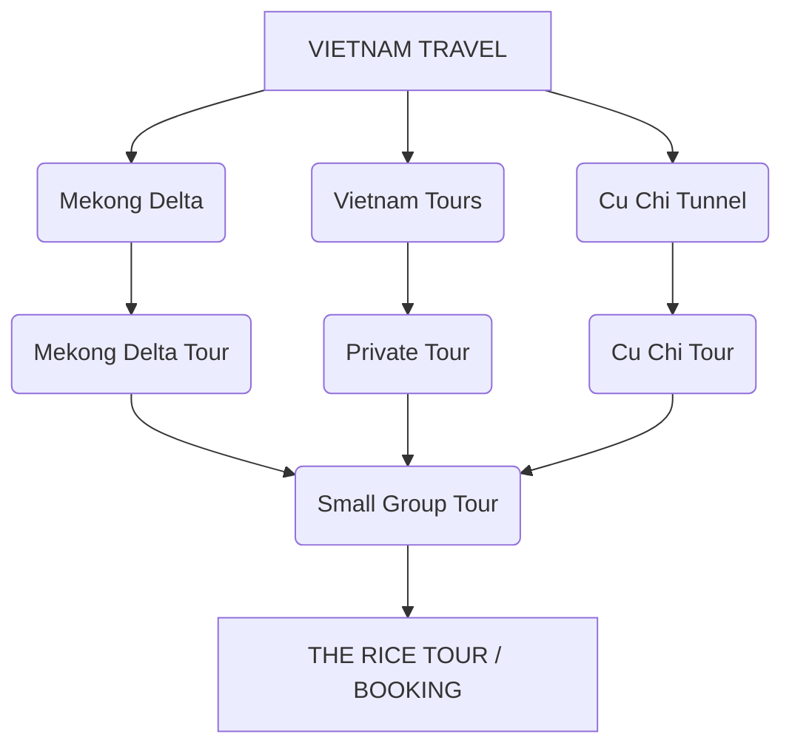

# Kế Hoạch SEO Content THE RICE TOUR

Nếu đây là plan content SEO cho The Rice Tour, em sẽ gom nhóm keyword theo search intent + funnel, tránh kiểu mỗi keyword viết 1 bài riêng mà bị cannibalization.

## 1. Keyword Map Tổng Thể

| Cluster | Keyword chính | Intent | Loại content | Priority |
| :--- | :--- | :--- | :--- | :--- |
| **Rice / Travel / Tour** | the rice / rice travel / rice tour | Informational + Commercial | Blog + Tour | ⭐⭐⭐ |
| **Mekong Delta** | Mekong Delta | Informational / Commercial | Pillar page | ⭐⭐⭐⭐⭐ |
| | Mekong Delta tour | Commercial | Tour landing page | ⭐⭐⭐⭐⭐ |
| | Mekong Delta day tour | Commercial | Tour landing page | ⭐⭐⭐⭐ |
| | Mekong River | Informational | Blog / Destination | ⭐⭐⭐⭐ |
| | Mekong River tour | Commercial | Tour page | ⭐⭐⭐⭐ |
| **Cu Chi Tunnel** | Cu Chi Tunnel | Informational | Pillar page | ⭐⭐⭐⭐⭐ |
| | Cu Chi Tunnel tour | Commercial | Tour landing page | ⭐⭐⭐⭐⭐ |
| | Cu Chi Tunnels half day tour | Commercial | Tour page | ⭐⭐⭐⭐ |
| | Cu Chi Tunnel from Ho Chi Minh City | Commercial | Tour page | ⭐⭐⭐⭐ |
| **Private Tour** | private tour Vietnam | Commercial | Service landing page | ⭐⭐⭐⭐⭐ |
| | private tour Ho Chi Minh City | Commercial | Service page | ⭐⭐⭐⭐⭐ |
| | private tour Mekong Delta | Commercial | Tour page | ⭐⭐⭐⭐⭐ |
| | private Vietnam tour | Commercial | Service landing page | ⭐⭐⭐⭐⭐ |
| **Small Group Tour** | small group tour Vietnam | Commercial | Service landing page | ⭐⭐⭐⭐⭐ |
| | small group tour Ho Chi Minh City | Commercial | Service page | ⭐⭐⭐⭐ |
| | small group Mekong Delta tour | Commercial | Tour page | ⭐⭐⭐⭐⭐ |
| | Vietnam small group tours | Commercial | Category page | ⭐⭐⭐⭐⭐ |
| **Travel Agency Near Me**| travel agency near me | Local Commercial | Local landing page | ⭐⭐⭐⭐⭐ |
| | travel agency Ho Chi Minh City | Commercial | Agency page | ⭐⭐⭐⭐⭐ |
| | tour agency near me | Local Commercial | Local landing page | ⭐⭐⭐⭐⭐ |
| | tour operator Ho Chi Minh City | Commercial | Agency page | ⭐⭐⭐⭐ |
| **Agency Bui Vien** | travel agency Bui Vien | Local Commercial | Location page | ⭐⭐⭐⭐⭐ |
| | tour agency Bui Vien | Local Commercial | Location page | ⭐⭐⭐⭐⭐ |
| | travel agency near Bui Vien | Local Commercial | Location page | ⭐⭐⭐⭐⭐ |
| | Vietnam tour agency Bui Vien | Commercial | Location page | ⭐⭐⭐⭐ |
| | tours from Bui Vien | Commercial | Tour collection | ⭐⭐⭐⭐ |

---

## 2. Em Sẽ Xây Theo 6 Content Pillar

### Pillar 1 — Mekong Delta
Đây nên là pillar mạnh nhất vì vừa có traffic informational vừa kéo trực tiếp sang tour.

**Pillar:**
- Mekong Delta: Complete Travel Guide

**Các supporting articles:**
- Mekong Delta là gì?
- Mekong Delta Travel Guide
- Best Time to Visit Mekong Delta
- How to Get to Mekong Delta from Ho Chi Minh City
- Things to Do in Mekong Delta
- Mekong Delta Floating Markets
- Mekong Delta Villages
- Mekong Delta Food
- Mekong River vs Mekong Delta
- Can You Visit Mekong Delta in One Day?
- How Many Days Do You Need in Mekong Delta?
- Best Mekong Delta Tours from Ho Chi Minh City
- Private Mekong Delta Tour
- Small Group Mekong Delta Tour

→ **Tất cả link về:** Mekong Delta Tours

### Pillar 2 — Mekong River
Keyword này nên tách khỏi Mekong Delta, vì intent rộng hơn.

**Pillar:**
- Mekong River: Complete Travel Guide

**Supporting:**
- Mekong River
- Where Is the Mekong River?
- Mekong River Countries
- Mekong River Map
- Mekong River Cruise
- Mekong River Travel
- Mekong River Tour
- Mekong River Delta
- Mekong River vs Mekong Delta
- Best Places to Visit Along the Mekong River

→ **Internal link flow:** Mekong River → Mekong Delta → Mekong Delta Tour

### Pillar 3 — Cu Chi Tunnel
Đây là cluster rất đáng làm vì intent du lịch cực rõ.

**Pillar:**
- Cu Chi Tunnels: Complete Travel Guide

**Supporting:**
- Cu Chi Tunnels
- Cu Chi Tunnel History
- Cu Chi Tunnel Facts
- How to Visit Cu Chi Tunnels
- How Far Is Cu Chi Tunnels from Ho Chi Minh City?
- How Long Does Cu Chi Tunnel Tour Take?
- Cu Chi Tunnels Half Day Tour
- Cu Chi Tunnels Full Day Tour
- Cu Chi Tunnels and Mekong Delta Tour
- Cu Chi Tunnels Private Tour
- Cu Chi Tunnels Small Group Tour

**Commercial pages:**
- Cu Chi Tunnel Tours
  - → Private
  - → Small Group
  - → Half Day
  - → Full Day
  - → Cu Chi + Mekong Delta

> [!TIP]
> Đây là cluster có khả năng chuyển đổi tốt hơn nhiều so với chỉ viết bài lịch sử.

### Pillar 4 — Private Tour
Cái này em sẽ làm thành commercial pillar riêng.

**Main page:**
- Private Tours in Vietnam

**Supporting:**
- Private Tour Vietnam
- Private Tour Ho Chi Minh City
- Private Tour Mekong Delta
- Private Tour Cu Chi Tunnels
- Private Tour Hanoi
- Private Tour Central Vietnam
- Private Vietnam Family Tour
- Private Vietnam Tour for Couples
- Private Vietnam Tour for Seniors

**Sau này có thể mở rộng:**
- Private Tours
  - → Ho Chi Minh City
  - → Mekong Delta
  - → Cu Chi
  - → Hanoi
  - → Ha Long Bay
  - → Ninh Binh
  - → Central Vietnam

### Pillar 5 — Small Group Tour
Tương tự nhưng target một nhóm khách khác.

**Main page:**
- Small Group Tours in Vietnam

**Supporting:**
- Small Group Tour Vietnam
- Vietnam Small Group Tours
- Small Group Tour Ho Chi Minh City
- Small Group Mekong Delta Tour
- Small Group Cu Chi Tunnel Tour
- Small Group Vietnam Travel
- Best Small Group Tours in Vietnam
- Vietnam Small Group Tour vs Private Tour

*Bài cuối rất hay để kéo commercial intent:*
- **Private Tour vs Small Group Tour in Vietnam: Which Is Better?**
→ Cuối bài CTA cả hai lựa chọn.

### Pillar 6 — Travel Agency Near Me
Cái này không nên chỉ viết blog. Đây là local/commercial keyword nên cần landing page thực sự.

**Main:**
- Travel Agency in Ho Chi Minh City

**Sau đó:**
- Travel Agency Near Me

> [!NOTE]
> Không nhất thiết URL phải là `/travel-agency-near-me`; nên xây page có local relevance thật.

**Content page nên có:**
- The Rice Tour là ai
- Office/location
- Google reviews
- Tour đang bán
- Private tours
- Small group tours
- Mekong Delta
- Cu Chi Tunnel
- Vietnam tours
- Contact
- Directions
- FAQ

> [!IMPORTANT]
> Quan trọng nhất là Google Business Profile + NAP + review + local entity signals, chứ không phải nhồi keyword "near me".

### Pillar 7 — Bui Vien Agency
Cluster này khá hay vì Bùi Viện chính là một điểm mà khách Tây tìm tour trực tiếp.

**Em sẽ làm một landing page:**
- Travel Agency Near Bui Vien Walking Street
*Hoặc tự nhiên hơn:* Travel Agency in Bui Vien, Ho Chi Minh City

**Supporting content:**
- Travel Agency Bui Vien
- Tour Agency Bui Vien
- Tours from Bui Vien
- Mekong Delta Tour from Bui Vien
- Cu Chi Tunnel Tour from Bui Vien
- Private Tour from Bui Vien
- Small Group Tours from Bui Vien
- Vietnam Tours from Bui Vien
- Where to Book Tours in Bui Vien

**Một bài rất đáng làm:**
- Best Tours to Book from Bui Vien Walking Street
*(Trong bài đưa thẳng các tour: Mekong Delta → Cu Chi → City Tour → Private Tour → Multi-day Vietnam → CTA về tour).*

### Pillar 8 — Còn "The Rice / Travel / Tour"
Cái này em chưa muốn cho team viết ngay, vì keyword "The Rice" đang quá mơ hồ.

Nếu ý anh là các keyword kiểu: `rice travel`, `rice field travel`, `rice field tour`, `rice terraces Vietnam`, `rice farming Vietnam`, `Vietnam rice tour` thì nó sẽ thành một cluster rất khác.

Nếu target là rice tourism / rice field experience, em sẽ xây:
- Rice & Agriculture Travel
- Rice Fields in Vietnam
- Rice Terraces in Vietnam
- Vietnamese Rice Farming
- How Rice Is Grown in Vietnam
- Best Rice Fields to Visit in Vietnam
- Rice Field Tour Vietnam
- Rice Farming Experience Vietnam
- Vietnam Rice Village
- Mekong Delta Rice Fields
- Rice Culture in Vietnam

> [!TIP]
> Cái này có thể nối rất đẹp với Mekong Delta.

---

## 3. Funnel Đề Xuất Cho THE RICE TOUR

Em sẽ không triển khai theo kiểu: 20 keyword → 20 bài blog. Mà đi theo sơ đồ sau:



**Local layer nằm bên dưới:**
```text
Ho Chi Minh City
│
├── Travel Agency
├── Tour Agency
├── Bui Vien
├── Mekong Delta Tours
├── Cu Chi Tunnel Tours
├── Private Tours
└── Small Group Tours
```

---

## 4. Ưu Tiên 15 Content Cho Batch 1

Triển khai Commercial trước, Informational sau:

| # | Content | Type |
|---|---|---|
| 1 | Mekong Delta Tours | Money Page |
| 2 | Cu Chi Tunnel Tours | Money Page |
| 3 | Private Tours in Vietnam | Money Page |
| 4 | Small Group Tours in Vietnam | Money Page |
| 5 | Travel Agency in Ho Chi Minh City | Local |
| 6 | Travel Agency in Bui Vien | Local |
| 7 | Mekong Delta Private Tour | Money Page |
| 8 | Mekong Delta Small Group Tour | Money Page |
| 9 | Cu Chi Tunnel Private Tour | Money Page |
| 10 | Cu Chi Tunnel Small Group Tour | Money Page |
| 11 | Mekong Delta Travel Guide | Pillar |
| 12 | Cu Chi Tunnels Travel Guide | Pillar |
| 13 | Mekong River Travel Guide | Pillar |
| 14 | Best Tours to Book from Bui Vien | Commercial Blog |
| 15 | Private vs Small Group Tour in Vietnam | Comparison |

> [!IMPORTANT]
> **Đặc biệt ưu tiên #1–#10 trước.** Đây là nhóm keyword có khả năng mang khách có nhu cầu mua tour, thay vì chỉ lấy traffic.
> 
> Nếu The Rice Tour đang muốn đánh thị trường khách quốc tế vào Việt Nam, thì cluster này còn có thể mở rộng thành một **Vietnam Incoming SEO Hub** khá mạnh: 
> `Ho Chi Minh City → Mekong Delta → Cu Chi → Bui Vien → Private Tour → Small Group Tour → Vietnam Multi-day Tour`.

---

## 5. Bảng Checklist Kế Hoạch Viết Bài Chi Tiết (Dành Cho Writer)

Bảng dưới đây tổng hợp tất cả các bài viết từ các Pillar trên thành một danh sách dễ theo dõi, giúp team content dễ dàng lên outline, assign task và quản lý tiến độ.

| STT | Cụm Chủ Đề (Cluster) | Keyword Trọng Tâm | Tiêu Đề Đề Xuất (Title) | Loại Trang | Target Internal Link | Ưu Tiên |
|:---|:---|:---|:---|:---|:---|:---|
| **1** | **Mekong Delta** | Mekong Delta | Mekong Delta: Complete Travel Guide | Pillar Page | Mekong Delta Tours | Cao |
| 2 | Mekong Delta | Mekong Delta là gì | What is the Mekong Delta? A Brief Introduction | Blog / Info | Pillar Page | Trung bình |
| 3 | Mekong Delta | Best time to visit Mekong Delta | Best Time to Visit Mekong Delta: Weather & Seasons | Blog / Info | Pillar Page | Cao |
| 4 | Mekong Delta | How to get to Mekong Delta | How to Get to Mekong Delta from Ho Chi Minh City | Blog / Info | Pillar Page | Cao |
| 5 | Mekong Delta | Things to do in Mekong Delta | 15 Best Things to Do in Mekong Delta | Blog / Info | Mekong Delta Tours | Cao |
| 6 | Mekong Delta | Mekong Delta floating markets | A Guide to Mekong Delta Floating Markets | Blog / Info | Mekong Delta Tours | Cao |
| 7 | Mekong Delta | Mekong Delta villages | Best Mekong Delta Villages You Must Visit | Blog / Info | Mekong Delta Tours | Trung bình |
| 8 | Mekong Delta | Mekong Delta food | Must-Try Mekong Delta Food & Specialties | Blog / Info | Pillar Page | Trung bình |
| 9 | Mekong Delta | Mekong River vs Mekong Delta | Mekong River vs Mekong Delta: What's the Difference? | Blog / Info | Cả 2 Pillar | Thấp |
| 10 | Mekong Delta | Mekong Delta in one day | Can You Visit Mekong Delta in One Day? | Blog / Info | 1-Day Tour | Cao |
| 11 | Mekong Delta | How many days in Mekong Delta | How Many Days Do You Need in Mekong Delta? | Blog / Info | Multi-day Tours | Cao |
| 12 | Mekong Delta | Best Mekong Delta tours | Best Mekong Delta Tours from Ho Chi Minh City | Listicle | Các trang Tour | Rất Cao |
| 13 | Mekong Delta | Private Mekong Delta tour | Private Mekong Delta Tour: Exclusive Experience | Service / Tour | - | Rất Cao |
| 14 | Mekong Delta | Small group Mekong Delta tour | Small Group Mekong Delta Tour: Authentic Vibes | Service / Tour | - | Rất Cao |
| **15** | **Mekong River** | Mekong River | Mekong River: Complete Travel Guide | Pillar Page | Mekong Delta | Cao |
| 16 | Mekong River | Where is the Mekong River | Where Is the Mekong River Located? | Blog / Info | Pillar Page | Trung bình |
| 17 | Mekong River | Mekong River countries | Mekong River Countries: A Journey Through Southeast Asia | Blog / Info | Pillar Page | Trung bình |
| 18 | Mekong River | Mekong River map | Mekong River Map: Route & Key Destinations | Blog / Info | Pillar Page | Trung bình |
| 19 | Mekong River | Mekong River cruise | Best Mekong River Cruise Recommendations | Blog / Info | Tour | Cao |
| 20 | Mekong River | Mekong River travel | Mekong River Travel: Ultimate Guide | Blog / Info | Tour | Cao |
| 21 | Mekong River | Mekong River tour | Best Mekong River Tours | Service / Tour | - | Cao |
| 22 | Mekong River | Best places to visit Mekong River| Best Places to Visit Along the Mekong River | Blog / Info | Pillar Page | Trung bình |
| **23** | **Cu Chi Tunnels** | Cu Chi Tunnels | Cu Chi Tunnels: Complete Travel Guide | Pillar Page | Cu Chi Tours | Rất Cao |
| 24 | Cu Chi Tunnels | Cu Chi Tunnel history | Cu Chi Tunnel History: Everything You Need to Know | Blog / Info | Pillar Page | Trung bình |
| 25 | Cu Chi Tunnels | Cu Chi Tunnel facts | 10 Interesting Cu Chi Tunnel Facts | Blog / Info | Pillar Page | Trung bình |
| 26 | Cu Chi Tunnels | How to visit Cu Chi Tunnels | How to Visit Cu Chi Tunnels: Tips & Guide | Blog / Info | Cu Chi Tours | Cao |
| 27 | Cu Chi Tunnels | How far is Cu Chi Tunnels | How Far Is Cu Chi Tunnels from Ho Chi Minh City? | Blog / Info | Pillar Page | Cao |
| 28 | Cu Chi Tunnels | How long does Cu Chi tour take | How Long Does a Cu Chi Tunnel Tour Take? | Blog / Info | Half/Full Day Tour | Cao |
| 29 | Cu Chi Tunnels | Cu Chi Tunnels half day tour | Cu Chi Tunnels Half Day Tour | Service / Tour | - | Rất Cao |
| 30 | Cu Chi Tunnels | Cu Chi Tunnels full day tour | Cu Chi Tunnels Full Day Tour | Service / Tour | - | Rất Cao |
| 31 | Cu Chi Tunnels | Cu Chi & Mekong Delta tour | Cu Chi Tunnels and Mekong Delta Tour | Service / Tour | - | Rất Cao |
| 32 | Cu Chi Tunnels | Cu Chi private tour | Cu Chi Tunnels Private Tour | Service / Tour | - | Rất Cao |
| 33 | Cu Chi Tunnels | Cu Chi small group tour | Cu Chi Tunnels Small Group Tour | Service / Tour | - | Rất Cao |
| **34**| **Private Tour** | Private tour Vietnam | Private Tours in Vietnam: Tailor-Made Holidays | Money Page | Các Tour Private | Rất Cao |
| 35 | Private Tour | Private tour Ho Chi Minh City | Private Tour Ho Chi Minh City: Custom Itinerary | Service / Tour | - | Rất Cao |
| 36 | Private Tour | Private tour Mekong Delta | Private Tour Mekong Delta | Service / Tour | - | Rất Cao |
| 37 | Private Tour | Private tour Cu Chi Tunnels | Private Tour Cu Chi Tunnels | Service / Tour | - | Rất Cao |
| 38 | Private Tour | Private Vietnam family tour | Private Vietnam Family Tour Packages | Service / Tour | - | Cao |
| 39 | Private Tour | Private Vietnam tour couples | Private Vietnam Tours for Couples & Honeymooners | Service / Tour | - | Cao |
| 40 | Private Tour | Private Vietnam tour seniors | Private Vietnam Tours for Seniors | Service / Tour | - | Cao |
| **41**| **Small Group Tour**| Small group tour Vietnam | Small Group Tours in Vietnam | Money Page | Các Tour Group | Rất Cao |
| 42 | Small Group Tour| Vietnam small group tours | Top Vietnam Small Group Tours | Service / Tour | - | Rất Cao |
| 43 | Small Group Tour| Small group tour HCMC | Small Group Tour Ho Chi Minh City | Service / Tour | - | Cao |
| 44 | Small Group Tour| Small group Mekong Delta tour | Small Group Mekong Delta Tour | Service / Tour | - | Rất Cao |
| 45 | Small Group Tour| Small group Cu Chi Tunnel tour| Small Group Cu Chi Tunnel Tour | Service / Tour | - | Rất Cao |
| 46 | Small Group Tour| Private vs Small group tour | Private Tour vs Small Group Tour in Vietnam: Which Is Better? | Blog / Compare | Cả 2 Money Page| Cao |
| **47**| **Agency HCMC** | Travel agency Ho Chi Minh City| Travel Agency in Ho Chi Minh City | Local / Landing | Các Tour | Rất Cao |
| 48 | Agency HCMC | Travel agency near me | Top Travel Agency Near Me in HCMC | Local / Landing | Các Tour | Cao |
| **49**| **Agency Bui Vien**| Travel agency Bui Vien | Travel Agency in Bui Vien, Ho Chi Minh City | Local / Landing | Các Tour | Rất Cao |
| 50 | Agency Bui Vien| Tours from Bui Vien | Best Tours to Book from Bui Vien Walking Street | Listicle | Tour từ HCMC | Rất Cao |
| 51 | Agency Bui Vien| Mekong Delta tour from Bui Vien| Mekong Delta Tour from Bui Vien | Service / Tour | - | Cao |
| 52 | Agency Bui Vien| Cu Chi tour from Bui Vien | Cu Chi Tunnel Tour from Bui Vien | Service / Tour | - | Cao |
| **53**| **The Rice** | Rice travel Vietnam | Rice & Agriculture Travel in Vietnam | Info / Hub | Mekong Delta | Trung bình |
| 54 | The Rice | Rice fields Vietnam | Beautiful Rice Fields in Vietnam | Blog / Info | Hub | Trung bình |
| 55 | The Rice | Vietnamese rice farming | Vietnamese Rice Farming Experience | Blog / Info | Hub | Trung bình |
| 56 | The Rice | Best rice fields Vietnam | Best Rice Fields & Terraces to Visit in Vietnam | Listicle | Các Tour | Trung bình |
| 57 | The Rice | Rice farming experience | Rice Farming Experience in Vietnam | Service / Tour | - | Cao |
